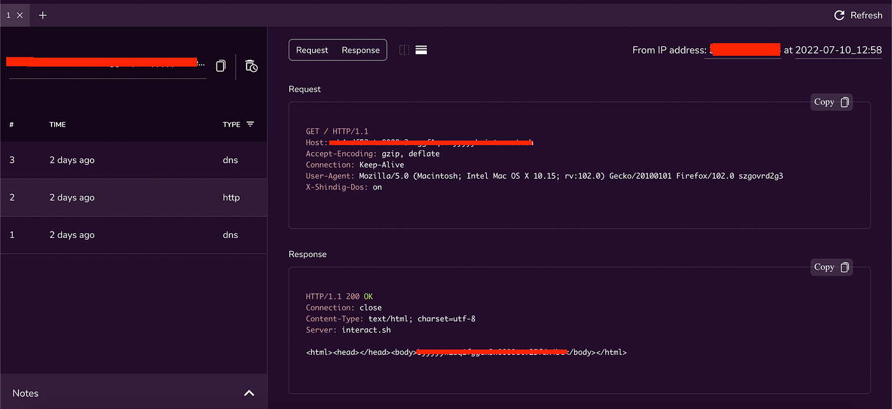
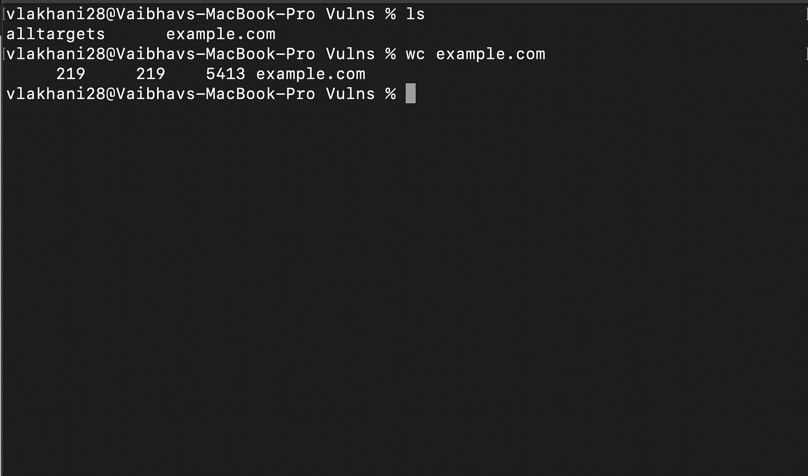
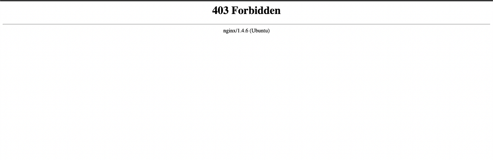
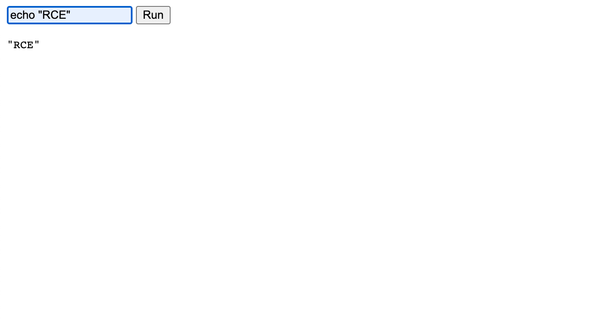

# :globe_with_meridians: How I found my first RCE!. Remote code executions (RCEs) are…

---

# How I found my first RCE!

Remote code executions (RCEs) are dreams of all, but only some of them have found it. This story is about how I was able to find my RCE using simple fuzzing techniques and a little bit of recon. So here we go….

My Methodology:

- Gathered the in-scope domains.

- Started active and passive subdomain enumeration. Tools used for Passive Subdomain Enumeration: [subfinder](https://github.com/projectdiscovery/subfinder) (with API Keys of different services such as Shodan, Chaos, GitHub, Sublist3r, etc). For Active subdomain enumeration, [Best DNS Wordlist](https://wordlists-cdn.assetnote.io/data/manual/best-dns-wordlist.txt) from [Assetnote Wordlist](https://wordlists.assetnote.io/) was used.

- Around 219 subdomains were found

4. The next step was to filter out the live domains based on the status code.

5. Quickly I found the subdomain accounts.example.com with the status code 403 Forbidden.

6. And here's where the actual journey begins.

So I geared up with [FFuF](https://github.com/ffuf/ffuf) and the wordlist from the all-famous [Seclists](https://github.com/danielmiessler/SecLists) and initiated the fuzzing scan. Found an endpoint */fileupload/toolsAny *which was seemed to be vulnerable to CVE-2022–29464.

[CVE-2022–29464](https://docs.wso2.com/display/Security/Security+Advisory+WSO2-2021-1738) is a critical vulnerability on WSO2 discovered by [Orange Tsai](https://twitter.com/orange_8361). the vulnerability is an unauthenticated unrestricted arbitrary file upload that allows unauthenticated attackers to gain RCE on WSO2 servers via uploading malicious JSP files.

The vulnerable endpoint was /fileupload using which an attacker could upload an .jsp file which could lead to a reverse shell of the victim machine.

Once I confirmed the vulnerability, the next task was to find a proper exploit. There were two approaches to doing it, either capturing the request in Burp and modifying the request or using a developed exploit. Let’s understand the steps for both of them

Method 1: Using Burp

- Capture the endpoint request in Burp Suite

- Change the method from GET to POST

- Along with the Content-Disposition Header, enter the endpoint name along with the file name and the filename. For example:

Content-Disposition: form-data; name=”../../../../repository/deployment/server/webapps/authenticationendpoint/MyShell.jsp”;filename=”MyShell.jsp”

## Get TheBountyBox’s stories in your inbox

Join Medium for free to get updates from this writer.

Remember me for faster sign in

4. In the POST body enter the command the file.jsp should perform. For example:

<% out.print(“MyShell Uploaded here”); %>

5. Navigate to the endpoint accounts.example.com/authenticationendpoint/MyShell.jsp and your commands would be executed

Method 2: Using an exploit

- Navigate to [https://github.com/hakivvi/CVE-2022-29464](https://github.com/hakivvi/CVE-2022-29464)

- Git clone the file to the local machine

- run the exploit using python3 exploit.py https://accounts.example.com MyShell.jsp

- Visit the endpoint https://accounts.example.com/authenticationendpoint/MyShell.jsp

- You will be able to run any command

Meanwhile, I was exploiting the RCE, I used [waybackurls](https://github.com/tomnomnom/waybackurls) on the same domain accounts.example.com and the following endpoint captured my eye. https://accounts.example.com/shindig/gadgets/proxy?container=default&url=https://google.com

I quickly opened up the [Interactsh client](https://app.interactsh.com/#/) and pasted the payload.

And BOOM SSRF! Turns out that the same WSO2 was vulnerable to SSRF as well.

Timeline

Both vulnerabilities found: 10 July 2022

Reported on: 10 July 2022

Initial Response: 11 July 2022

Hall of Fame Awarded + Letter of recommendation: 13 July 2022

---
