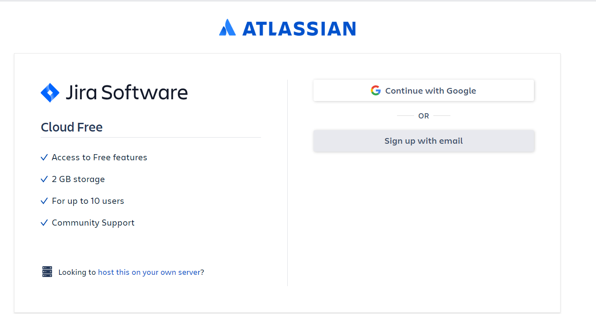
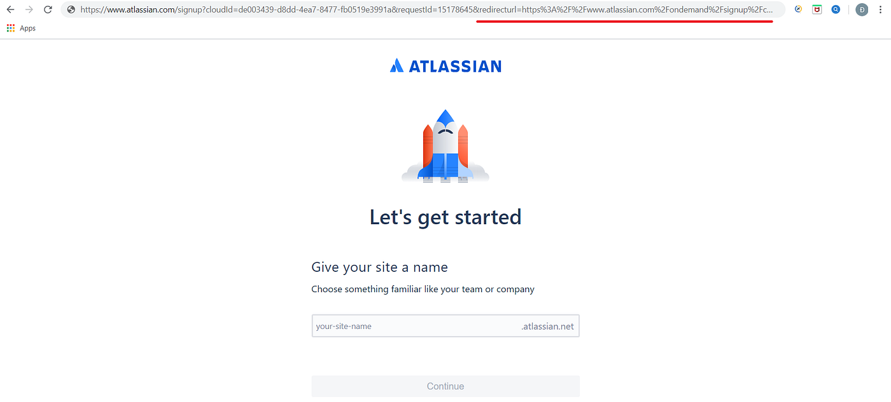
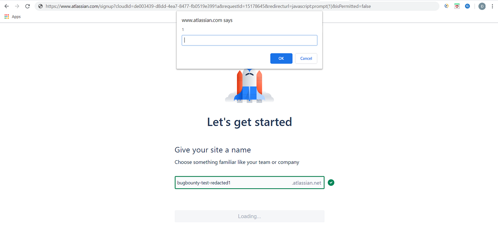
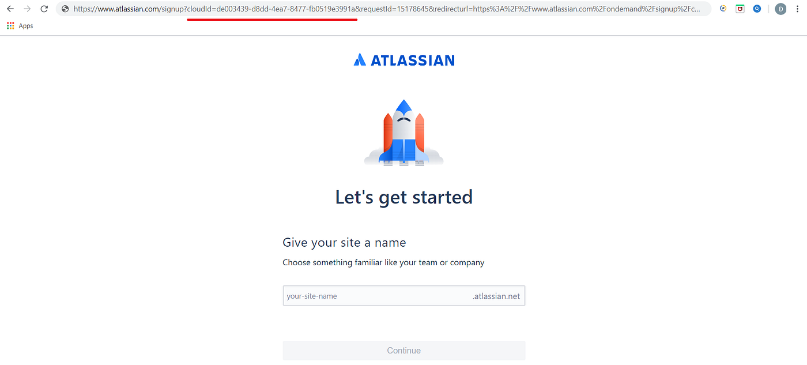
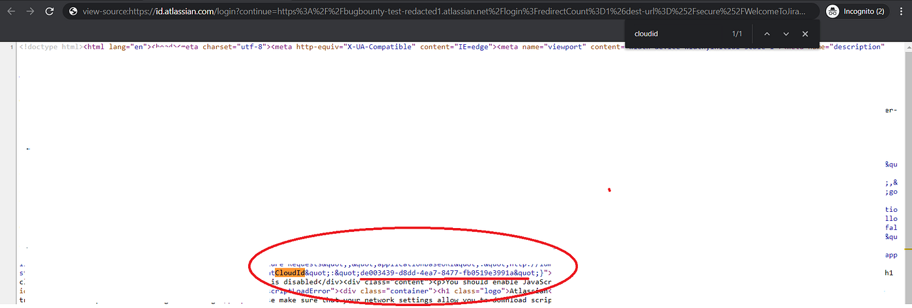
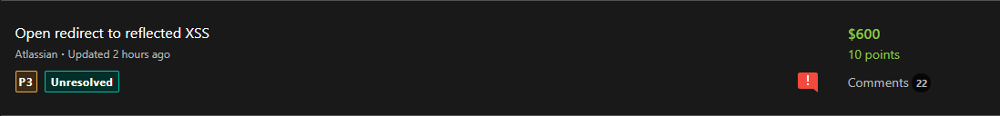

# :globe_with_meridians: How I Found My First XSS Bug via Open Redirect

---

# How I Found My First XSS Bug via Open Redirect

Hi everyone,

I am @goj0s4t0ru. Today I am going to talk about the process I found my first XSS bug at [@Bugcrowd](http://twitter.com/Bugcrowd).

## Summary:

The story happens when I receive a private invitation for a program (*Assuming: redacted.com*). This program is affiliated with Atlassian and for testing on this program, I need to create a Jira cloud account.




After logging into Google account, I will be redirected to the username creation page.




In my head right now all I can think of is the “Open redirect” bug. I started changing the domain name, adding characters to bypass the open redirect filter, and finally I succeeded.

I immediately created a report and sent it to the Atlassian program.

Then I went to the toilet. At that moment, a thought suddenly occurred to me. Why don’t I try XSS? Without thinking about anything else, I immediately ran up to my room and turned on my computer. In the *“&redirecturl=”* parameter, I tried with javascript payload: *javascript:prompt(1)* -> set any username and Continue. Boom! XSS is executed.




## Difficult times to find ways to exploit:

But wait. It seems that the *“?cloudId=”* parameter corresponds to each account. This means that XSS will only be executed for me individually because the *“?cloudId=”* parameter is created specifically for me. So now this would be self-XSS if I couldn’t get the victim’s *“?cloudId=”.*




I was a bit worried. Although this XSS search process only takes about 5 minutes, all will fail if this is just a self-XSS.

## Get thanhdat1011’s stories in your inbox

Join Medium for free to get updates from this writer.

Remember me for faster sign in

I began to continue to exploit and exploit. I finally found 2 ways to get this parameter:

```
1. The attacker needs to join the victim's Jira team. To do this, an attacker needs to trick the victim into inviting him to join his team.
```

So how can an attacker not need to join the victim’s Jira group and still be able to steal *“cloudId”* ?

```
2. An attacker does not need to log in to his account nor join the victim's team. An attacker just needs to visit the victim's domain and view the *"Source page"*. The parameter *"cloudId"* will appear there.



```

## Time to attack:

Now after stealing *“cloudId”* of the victim. The full link will include: https://www.atlassian.com/signup?cloudId=[victim-id]&requestId=15178645&redirecturl=javascript:prompt(1)&isPermitted=false

When the victim access -> Set user name and Continue -> XSS will be executed

## Sweet fruit 😁

At the same time I have provided additional information to prove this is an Reflected-XSS bug. After that, the Atlassian team accepted and considered it a P3




## Advice:

Always stay calm and think when you spot bugs, don’t stop there. Sometimes the bugs you find are not the end result. So my advice is to always find a way to string the bugs you find. The results you get will surprise you :>

Thank you everyone for reading!!! ❤

Happy Hacking :)))

Twitter: [https://twitter.com/goj0s4t0ru](https://twitter.com/goj0s4t0ru)

---
