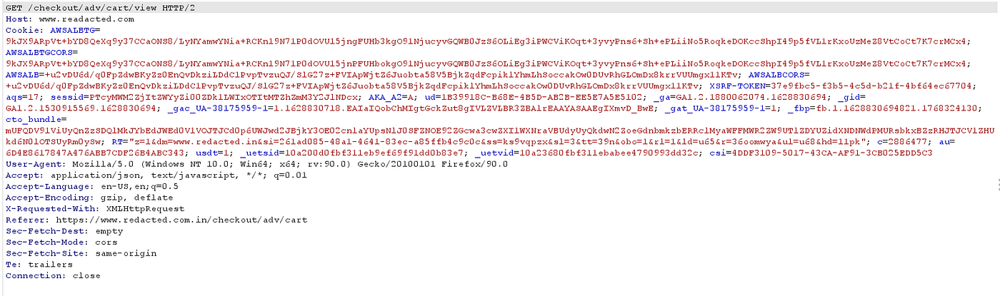
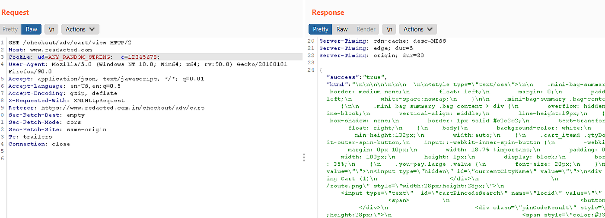
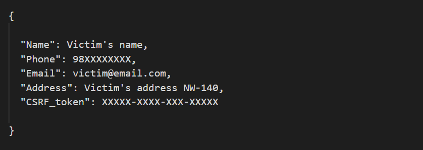
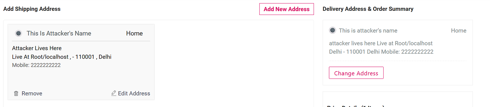

# :globe_with_meridians: How I found read/write access to the personal data of 3 million users of an E-commerce website?

---

# How I found read/write access to the personal data of 3 million users of an E-commerce website?

This is [Prashant Singh](https://www.linkedin.com/in/prashant-singh-430452193/), a cybersecurity researcher. This is my first bug bounty write-up. Just a small contribution from my end to the community.

## First things come First

I can’t disclose the name of the bug bounty program and hence in this context, it would be referred to as redacted.com. The website uses cookie-based authentication and authorization mechanism to validate legitimate requests on the server-side.

Keenly observe the parameters present in the cookie. There Exists a user identity param “c=1234567”. The whole nuance revolves around the same.

## What did I do?

Almost every E-commerce website has a section where users can add/remove/update their address. The address was reflecting on the following two endpoints.

- On the user profile section *( *[https://www.redacted.com/profile/address)](https://www.redacted.com/profile/address))

- On the final steps for completing the order while clearing the cart items. *(https://www.redacted.com /checkout/adv/address/view) — *A hidden JSON endpoint*.*

Developers usually emphasize more on the endpoints which are easily feasible to the user. Hence, found no luck with the first endpoint because it was safe and secure.

Proceeded with the second endpoint, tried changing the customer_id, but didn’t work. Also, tried parameter pollution but none worked.

Later I tried to find out on what basis does the webserver validates the session request.

## Get Madari’s stories in your inbox

Join Medium for free to get updates from this writer.

Remember me for faster sign in

As per my investigation, redacted.com validates the session with the following parameters via cookies:-

- ud= XXXXXXX;

- c= CUSTOMER_ID;

- XSSRF-TOKEN= XXXXXXXX;

- sessid= XXXXXXXXXX;

>

GET /checkout/adv/address/view HTTP/1.1

But on the following endpoint, it gets quite tricky. If we remove the “sessid” and “XSSRF-Token” parameters and then sent any request to the server, it would treat it as a valid request and fetch the content made by the request.

So, if I manipulate the attacker’s customer-ID parameter in the request to the victims’ customer-ID. The web server would fetch the contents of victims’ personal account detail.

Note: The web server verifies the presence of “Ud” parameter, but it does not verify the contents of “Ud” parameter.

So, the final request sent to the server looks like this:

*Final response*

The response JSON data is jumbled with very long HTML elements, so the PII data isn’t visible clearly. However, I am below attaching a clean form of the personal data retrieved from the response mentioned above.

*PII data extracted from the response*

Please note the presence of CSRF_token, things gonna be interesting now. Until now I was only able to read someone’s else private data but couldn’t write it. Here is how I found a way.

*Address section*

There existed a functionality to edit/update the address. The post request sent to the server consisted of the same cookies as mentioned above. So without any further delay, I manipulated the cookie with the victim’s customer_ID.

But it didn’t work !!!!

Later I realized that this time the authorization wasn’t based on the cookie. It was based on the value of CSRF-token which was passed in the POST request while updating the address.

Note that I already had the CSRF token of the victim. Hence, I substituted the token and the victim's details were updated.

Therefore, in this way, I was remotely able to read/write the personal data of almost 3 million users.

---
