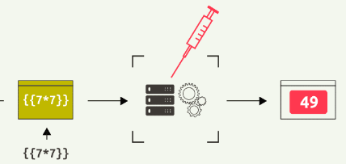
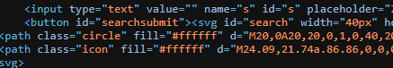

# :globe_with_meridians: How I Found SSTI in a Search Bar. While casually poking around a website…

---

## 🧪 Testing for SSTI

I began with some common SSTI payloads:



`{{7*7}}`

`${7*7}`

`<%= 7*7 %>`

`{{config}}`

Most of them either returned nothing or gave back the input as-is.

But then I tried:

```
{{7*7}}
```

Boom. The result came back as:

>


***Results found for: 49***

This was the first solid indicator that the input was being parsed by a server-side template engine.

## Get Umanhonlen Gabriel’s stories in your inbox



Join Medium for free to get updates from this writer.

Remember me for faster sign in

To be sure, I tried another:

```
{{8*8}}
```

Encoded as:

```
/search/%7B%7B8%2A8%7D%7D


```

The result?

>

***Results found for: 64***

Confirmed — the server is evaluating these expressions. That’s a classic **SSTI vulnerability**.

---
