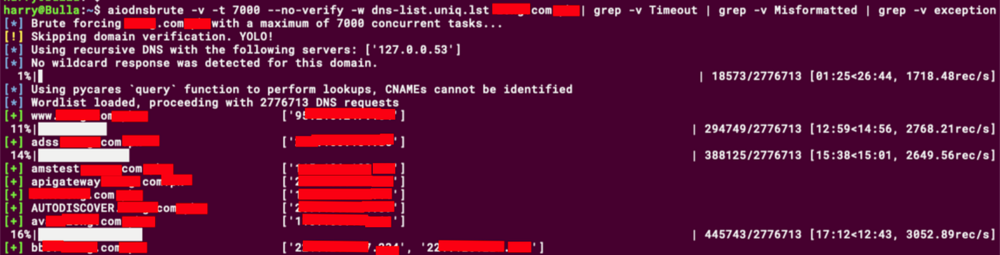
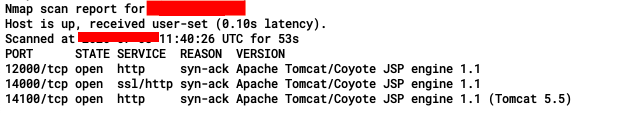
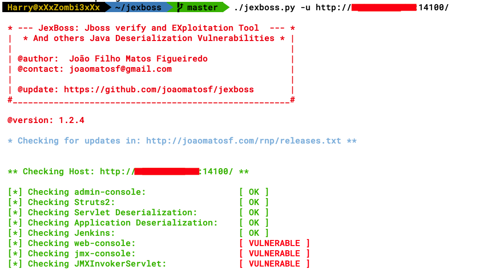
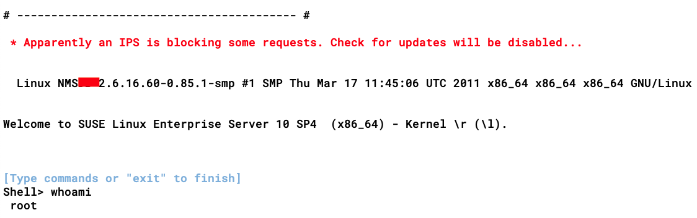
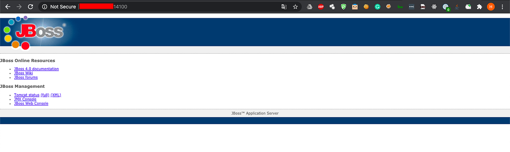
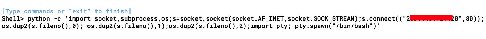
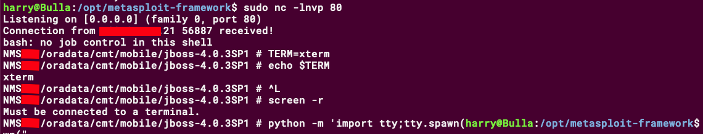

# :globe_with_meridians: How I hacked into a Telecom Network - Part 1 (Getting the RCE)

---

## Remote Code Execution

From here on, everyone who has exploited the infamous JBoss vulnerabilities before knows how things will move forward. For newbies, if you haven’t had the experience with JBoss exploitation, you can check out the following links to help you out with the exploitation:

[JBoss-Bridging-the-Gap-Between-the-Enterprise-and-You](https://www.redteam-pentesting.de/publications/2010-04-21-JBoss-Bridging-the-Gap-Between-the-Enterprise-and-You_Ruhr-Universitaet-Bochum_RedTeam-Pentesting.pdf)

## Get Harpreet Singh’s stories in your inbox

Join Medium for free to get updates from this writer.

Remember me for faster sign in

[hacking_and_securing_jboss](https://doc.lagout.org/Others/hacking_and_securing_jboss.pdf)

For JBoss exploitation, you can use [Jexboss](https://github.com/joaomatosf/jexboss). There are many methods and exploitation techniques included in the tool and it also covers the Application and Servlet deserializations and Struct2. You can exploit JBoss using Metasploit as well, though I prefer Jexboss.

Continuing with the engagement, once I discovered JBoss, I quickly fired up Jexboss for the exploitation. The tool was easy to use.

*./jexboss.py -u **http://[REDACTED]:14100/*

As we can see from the above screenshot, the server was vulnerable. Using the **JMXInvokerServlet** method, I was then able to get the Remote Code Execution on the server. Pretty straight forward exploitation! Right?

>

You must be thinking, that was no advance level shit, so what’s different about this post?

Patience guys!

Now that I had the foothold, the actual issue arose. Of course like always, once I had the RCE I tried getting a reverse shell.

and I even got a back connection!

However, the shell was not stable and the python process was getting killed after a few seconds. I even tried using other reverse shell one-liner payloads, different common ports, even UDP too, but the result was the same. I also tried reverse_tcp/http/https Metasploit payloads in different forms to get meterpreter connections but the meterpreter shells were disconnected after a few seconds.

I have experienced some situations like these before and I always questioned what if I’m not able to get a reverse shell, how will I proceed?

Entering **Bind shell connection over HTTP tunnel!**To be continued in part 2…

## Promotion Time!

If you guys want to learn more about the techniques I used and the basic concepts behind it, you can read my books (co-authored with ***@himanshu_hax)*

>

***Hands-On Red Team Tactics ***— [Amazon](https://www.amazon.in/Hands-Penetration-Testing-Metasploit-vulnerabilities-ebook/dp/B07MT8DDBR), [PacktPub](https://www.packtpub.com/in/networking-and-servers/hands-red-team-tactics)

>

***Hands-On Web Application Penetration Testing with Metasploit ***— [Amazon](https://www.amazon.in/Hands-Penetration-Testing-Metasploit-vulnerabilities-ebook/dp/B07MT8DDBR), [PacktPub](https://www.packtpub.com/in/networking-and-servers/hands-web-penetration-testing-metasploit)

---
