# :globe_with_meridians: How I hacked into one of India’s biggest online book stores(RCE and more)

---

# How I hacked into one of India’s biggest online book stores(RCE and more)

*Oswaal Books(oswaalbooks.com)*


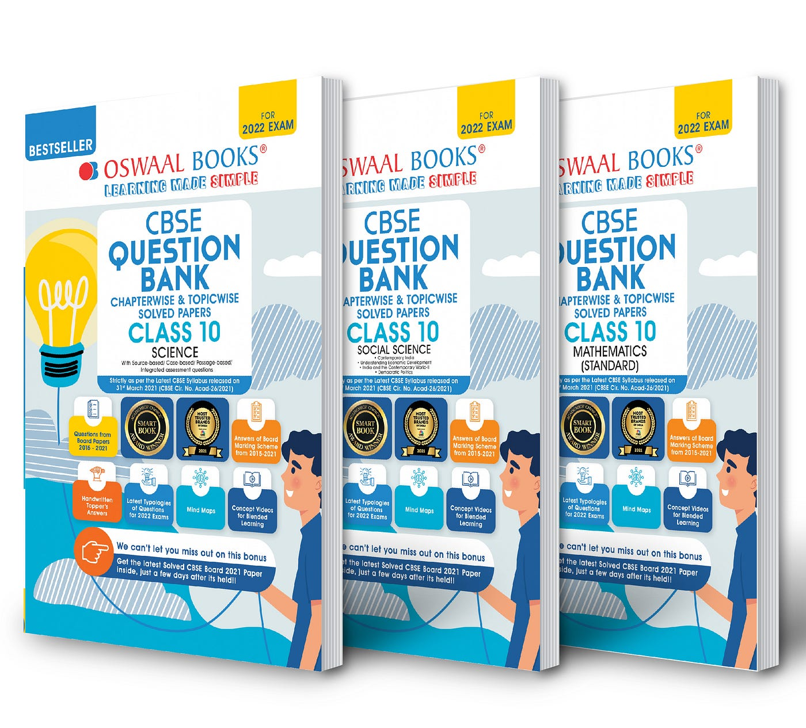
This article is going to be about how I found my 1st RCE on one of India’s biggest e-commerce sites(+ a few more bugs).

Oswaal Books is a very popular company among high schoolers in India and the ones studying for competitive exams like JEE, NEET etc. They make guides, sample question papers, question banks etc. The story begins with a simple XSS bug. As I was trying to log in to my account one day, and I typed in the wrong password by mistake it displayed an error message saying that the password was invalid. The weird thing I noticed was that the error message was the same as the input given to the ‘errmsg’ parameter in the URL.

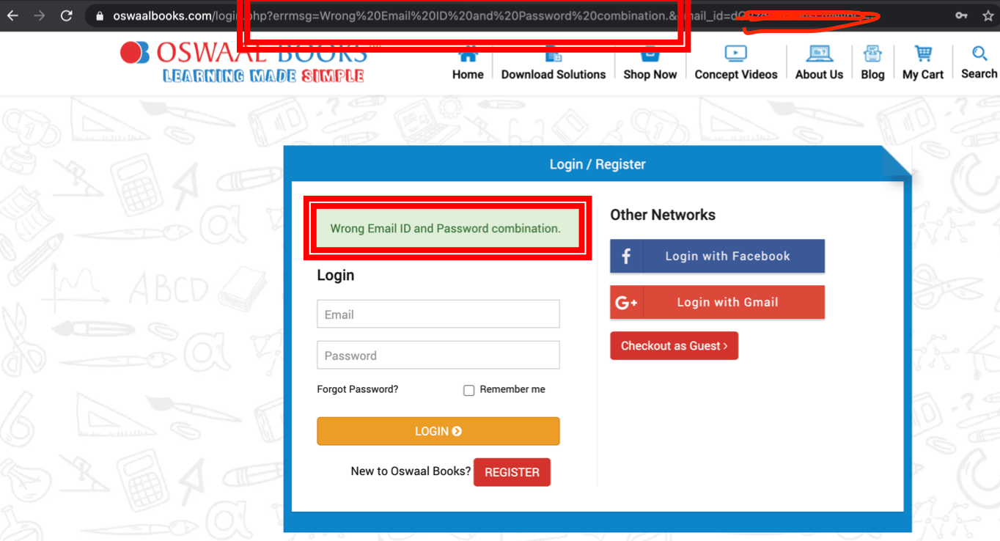


For those of you who have even just read the first few pages of the XSS chapter in the Web Hacker’s handbook know what to do. I just replaced the error message with my XSS payload and found another XSS bug.


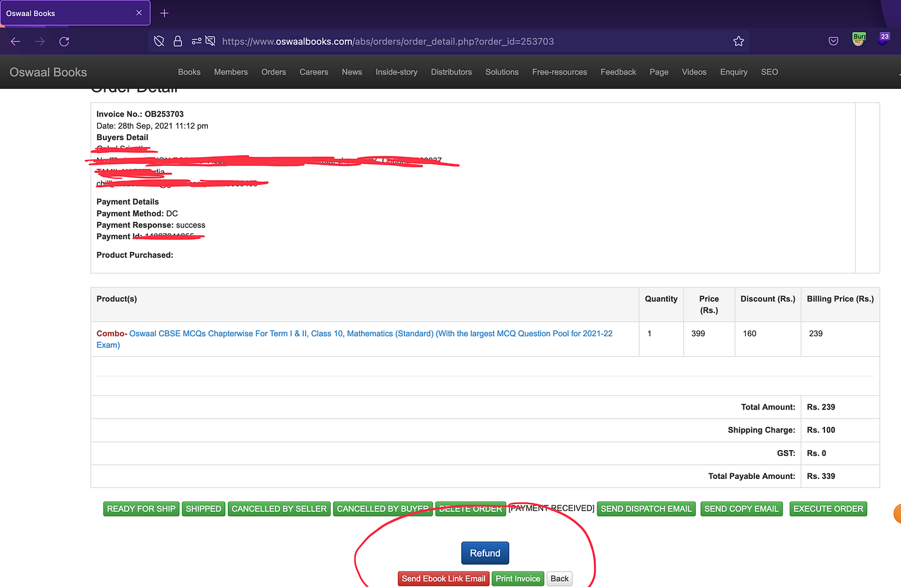
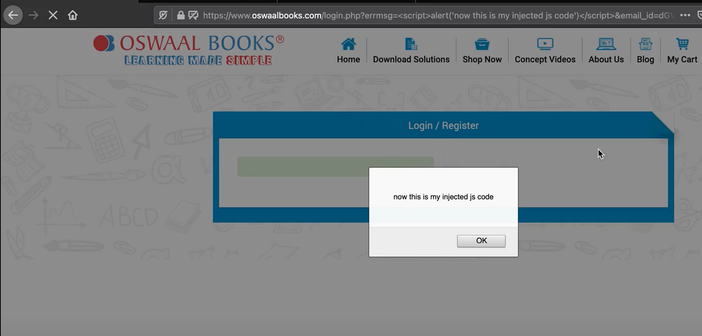


A few months later as I was wandering on the site again, I decided to come back to this. This bug was now fixed, I edited my profile and saw that there was a success message but this was from the ‘errmsg’ parameter too. Tested for XSS here and got one. I realised that the ‘errmsg’ parameter is used in multiple places. I ran waybackurls on the domain and filtered all queries that had the ‘errmsg’ parameter.

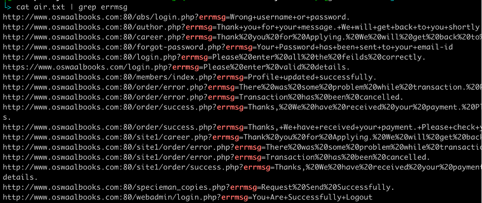


If you look closely at these links, you will realise that I didn’t just find multiple links vulnerable to XSS but I also found a secret login page which I couldn’t find using directory brute force(URL 1).

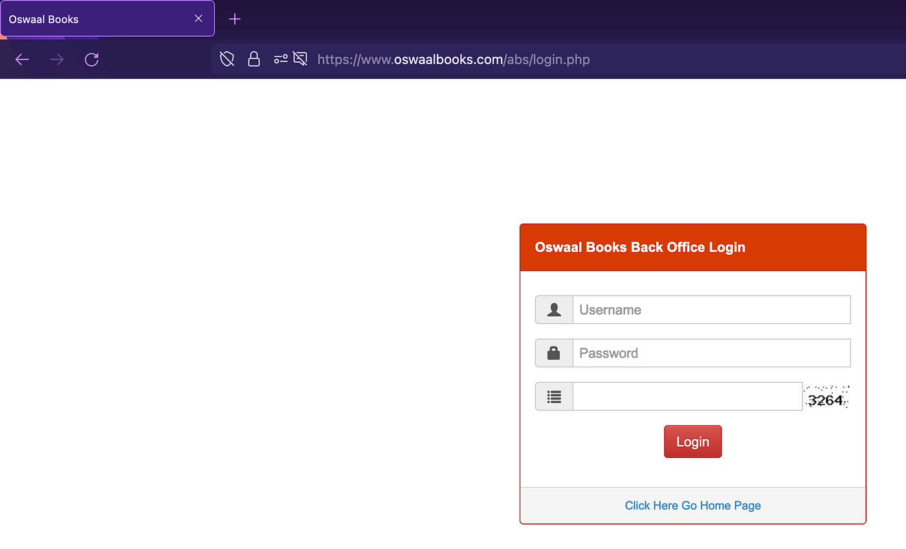


*Backend admin panel*

I was quite excited looking at this page and tried all the basic textbook methods like trying to bypass captcha(failed), response code manipulation(failed), default credentials(failed). The last option was to try SQLi but it was a long shot as it didn’t work anywhere on the main website. I also realised that I had only tried GET based SQLi so I decided to go for POST based SQLi.


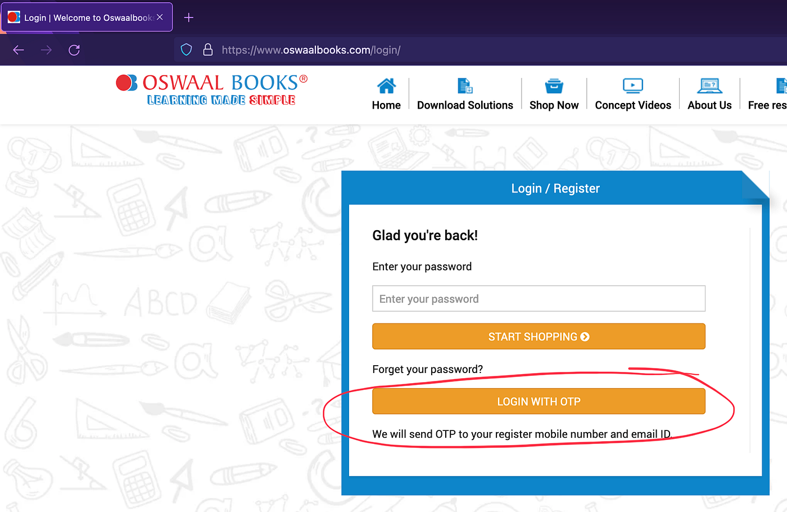
```
Try 1:

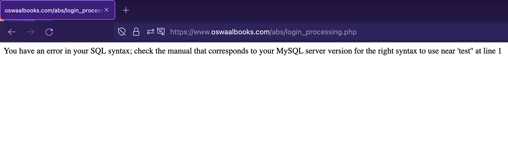

user = admin’
pass = test
```

And the error was triggered!

```
Try 2:
user = admin’ OR 1=1 --
pass = test


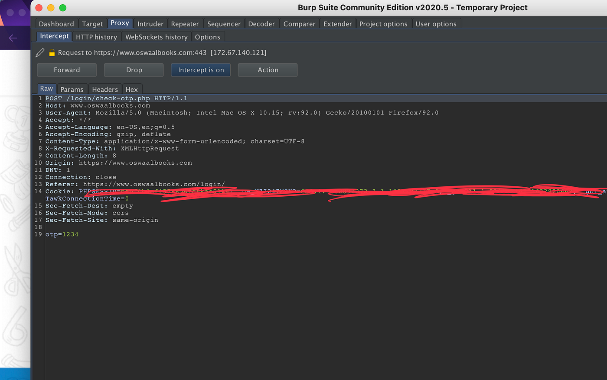
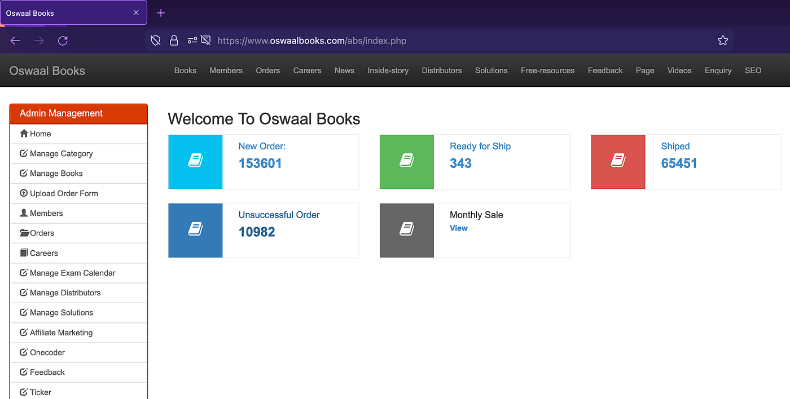

```

And….. I was web admin!!!

*Dashboard*

Privileges:
1)Change password
2)Edit member details
3)View orders and tamper with its settings(cancel orders, initiate refund etc)
4)Edit books details(even prices)
5)Edit blogs, news etc
6)Look at resumes uploaded from the portal on the main site.
7)Edit SEO settings
8)View private customer info(address, phone number etc)


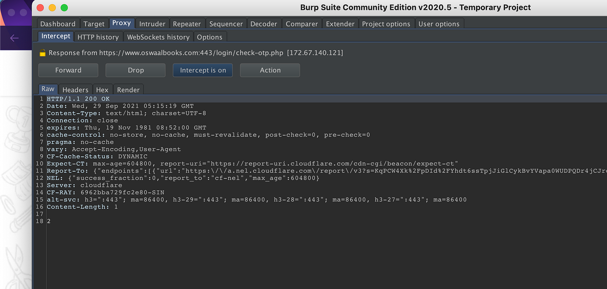
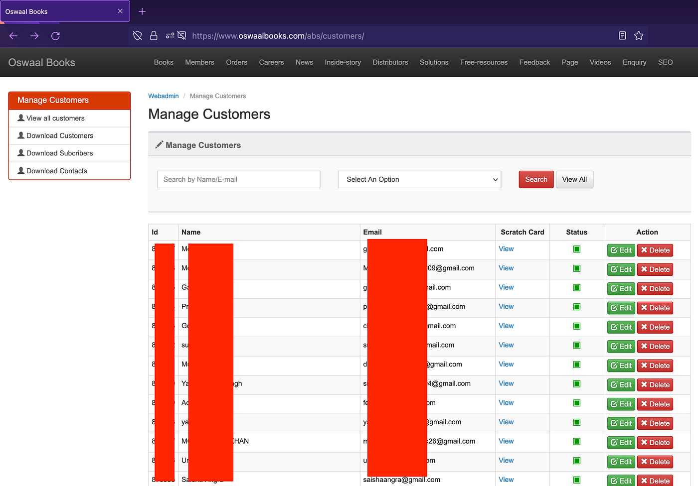


*Customer details*

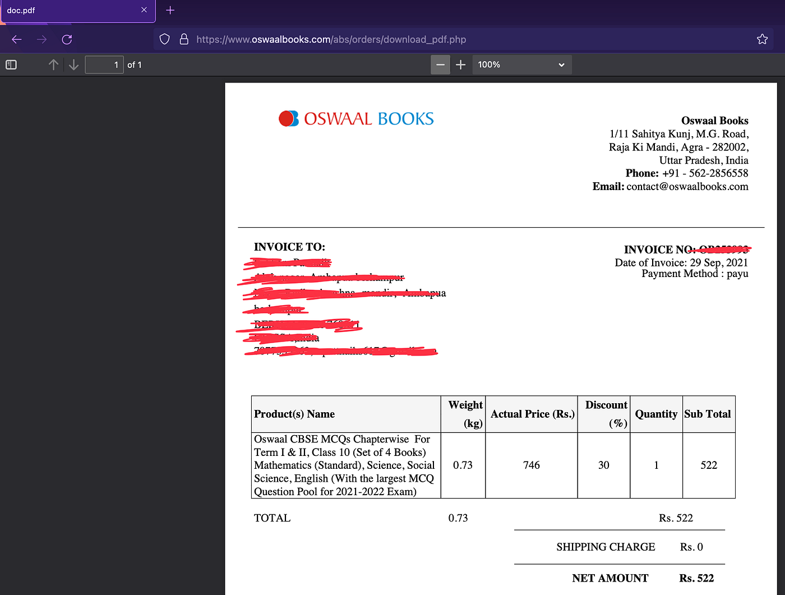


*Ability to tamper with the order*

*Customer Invoice*


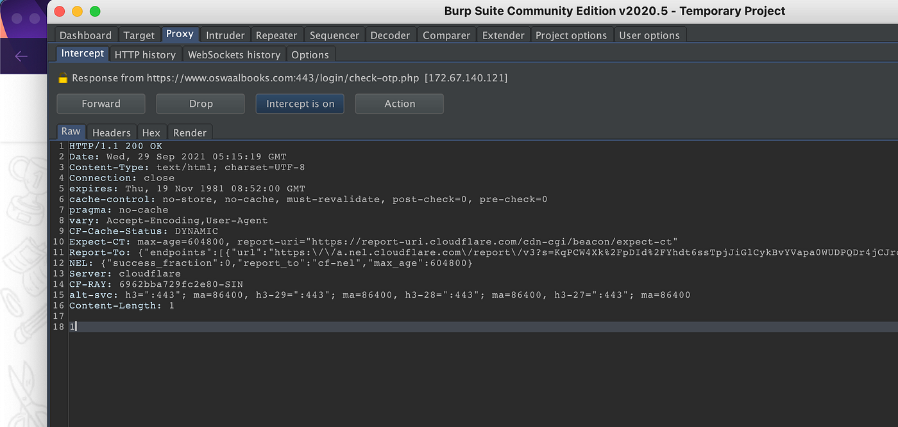
Moving on, getting into the admin panel was could but I wanted to see if I could do more. With all the new functionality I now have a higher chance at something big like an RCE. I explored the panel and navigated to the manage blog section. I chose an old and disabled blog for the test. I went to the edit section and tried tampering with the photo upload section.

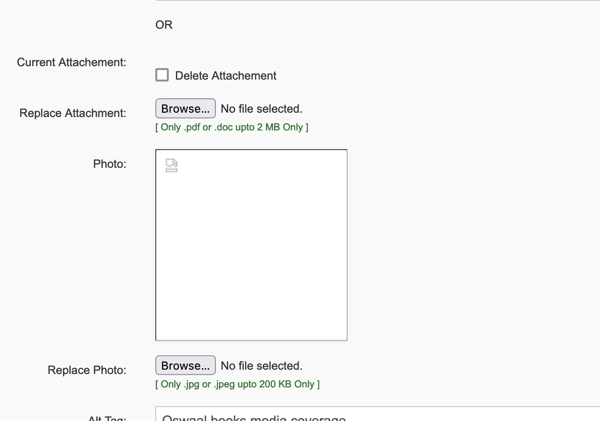


Methodology:

- I first tried uploading a sample photo to see if the file was getting renamed, but it wasn’t(win 1)


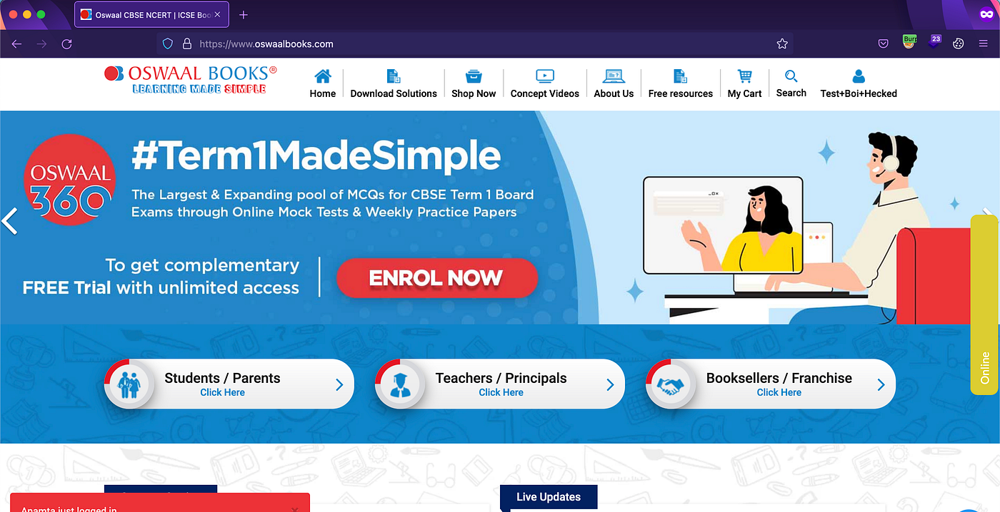
- Tried to see what extensions it accepted(.php, .php5, .php4, .phtml, .php.jpg didn't work)

- Tried to see if the mime type was triggering any alerts.

- Finally changing the extension to ‘.PhP’ did the job

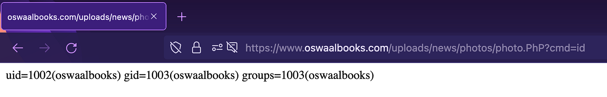


Here we go…

---
