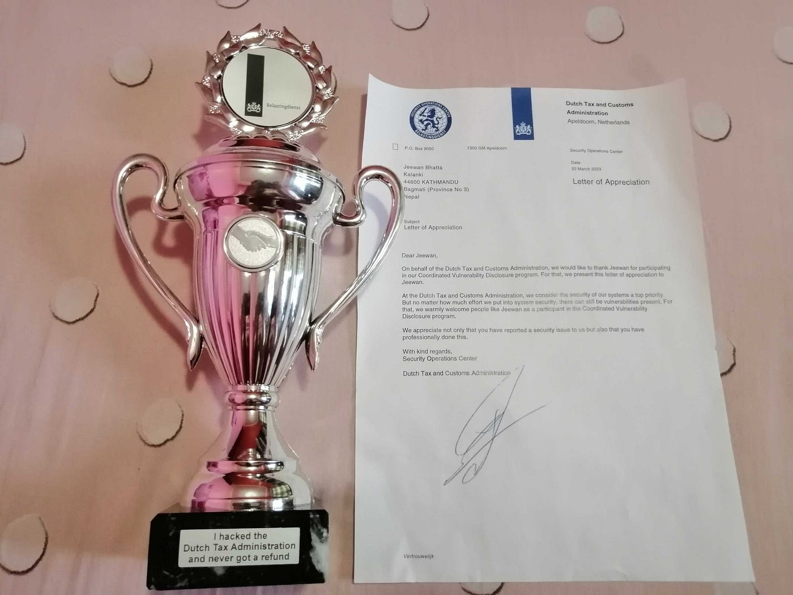
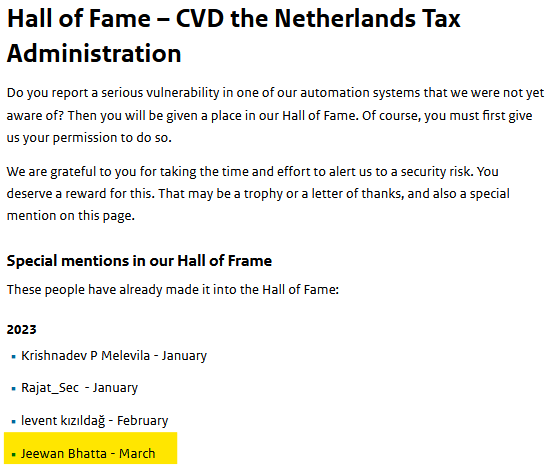
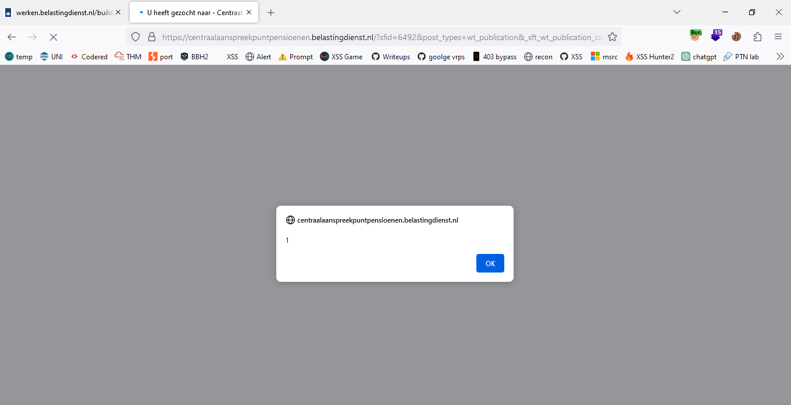

# :globe_with_meridians: How I Stumbled Upon an XSS in Dutch Tax Administration System

---

# How I Stumbled Upon an XSS in Dutch Tax Administration System

*Reward for Coordinated Vulnerability Disclosure (CVD)*

Greetings Everyone. Hope you’re all doing well. In this new article, I will be explaining how I stumbled upon an XSS vulnerability on Dutch Tax and Administration system. I will be explaining about the target, it’s scope and the reward for the Coordinated Vulnerability Disclosure (CVD).

About Dutch tax administration: “The Belastingdienst”, directly translated as “Dutch Tax Administration”, is the department responsible for the assessment and collection of taxes, custom duties and excise duties in the Netherlands. If you report a vulnerability in a Belastingdienst, Toeslagen or Douane system, then your report will be assessed by the security team. You can submit your vulnerability to the team using the mail address: cvd@belastingdienst.nl, cvd@douane.nl and cvd@toeslagen.nl respectively each for the Belastingdienst, Toeslagen or Douane system.

Recon: So, I started my recon with subdomain enumeration using cli tools like subfinder, assetfinder, amass, sublister and online tools like crt.sh, subdomainfinder.c99.nl, virustotal.com, so that I won’t miss any subdomains. Collected around good list of subdomains and passed that list to httpx in order to probe for the live ones. After probing, the total subdomains was almost reduced to half. Then I scanned those subdomains in Nuclei scanner for automatic scanning with the hope of finding low hanging fruits. And here comes the part of manual testing, with burpsuite running behind, I manually started checking each of the subdomains in my browser.

## Get Jeewan Bhatta’s stories in your inbox

Join Medium for free to get updates from this writer.

Remember me for faster sign in

Vulnerability: After checking few subdomains, and looking them one by one in wayback machine, one subdomain had good list of urls with unique parameters in them. So I started checking for any reflection or any SQL error by playing with different parameters. Eventually I found a reflection in the parameter “sft_wt_publication_category” in the url ‘https://centraalaanspreekpuntpensioenen.belastingdienst.nl/?sfid=6492&post_types=wt_publication&_sft_wt_publication_category=va-handreikingen-pensioen-odv-wet-vpb’. Here, the html tags were not being sanitized and was being rendered in the main webpage. So simply I tried with this XSS payload ‘test”>’. But, the reflection was like ‘test”>’ only. Maybe waf doing it’s work. Now I need to find a way to bypass the waf. After testing some tags, I found that using double url encoded payload, the popup would appear in my browser. So the final payload would be “%2522%253E%253Cmarquee%2520onstart%253Dprompt%25281%2529%253E”.

*XSS triggered*

Then, I submitted my issue to the security team using the mail address. After few days, the issue was patched and they rewarded me with a beautiful Trophy, Appreciation letter and Hall of Fame in their [thanks](https://www.belastingdienst.nl/wps/wcm/connect/bldcontenten/standaard_functies/individuals/contact/data-leak-vulnerability-abuse-computer-systems/hall-of-fame-cvd) page.

*Thanks page of Dutch Tax Administration*

So, this is all about how I discovered a reflected XSS on the dutch tax administration system. Thanks for reading till the end. You can also connect with me on [LinkedIn](https://np.linkedin.com/in/jeewanbhatta) & [Twitter](https://x.com/__jeewan_).

---
