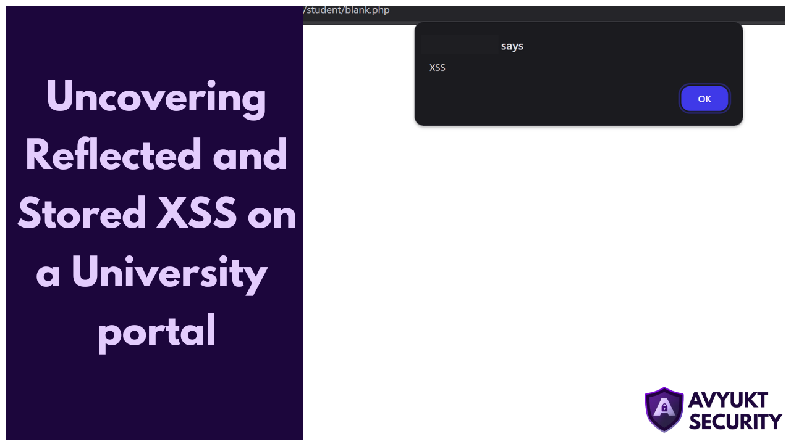
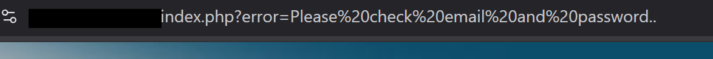
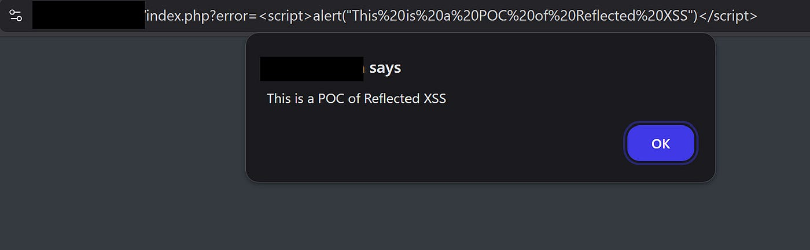
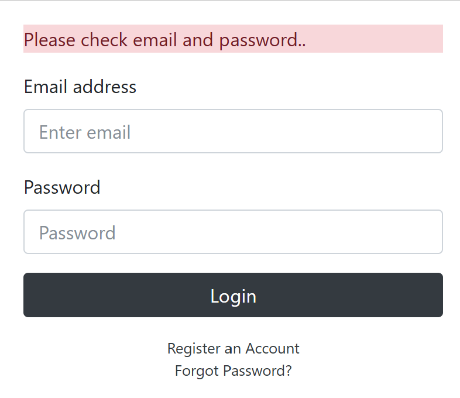
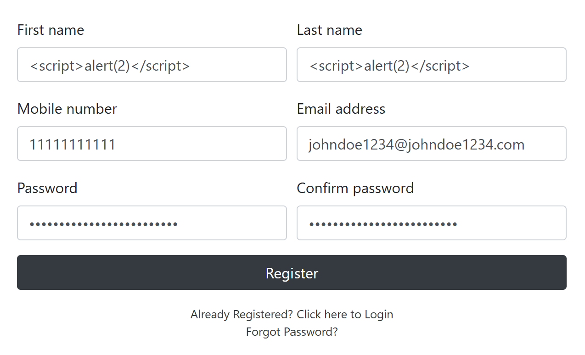
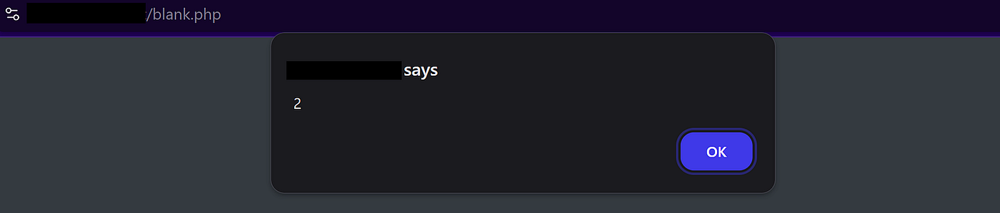
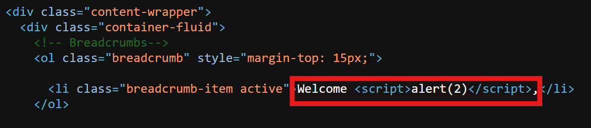

# :globe_with_meridians: How I Uncovered Reflected and Stored XSS on a University Portal

---

# How I Uncovered Reflected and Stored XSS on a University Portal

By: Kavin Jindal



## Get Avyukt Security’s stories in your inbox

Join Medium for free to get updates from this writer.

Remember me for faster sign in

Recently, while exploring the website of an educational institute, I came across a classic yet simple vulnerability of Reflected and Stored-XSS through a user-facing login page. Here’s a detailed breakdown of my methodology to find both the vulnerabilities:

## What is a Cross-Site Scripting (XSS) Vulnerability?

- Cross-site scripting, also known as XSS, is a vulnerability that enables attackers to inject malicious JavaScript code into a web application.

- These types of vulnerabilities occur mainly because a web server asks for user input and without any input sanitization or checks, it reflects that data on the page. It allows attackers to inject malicious JavaScript code into the web application which can be used to chain more complex vulnerabilities and execute attacks such as stealing cookies of a high privileged user or phishing attacks.

- I was able to discover two different types of XSS vulnerabilities on the target site:

- Reflected XSS: Reflected XSS occurs when malicious user input is reflected to that user without any input- sanitization, facilitating in execution of malicious JavaScript on the client side.

- Stored-XSS: As the name suggests, these types of vulnerabilities occur when the web server stores user input (for example, in a database) and is reflected by the user. The root cause here is that the web server doesn’t validate user input before storing it in its database or while reflecting the data on the page. These types of vulnerabilities are especially critical because they expand the attack surface, putting a larger number of website users at risk.

## My Methodology for finding both types of XSS:

## - Reflected XSS in the Student Login Form:

- I ran a very basic web directory scan using [dirb](https://www.kali.org/tools/dirb/)which returned several paths. I ran basic SQLi and XSS payloads on the relevant pages to look for an exploit. Unfortunately, the website had security mechanisms in place to block SQL Injection attacks but interestingly it was vulnerable to XSS payloads.

- After browsing through several pages I came across a student login page that was prone to Reflected XSS via the GET method.




- Basically after using the wrong credentials on the login form an error message popped up which was received from the URL. This seemed interesting and absurd at the same time due to which I had the idea of attempting XSS Injection here which surprisingly worked.




- This only increased my curiosity and I looked for other instances on the website which were vulnerable to XSS and I wondered if I could get access to something more critical and interesting.



## - Stored-XSS via Student Registration Page:

- I opened up the registration page and entered fake credentials hoping that there would be no email or phone validation active. To my guess, there wasn’t and the system only checked for the email regex pattern.




- I used the following JavaScript payload in the Name fields with an invalid phone number and email address.

```
<script>alert(2)</script>
```

- Luckily, the account was successfully registered and I got through the authentication process without any hassle.

- After the registration, I was redirected to an admission portal where students could fill in their details in an application form and make a fee payment. The website was using a secure third-party service for receiving payments hence it had no scope of exploitation. The admission form itself couldn’t be submitted without paying the fee hence that too was out of scope.

- But while browsing through the portal and clicking around on links I found an instance of stored XSS on a random page.




- It basically was an empty page that showed a welcome message with the first name.

- Here as I used the JavaScript payload in the first name field it doesn’t display anything and instead initiates the payload. But upon checking the page source it is visible in the field as follows.




- You can see that the XSS payload isn’t sanitized and is instead treated as a normal scripting element, hence explaining the vulnerability.

## Conclusion

- This was a very easy exploit that explored the XSS web vulnerability. It’s quite surprising to come across such a basic security loophole nowadays in user-facing features on websites. It was a fun learning experience working on this website and sharing my insights with you. I hope you found this write-up informative.

### Happy Hacking!

---
