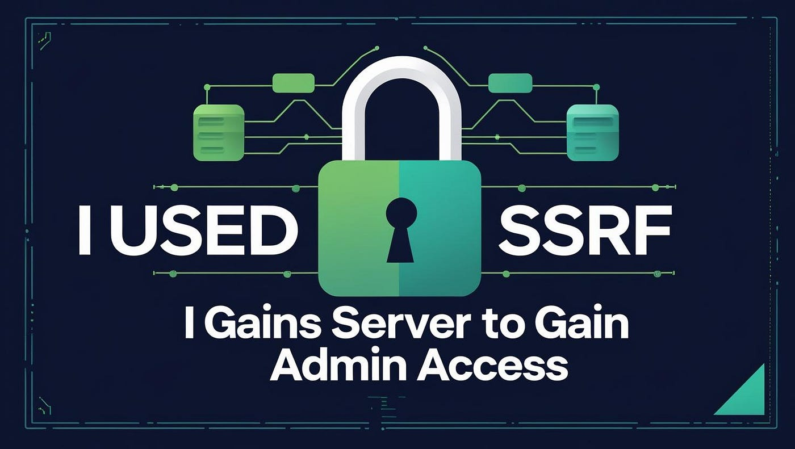

# :globe_with_meridians: 💥 How I Used SSRF to Gain Admin Access: Step-by-Step with Payloads

---

# 💥 How I Used SSRF to Gain Admin Access: Step-by-Step with Payloads

>

*“The admin dashboard was supposed to be internal-only. Until I showed them it wasn’t.”*

It started with a coffee-fueled recon session on a bug bounty target. A relatively simple app with a few features, nothing flashy. But like many modern web platforms, it had microservices and internal routes lurking just beneath the surface.

What I didn’t expect was that a simple URL preview endpoint would become my golden ticket. Using Server-Side Request Forgery (SSRF), I pivoted into the internal network, uncovered an admin panel, and walked away with a high-impact vulnerability disclosure (and a solid bounty).

In this post, I’ll walk you through exactly how I did it:

- The initial discovery

- Step-by-step exploitation

- Real payloads that worked

- Tools I used

- How to protect your apps from SSRF

- And bonus tips to avoid SSRF vulnerabilities

Let’s dive in.

## 🔍 What is SSRF, and Why Is It So Dangerous?

Server-Side Request Forgery (SSRF) occurs when an attacker can make a server send HTTP requests to other systems, either inside or outside its…

---
