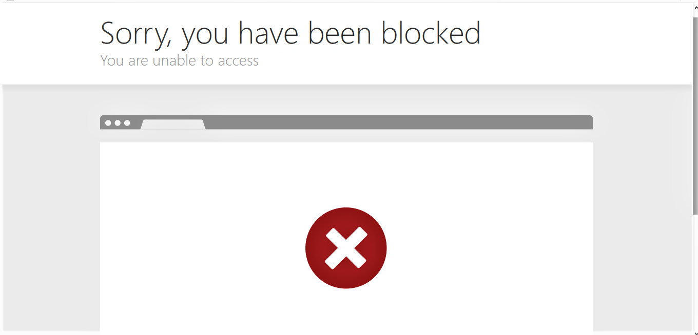
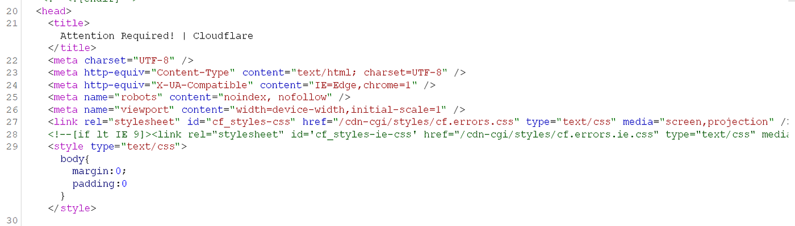
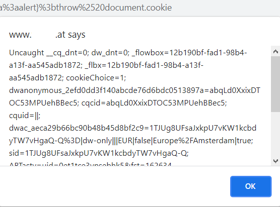

# :globe_with_meridians: How i was able to bypass Cloudflare for XSS!

---

# How i was able to bypass Cloudflare for XSS!

In the name of God.

Hi researchers,

This is my second write-up and if you’ve read my previous one it was about bypassing cloudflare to achieve ssrf , but this time we are going to bypass cloudflare for XSS !

## The Story:

I was working on a program and in login page there was a parameter which was “rurl” , so totally it was about redirecting the user to other locations.

I tried for open redirect and i got successful result’s ! but it marked as duplicate :’(

*:’(*

As we all know , when there is an open redirect vulnerability we can try for xss as it’s been inserted into “href” attribute inside “a” tag.

So i tried my xss payload “javascript:alert(1)” and Again, i got this annonying response :

*Cloudflare everywhere ! :@*

## Bypass Time

One of my favorites way’s to deal with these kind of situations is to try all my assumptions one by one.

## Get hosein vita’s stories in your inbox

Join Medium for free to get updates from this writer.

Remember me for faster sign in

So i tried “javascript:” and looked for these :

- Was the whole JavaScript keyword stripped?

- Was the “:” part stripped?

With this i got 200 response and i moved further for “javascript:alert” :

- Was alert keyword stripped?

- if there is alert(1) parenthesis stripped?

So as we saw our main problem was at parenthesis so i tried to bypass parenthesis with “alert`1`" but still no success there . but there is other techniques like throw.

>

Many filters block parenthesis as they are essential for invoking functions and passing parameters, in case if a filter removes parenthesis in our injected vectors, there are several ways in order to bypass it, let’s take a look at a traditional method where Gareth Heyes found a method to pass arguments to function without using parenthesis by using a throw technique, The throw technique abuses the onerror event handler for assigning a function call once an error has been triggered.

XSS payloads with throw are like this one :

“javascript:window.onerror=alert;throw 1” i tried this payload but again cloudflare caught me.!

So i skip here all of my hard works with trying different payloads with other encoding techniques like “base64” , “UrlEncoding” , “Htmlencoding ” and i give you the Diamond i’ve found .

And in the end here is my payload:

“javascript%3avar{a%3aonerror}%3d{a%3aalert}%3bthrow%2520document.cookie”

*Cloudflare ?*

And Again I :

*^_^*

This is the end , Thank you for reading my article hope you learned something, and wish me to find more bugs like this to share with you ! ❤

My twitter : [https://twitter.com/HoseinVita](https://twitter.com/HoseinVita)

---
