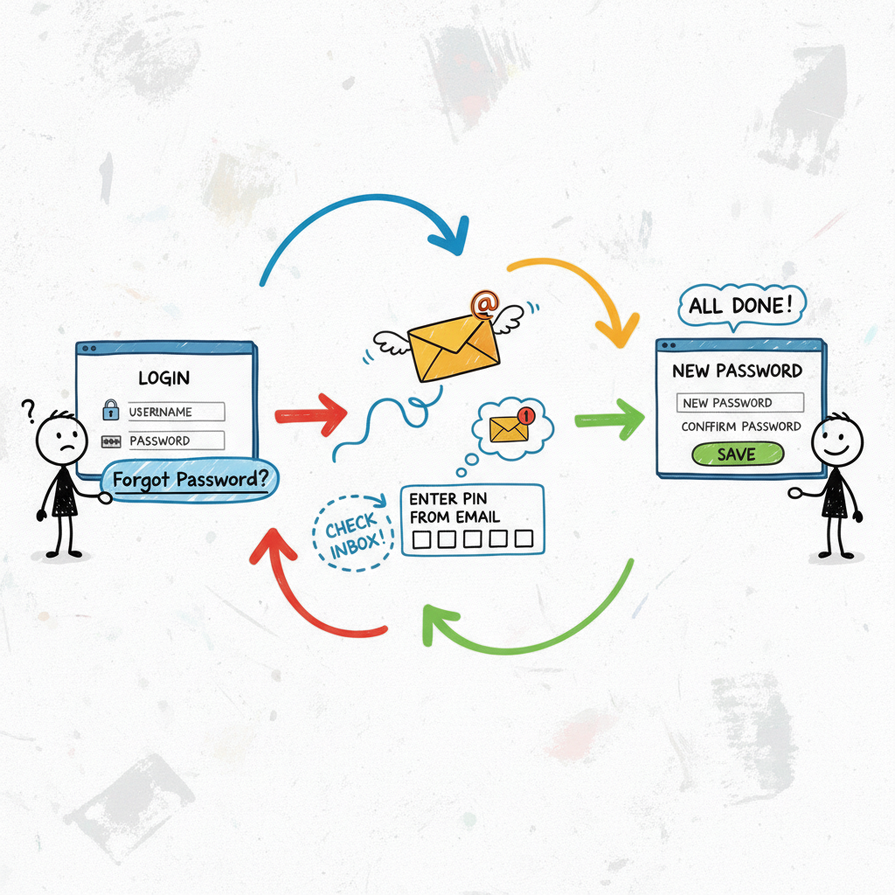

# :globe_with_meridians: 💀 I Hacked Your Account with a 6-Digit PIN: The Brute-Force Nightmare You Need to Fix

---

# 💀 I Hacked Your Account with a 6-Digit PIN: The Brute-Force Nightmare You Need to Fix

>

TL;DR: Your Quick & Dirty Guide

💀 A missing rate limit on a password reset PIN form is a one-way ticket to account takeover. It’s a critical, high-impact vulnerability hiding in plain sight.

🕵️ Attackers can abuse server-side sessions to keep their reset attempt “alive” while they brute-force every possible PIN combination without the token expiring.

🤖 We used Burp Suite’s Intruder to automate this, turning a million guesses into a 15-minute coffee break. It’s shockingly easy.

🛡️ The fix is simple but crucial: Implement strict rate limiting, use CAPTCHA after failed attempts, and make your reset tokens expire quickly. Don’t be the low-hanging fruit!

You know that “Forgot Password” link? The one you’ve clicked a thousand times? It’s often the weakest link in an application’s entire security chain.

We’re about to dive deep into a devastatingly simple attack that turns this helpful feature into a wide-open backdoor. This isn’t theoretical; this is happening right now, and your application could be next. 🤯

Let’s break down how a simple 6-digit PIN becomes the key to the kingdom.

## 🎯 The Setup: A Deceptively…

---
