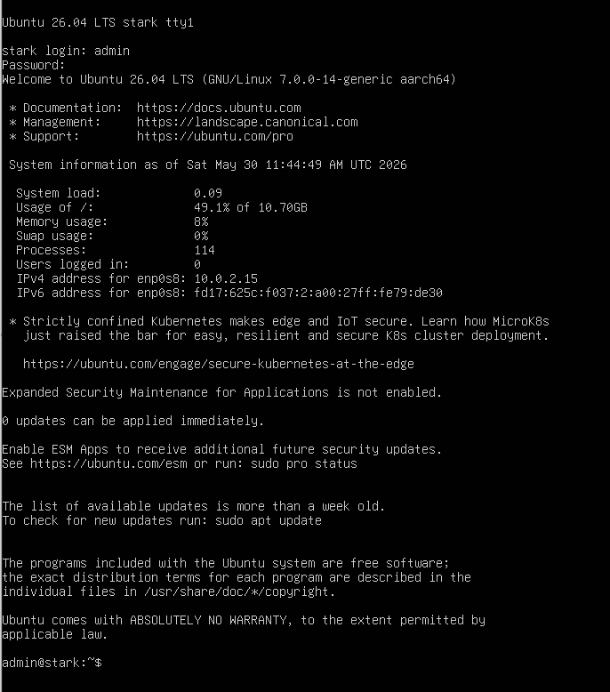

# :globe_with_meridians: I Simulated an SSH Brute-Force Attack on My Ubuntu Server — Here’s How Fail2Ban Stopped It

---

# I Simulated an SSH Brute-Force Attack on My Ubuntu Server — Here’s How Fail2Ban Stopped It

## Building a simple attack lab to understand how Fail2Ban detects and blocks repeated SSH login attempts.

*Photo by [Esther Jiao](https://unsplash.com/@estherrj?utm_source=unsplash&utm_medium=referral&utm_content=creditCopyText) on [Unsplash](https://unsplash.com/photos/gray-blocks-3HqSeexXYpQ?utm_source=unsplash&utm_medium=referral&utm_content=creditCopyText)*

This time, I wanted to simulate the implementation of one of the most common SSH protection mechanisms: Fail2Ban.

I briefly mentioned Fail2Ban in one of my previous articles [ACCESS IT], but I don’t like stopping at theory. I prefer seeing things in action. So instead of just talking about it, let’s put it to the test.

>>> READ FOR FREE <<<

## Setup Lab

For this experiment, I did not use the same lab environment as my penetration testing setup [ACCESS IT]. Instead, I built a simple Ubuntu Server environment and used my own computer as the attacker.

To make administration easier, I accessed the server through SSH. At this point, the server did not have Fail2Ban installed or configured.

## Attacker tool

---
