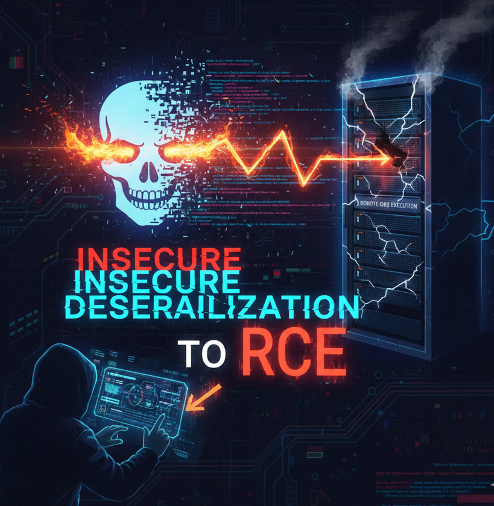

# :globe_with_meridians: Insecure Deserialization → RCE

---

# Insecure Deserialization → RCE

## In this blog, we will discuss insecure deserialization and how we can achieve RCE



## First, what is “serialization”?

Serialization = converting an object into a format that can be:

- > Stored

- > Sent over a network

- > Saved in cookies or sessions

```
Python → pickle

Java → Serializable

PHP → serialize()

.NET → BinaryFormatter
```

```
Example of Serialization data

Python (pickle) – Binary → Base64 (very common)

Original object

{"username": "alex", "role": "user"}

Serialized (pickle → Base64)

gASVJAAAAAAAAAB9lCiMBHVzZXKUjAVhZG1pbpSMBHJvbGWUjAR1c2VylHUu
```

This is stored in the cookies, and the reverse process is called deserialization.

## How does insecure deserialization occur?

```
Serialization data
{"username": "alex", "role": "user"}

Modified Serialization data by attacker which is now insecure
{"username": "alex", "role": "admin"}

insecure deserialization data
gASVJwAAAAAAAAB9lCiMBHVzZXKUjANyYWqUjARyb2xllIwEdXNlcpR1Lg==

Which leads to privilage esclation from normaluser -> admin
```

---
