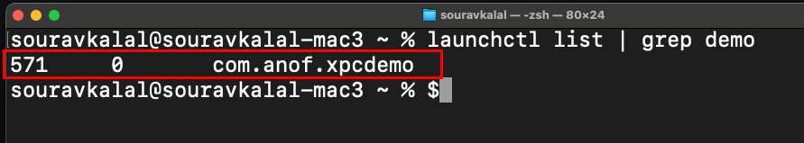
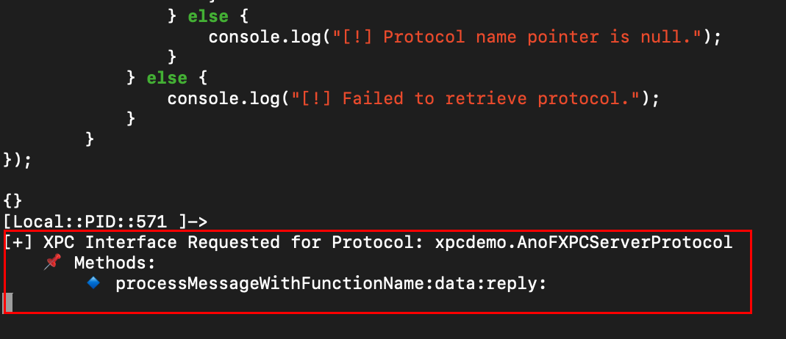
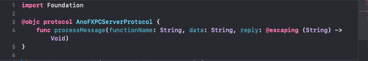
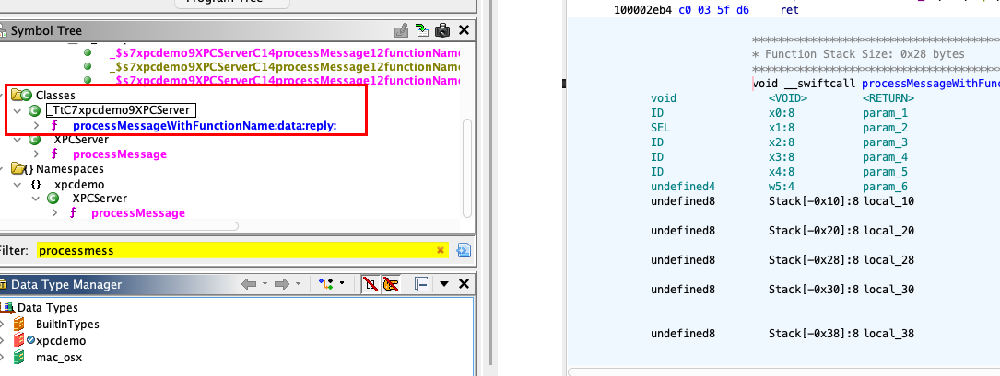
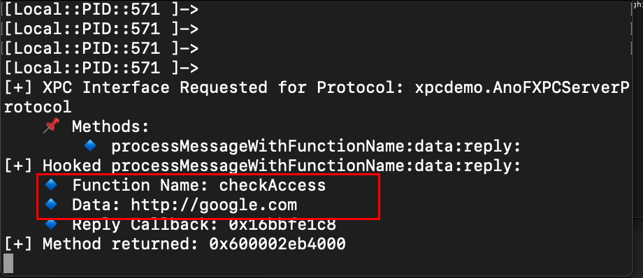

# :globe_with_meridians: Intercepting MacOS XPC. Intercepting XPC Messages With Frida

---

While I was exploring XPC in the macOS application, I noticed some changes in the Apple opcodes, particularly targeting the newer ARM architecture of macOS. Previously, macOS was using Intel x64, but in the last 3–5 years.

Apple has transitioned to M1, M2, and other ARM-based technologies. As a result, Apple has made certain changes to the opcode for the APIs. I haven’t examined the specifics of these changes, but the issue is that the methods commonly used to dump XPC details — such as methods or protocol interfaces — are not functioning properly, especially with popular tools like class-dump.

There is another tool that I discovered through research, and it offers extensive details while working with both newer and older binary versions as well.

This tool operates effectively. In most blogs and videos I’ve come across, class-dump is commonly used, but the IPSW tool provides similar and often superior output. However, the drawback of this method is that it relies on static analysis of the IPC. To identify XPC vulnerabilities, we need to conduct static analysis on multiple components.

Some parts should be analyzed dynamically, especially to determine which XPC methods are used by the application and to observe the data being sent and received. It is similar to monitoring the requests and responses between the XPC server and the client in real time. To achieve this, we should combine static analysis with Ghidra or Hopper and dynamic analysis with Frida.

### Intercepting XPC With Frida

I have built a small application in Swift that exposes one XPC interface. Let's see if my application XPC is running or not.




*XPC Application*

The demo XPC is currently running on PID 571. I also have a client application that will make XPC requests to the `com.anof.xpcdemo` service. Our goal is to intercept the XPC requests exchanged between the client and server. To achieve this, we will attach Frida to the XPC server running on PID 571 using the command: `frida -p 571`.

When an application defines the XPC service, it is supposed to define the method or function along with the protocol.

```
@objc protocol XPCServiceProtocol {
func sendMessage(_ message: String, withReply reply: @escaping (String) -> Void)
}
```

To send data from a client application, it is essential to use the correct format in the code to communicate with the XPC. We must clarify which protocol or interface is being used, the functions within that protocol, and the arguments they accept.

In the example provided, if the XPC server application defines these parameters, we must mirror them in our exploit application. This ensures that we send the correct data otherwise, the application will reject the XPC request, resulting in an invalid request or interface error.

We get these details from reverse engineering the application but not the actual data. I have attached Frida to the XPC server application, I have created a Frida script that tries to show the XPC method and protocol details every time the XPC server gets an XPC request.

```
var objc_getProtocol = new NativeFunction(Module.findExportByName(null, "objc_getProtocol"), "pointer", ["pointer"]);
var protocol_getName = new NativeFunction(Module.findExportByName(null, "protocol_getName"), "pointer", ["pointer"]);
var protocol_copyMethodDescriptionList = new NativeFunction(Module.findExportByName(null, "protocol_copyMethodDescriptionList"), "pointer", ["pointer", "bool", "bool", "pointer"]);
var free = new NativeFunction(Module.findExportByName(null, "free"), "void", ["pointer"]);

Interceptor.attach(
ObjC.classes.NSXPCInterface["+ interfaceWithProtocol:"].implementation, {
onEnter: function (args) {
var proto = args[2];

if (!proto.isNull()) {
var protoNamePtr = protocol_getName(proto);
if (!protoNamePtr.isNull()) {
var protoName = protoNamePtr.readUtf8String();
console.log("\n[+] XPC Interface Requested for Protocol: " + protoName);

// protocol method descriptions
var outCount = Memory.alloc(Process.pointerSize);
var methodList = protocol_copyMethodDescriptionList(proto, 1, 1, outCount);
var count = outCount.readUInt();

console.log(" 📌 Methods: ");
for (var i = 0; i < count; i++) {
var methodDesc = methodList.add(i * Process.pointerSize * 2);
var sel = methodDesc.readPointer();
if (!sel.isNull()) {
console.log(" 🔹 " + ObjC.selectorAsString(sel));
}
}

if (!methodList.isNull()) {
free(methodList);
}
} else {
console.log("[!] Protocol name pointer is null.");
}
} else {
console.log("[!] Failed to retrieve protocol.");
}
}
});
```

The script tries to hook into the `NSXPCInterface` class, which is used to define the XPC interface.




*XPC Protocol*

Using the Frida script, we can capture the protocol and method whenever an application receives an XPC connection request. This is helpful because a single application can have multiple XPC protocols or functions within one protocol.

## Get Sourav Kalal’s stories in your inbox

Join Medium for free to get updates from this writer.

Remember me for faster sign in

Additionally, some applications may have methods with unclear names, making it difficult to ascertain their purpose through static analysis. By using Frida, we can interact with the application normally and track which actions trigger XPC connections, helping to clarify their functions.

In the output, we find details such as the interface protocol name, `AnoFXPCServerProtocol`, along with the method name `processMessage`. Within this method, we see `WithFunctionName:data:reply`, which clarifies that the application takes three main arguments: `FunctionName` and `data` are the input arguments, while `reply` indicates that the XPC server will return a reply message.




*Demo Application XPC Interface Source Code*

If we look at the actual source code of the XPC server application, we can confirm that the same method and protocol are used.

We now know `processMessage` is the function we need to call in order to exploit XPC, but it takes 2 arguments. From the security point of view, we can do fuzzing to see unexpected behaviours of the application based on the user input. That is a different case, we want to look at the actual data XPC server and Client share with each data.

To look at the data have to hook into the function; in this case, it's `processMessage `If we load the binary into Ghidra, we can see its parts `_TtC7xpcdemo9XPCServer` class




*XPC Class*

Let's update the Frida script to see what data is sent with XPC.

```
if (ObjC.available) {
var XpcServiceClass = ObjC.classes["_TtC7xpcdemo9XPCServer"];

if (XpcServiceClass && XpcServiceClass["- processMessageWithFunctionName:data:reply:"]) {
console.log("[+] Found method: - processMessageWithFunctionName:data:reply:");

Interceptor.attach(XpcServiceClass["- processMessageWithFunctionName:data:reply:"].implementation, {
onEnter: function(args) {
try {
var functionName = ObjC.Object(args[2]).toString();
var data = ObjC.Object(args[3]).toString(); /
var replyCallback = args[4];

console.log("[+] Hooked processMessageWithFunctionName:data:reply:");
console.log(" 🔹 Function Name: " + functionName);
console.log(" 🔹 Data: " + data);
console.log(" 🔹 Reply Callback: " + replyCallback);
} catch (e) {
console.log("[!] Error extracting arguments: " + e);
}
},
onLeave: function(retval) {
console.log("[+] Method returned: " + retval);
}
});
} else {
console.log("[-] Failed to find method - processMessageWithFunctionName:data:reply:");
}
} else {
console.log("[-] Objective-C Runtime not available.");
}
```

Now, if we run the above Frida script and send the XPC request from the XPC client, we can see what data is there.




*XPC Data*

This method, using Frida, allows us to reduce the amount of static analysis needed. Although we still need to conduct a significant amount of static analysis to exploit vulnerabilities in XPC, using Frida simplifies some initial steps.

This discussion pertains to various vulnerabilities. Typically, an application that allows user interaction, like a UI application, exists alongside another application binary that runs the XPC server. The UI application primarily sends XPC requests. To exploit the vulnerabilities in the XPC, we need to create an exploit that directly sends XPC requests to the vulnerable application. However, we must first gather information about the interface method and the data required to connect to the vulnerable XPC server.

By hooking into the XPC server application, we can perform actions on the UI application that will send XPC requests to the server. This allows us to observe the transmitted data and understand how it is sent. Although there are different methods to achieve this, using Frida provides us with more detailed insights.

Based on these details, we can create a simple XPC client application as an attacker to send an XPC connection.

```
import Foundation

@objc protocol AnoFXPCServerProtocol {
func processMessage(functionName: String, data: String, reply: @escaping (String) -> Void)
}

class XPCDemoClient {
private let serviceName = "com.anof.xpcdemo"
private var connection: NSXPCConnection?

func checkAccess(host: String, completion: @escaping (String?, Error?) -> Void) {
if connection == nil {
connection = NSXPCConnection(machServiceName: serviceName)
connection?.remoteObjectInterface = NSXPCInterface(with: AnoFXPCServerProtocol.self)
connection?.resume()
}

guard let proxy = connection?.remoteObjectProxyWithErrorHandler({ error in
completion(nil, error)
}) as? AnoFXPCServerProtocol else {
completion(nil, NSError(domain: "XPCDemoClient", code: -1, userInfo: [NSLocalizedDescriptionKey: "Failed to connect to XPC service"]))
return
}

proxy.processMessage(functionName: "checkAccess", data: host) { response in
if response.lowercased().contains("error") {
completion(nil, NSError(domain: "XPCDemoServer", code: -2, userInfo: [NSLocalizedDescriptionKey: response]))
} else {
completion(response, nil)
}
}
}

deinit {
connection?.invalidate()
}
}

let client = XPCDemoClient()
let hostToPing = "http://google.com"

client.checkAccess(host: hostToPing) { response, error in
if let error = error {
print("Error: \(error.localizedDescription)")
exit(1)
}

if let response = response {
print("Ping results for \(hostToPing):")
print(response)
}

exit(0)
}

RunLoop.main.run()
```

---
