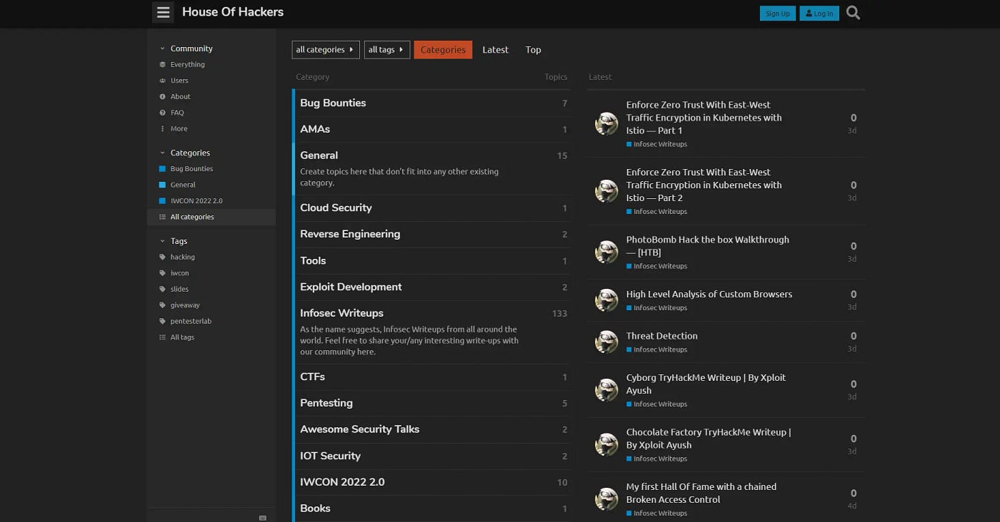

# :globe_with_meridians: Iw Weekly 45 Rce In Avaya Aura Device Services Bypass Sign Up Pages Jwt Hacking 

---

*That’s all for this week. Hope you enjoyed these incredible finds and learned something new from today’s newsletter. Meet you again next week hacker, until then keep pushing 💪This newsletter would not have been made possible without our amazing ambassadors.Resource contribution by:*[Nikhil A Memane,](https://twitter.com/NikhilMemane09)[Bhavesh Harmalkar](https://twitter.com/bhavesharmalkar)*, *[Mohit Khemchandani](https://twitter.com/mohitkchandani)*, *[Tuhin Bose](https://twitter.com/tuhin1729_)*,*[Manan](https://twitter.com/0xManan)*, *[Alvin](https://twitter.com/Steiner254)* and *[Nithin R](https://twitter.com/thebinarybot)*.Newsletter formatting by:*[Ayush Singh](http://twitter.com/AyushSingh1098)*, *[Hardik Singh](https://twitter.com/Kxddah?t=_Ghby7u5rNBfUxzzjEZUUw&s=09), [Siddharth](https://twitter.com/illucist_)* and *[Nithin R](https://twitter.com/thebinarybot)*.Lots of love
Editorial team,
*[Infosec Writeups](https://infosecwriteups.com/)

>

📧*If you have questions, comments, or feedback reach out to us on Twitter *[@InfoSecComm](https://twitter.com/InfoSecComm)* or email *nithin@infosecwriteups.com

---
