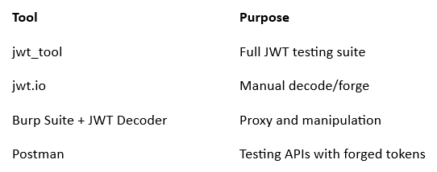

# :globe_with_meridians: 🔐 JWT Pentesting: A Journey from Token to Takeover

---

## Introduction

JWTs (JSON Web Tokens) are everywhere. They’re the backbone of modern authentication systems — lightweight, stateless, and compact. But with simplicity comes responsibility. A misconfigured JWT can lead to privilege escalation, unauthorized access, and even full account takeovers.

## Get Shah kaif’s stories in your inbox

Join Medium for free to get updates from this writer.

Remember me for faster sign in

This post walks you through the pentesting lifecycle of a JWT, from recon to exploitation, in a hands-on, beginner-to-advanced format.

---
