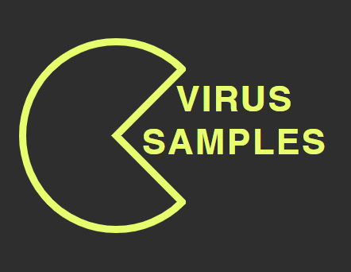
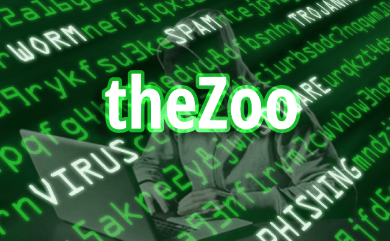

# :globe_with_meridians: Malware Sample Sources — New & Maintained

---

# Malware Sample Sources — New & Maintained

What is malware?

Malware is an abbreviated form of malicious software. This is software that is specifically designed to gain access to or damage a computer, usually without the knowledge of the owner. There are various types of malware including adware, backdoor, spyware, ransomware, trojan, worms and any type of malicious code that infiltrates a computer.

Why do researchers need malware samples?

Malware researchers continually inquire about up-to-date malware samples to analyze in order to learn, train or develop new threat techniques and defenses. Although it isn’t easy to find new and maintained malware samples all the time, there are many sources that involve malware but most of them are old and out-dated.

Where to find malware samples?

There are free sources that allow you to download malware samples directly or after registration, and some require you to contact the owner to set up an account.

Some sources have both free and paid versions, and you can access more data with a paid account, unlike a free account with daily download limits.

Please remember that these sources contain live malware and could damage your system. Be careful not to infect yourself when accessing and experimenting with malicious software DO NOT run them unless you are absolutely sure of what you are doing! Working on a virtual machine environment is suggested due to the fact that there is the possibility of your device gets infected.

## VirusSamples

VirusSamples claims that “We give you the best of the worst kind of files on the Internet.” They supply required data to the SOCs, teams, enterprises, and security researchers to better detect and fight malware, viruses, and other trojans found across the web and lurking in the various corners of the Internet.

VirusSamples requires you to contact the owner to set up an account. They provide both free feed with limited access (1000 samples/day) and enterprise feed (150K+ samples/day) to their 1 PetaByte database.

Malware is accessible by sorted categories such as Windows, Mac and APT malware, malicious scripts, Linux executables, Hijacked Webcode and PE Binaries. Also, there is a Github page that has free samples you can test without registration.

[https://github.com/MalwareSamples](https://github.com/MalwareSamples)/

[https://virussamples.com/](https://virusshare.com/)

## VirusShare

VirusShare is a service hosted and maintained by Corvus Forensics. It is a repository of malware samples to provide security researchers, incident responders, forensic analysts, and morbidly curious access to samples of live malicious code. Access to the site is granted by invitation only. To request to be added to the list, the host of the VirusShare needs to be emailed.

VirusShare has a torrent tracker serving up packages of malware packaged in the order they were received and indexed on the system. All samples are delivered in password-protected zip-files for safety. The password for all zip-compressed malware samples is “infected”.

[https://virusshare.com/](https://virusshare.com/)

## VirusSign

VirusSign offers a huge collection of high-quality malware samples, it is a valuable resource for cybersecurity, anti-malware and threat intelligence institutions. They are servicing two collections and a system such as; MalwareList, AndroidList, and Automated Malware Analysis System (VSAMAS).

## Get Buket’s stories in your inbox

Join Medium for free to get updates from this writer.

Remember me for faster sign in

— MalwareList contains computer malware samples (for PC) except Android.

— AndroidList is a collection of mobile samples, it includes Android, Mac and Java samples.

— Automated Malware Analysis System (VSAMAS) is based on AI, Virtual Machine and Behavior Analyzing independently identifies unknown malware without any third-party scanners or cloud supports. It has the ability to analyze programs about 20,000/day/PC.

According to varying privileges such as accessible volume, download resuming, multi-thread download, and bandwidth, offering accounts are Free (500 samples/day), Premium (10,000 samples/day), and Professional (200,000 samples/day).

[https://virussign.com/](https://virussign.com/)

## MalwareBazaar

MalwareBazaar is a project operated by abuse.ch. The project’s goal is to gather and exchange malware samples in order to assist IT security researchers and threat analysts in defending their constituents and consumers from cyber threats. MalwareBazaar has over 280,000 samples in its database. Most seen malware families associated with malware samples on MalwareBazaar are Heodo, Quakbot, AgentTesla and CobaltStrike.

[https://bazaar.abuse.ch/](https://bazaar.abuse.ch/)

## MalShare

The MalShare Project is a collaborative effort to create a community-driven public malware repository that works to build additional tools to benefit the security community at large. Their free malware repository provides researchers access to samples, malicious feeds, and Yara results. They offer free public API keys. Standard keys allow 2000 API calls per day (including downloading samples, details lookup, and search). If you require more, you should contact the administrator for further assistance.

[https://malshare.com](https://malshare.com/)

## theZoo

theZoo is a project created to make the possibility of malware analysis open and available to the public. theZoo’s purpose is to allow the study of malware and enable people who are interested in malware analysis to have access to live malware, analyze the ways they operate, and maybe even enable advanced and savvy people to block specific malware within their own environment.

[https://github.com/ytisf/theZoo](https://github.com/ytisf/theZoo)

## Malware Archive

This repository is intended to provide access to a wide variety of malicious files and other artifacts. It contains binaries, maldocs, memory dumps and malware analysis exercises.

[https://github.com/jstrosch/malware-samples](https://github.com/jstrosch/malware-samples)

REFERENCESBuket Gençaydın

---
