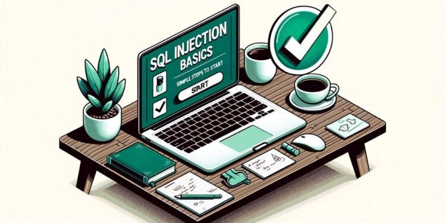

# :globe_with_meridians: Mastering SQL Injection on DVWA Low Security with Burp Suite: A Comprehensive Guide — StackZero

---

# Mastering SQL Injection on DVWA Low Security with Burp Suite: A Comprehensive Guide — StackZero

>

This article was originally published in its entirety at [https://www.stackzero.net/dvwa-sql-injection-low-burp/](https://www.stackzero.net/dvwa-sql-injection-low-burp/)

In prior tutorials, we delved deep into manual SQL injection techniques, laying a solid foundation for understanding its complexities. Now, we’re advancing to real-world cybersecurity scenarios where tools play a pivotal role in enhancing our efforts. This guide focuses on the integration of “SQL injection DVWA low security with Burp Suite.” We’ll examine how to effectively use Burp Suite for SQL injection, familiarize ourselves with its key features, and harmoniously merge it with DVWA. Although tools like Burp Suite are instrumental, having manual skills is crucial for situations where automated tools may not suffice. By the article’s conclusion, readers will be proficient in using Burp Suite for SQL injections on DVWA and will recognize the importance of balancing manual skills with tool-assisted proficiency. Dive into this informative exploration with us.

Here is the list of all the articles about SQL injection for quick navigation:

## In-Band SQL injection

---
