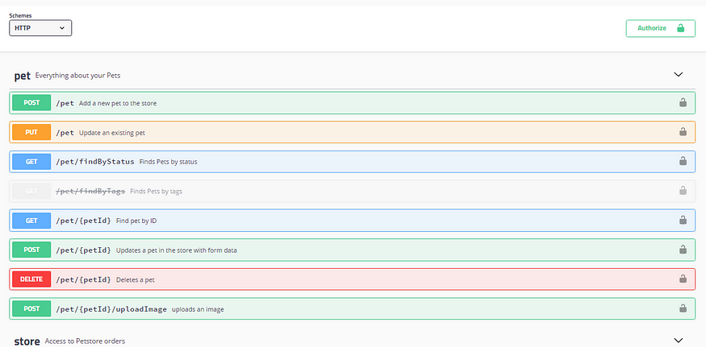

# :globe_with_meridians: Exploiting Swagger UI XSS in Mercedes-Benz API

---

# API Hacking on Mercedes-Benz

Read Freeeee….eee…👈


*Mercedes-Benz*

## Yo!!

After spending a long time hunting bugs on Paytm, I honestly started feeling a bit bored. So, I decided to switch things up and randomly picked a new target — Mercedes-Benz — without even checking their vulnerability disclosure policy at first. 😅

And just like that, a new journey began…

## Recon Begins

I kicked off with some recon. While hunting for subdomains, I started with a few Google Dorks and found an interesting one that was using Swagger UI:

```
https://subs.mercedes-benz.com/



```

*Swagger-UI Demo Page*

Swagger UI is something I’ve explored quite a bit in the past. If you’ve read my previous write-up about Paytm, you already know what payload I like to try first. 😉

So naturally, I tested one of my go-to payloads:

```
https://subs.mercedes-benz.com/?configU…
```

---
