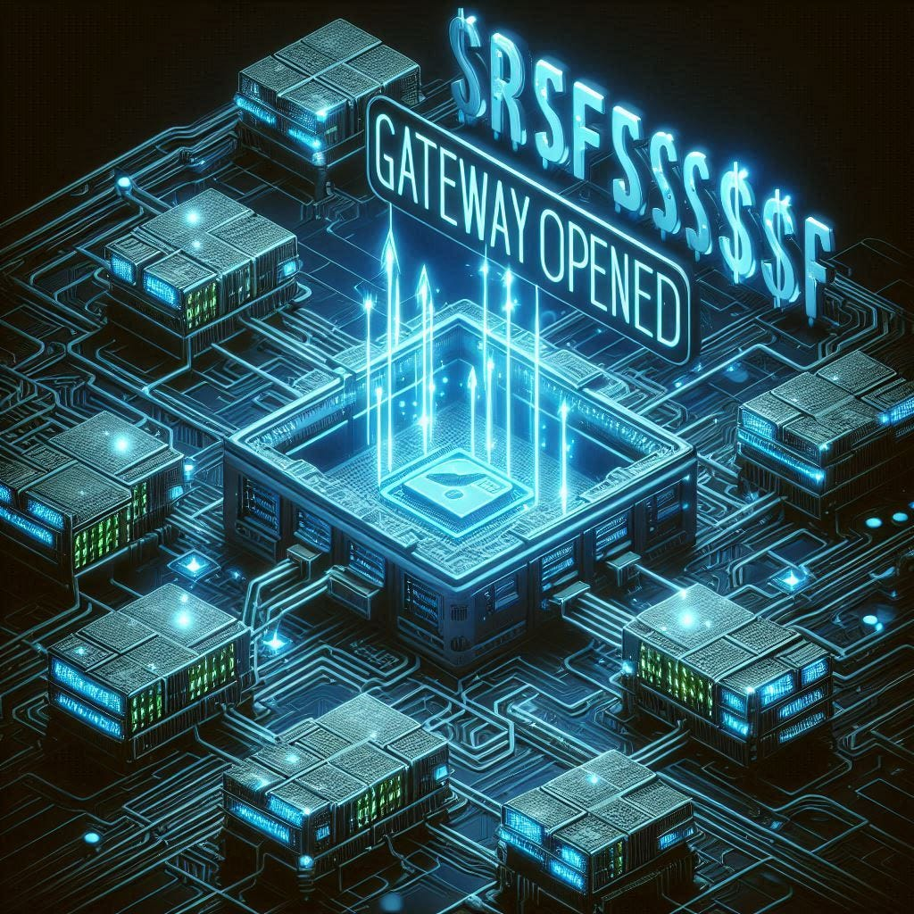

# :globe_with_meridians: 🚰 Not Just a Ping: How SSRF Opened the Gateway to Internal Secrets 🔓🧠

---

# 🚰 Not Just a Ping: How SSRF Opened the Gateway to Internal Secrets 🔓🧠

Free Link🎈



Hey there!😁

*Image by Copilot*

You know that feeling when you poke something *just a little*, and the whole thing falls apart like a Jenga tower?
That’s what this SSRF bug felt like. One small ping… BOOM — internal secrets, cloud keys, and money raining down. 💸😂

If curiosity killed the cat, thank god I’m a hacker, not a cat. 🐱‍💻

Grab your coffee ☕ — here’s the full story of how I *accidentally* became an internal server’s best friend. 🧑‍🤝‍🧑

## 🔍 Phase 1: Recon Recon Recon — The Dating App for Bug Hunters ❤️

I was doing what all serious bounty hunters do:
Mass recon while binge-watching Netflix in the background. 🎬

Here’s how I started:

```
subfinder -d target.com -silent > subs.txt
httpx -l subs.txt -mc 200,302 -title -tech-detect -vhost > live.txt
nuclei -l live.txt -t ssrf -severity high,critical
```

---
