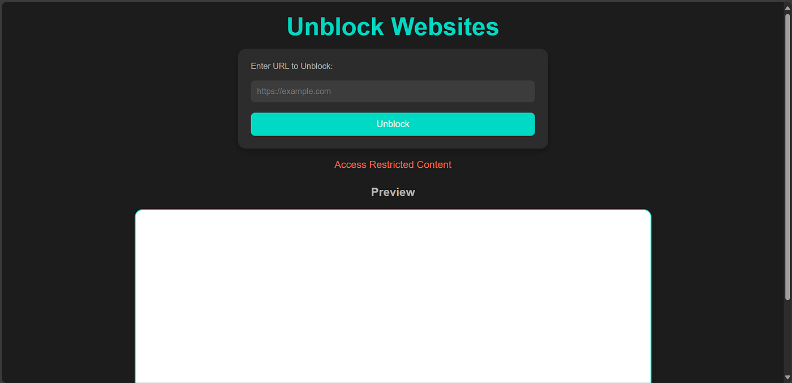
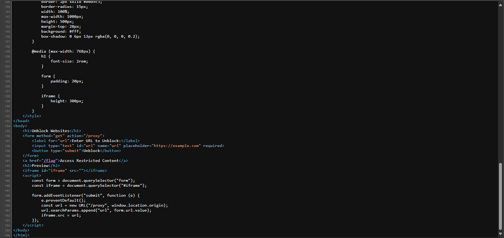
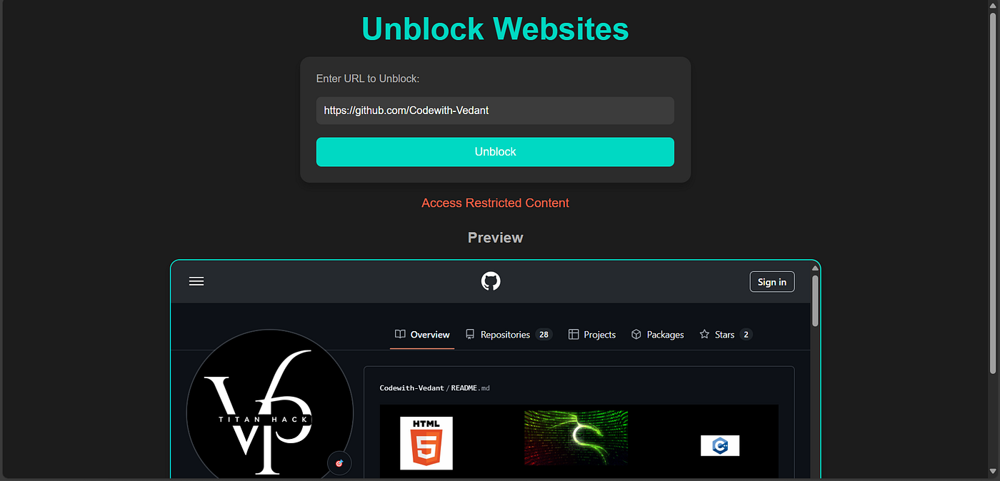
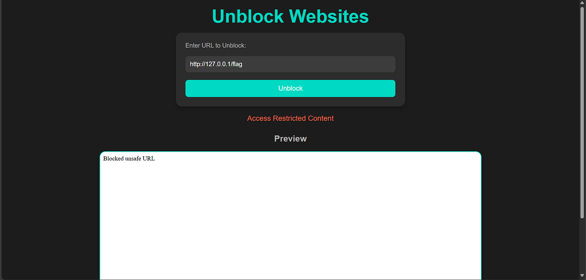
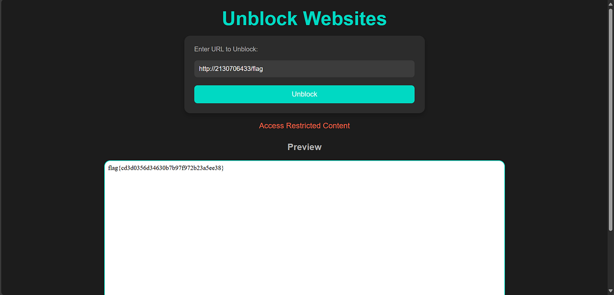

# :globe_with_meridians: Pentathon 2025 Web Challenge - Unblocker

---

# Pentathon 2025 Web Challenge — Unblocker

Challenge Name: Unblocker
Difficulty: Easy
Description: Need to access a blocked website? Use our unblocker to access it!




*Unblocker website*

The first web challenge of Pentathon 2025 was the Unblocker. This site loads a proxied webpage inside the iframe based on user input from a form.




*Source code*

I first decided to test the functionality of the website using a normal URL and see how this works.




*Loading my GitHub page*

The first thing that came in my mind was that this website might be vulnerable to SSRF. So, I tried to access the flag using the following payload:

```
http://127.0.0.1/flag



```

But it got blocked!!

*SSRF Blocked😢*

So, I decided to try for other SSRF payloads believing that they might be using some blacklist to block the localhost payloads.

## Get Vedant Pillai’s stories in your inbox

Join Medium for free to get updates from this writer.

Remember me for faster sign in

[PayloadsAllTheThings/Server Side Request Forgery/README.md at master · swisskyrepo/PayloadsAllTheThings](https://github.com/swisskyrepo/PayloadsAllTheThings/blob/master/Server%20Side%20Request%20Forgery/README.md)

I used the payloads in the above github repository. After trying a few I got a hit.




```
Payload: http://2130706433/flag
```

*SSRF exploited!😁*

It seems the website didn’t check for [Encoded IP Address payloads](https://github.com/swisskyrepo/PayloadsAllTheThings/blob/master/Server%20Side%20Request%20Forgery/README.md#bypass-using-an-encoded-ip-address)

And the flag is found successfully!!

```
FINAL FLAG: flag{cd3d0356d34630b7b97f972b23a5ee38}
```

Let’s connect:

Linkedin: [Vedant Pillai | LinkedIn](https://www.linkedin.com/in/vedant0701/)

Github: [Codewith-Vedant (Vedant Pillai)](https://github.com/Codewith-Vedant)

---
