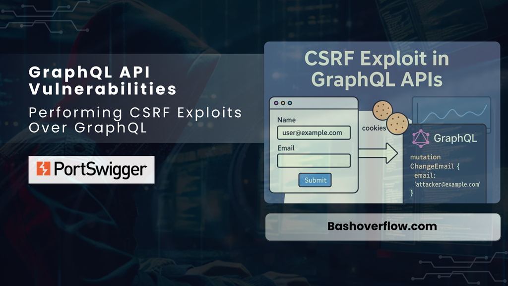

# :globe_with_meridians: Performing CSRF Exploits Over GraphQL

---

# Performing CSRF Exploits Over GraphQL

Exploiting CSRF in GraphQL Endpoints.

🔓 [Free Link](https://bashoverflow.com/d6e1165d44dd?sk=5aa0d67240d367df1d6e5ab6cd567f05)

*Performing CSRF Exploits Over GraphQL*

>

Disclaimer:
The techniques described in this document are intended solely for ethical use and educational purposes. Unauthorized use of these methods outside approved environments is strictly prohibited, as it is illegal, unethical, and may lead to severe consequences.

It is crucial to act responsibly, comply with all applicable laws, and adhere to established ethical guidelines. Any activity that exploits security vulnerabilities or compromises the safety, privacy, or integrity of others is strictly forbidden.

## Table of Contents

- Summary of the Vulnerability

- Steps to Reproduce & Proof of Concept (PoC)

- Impact

## Summary of the Vulnerability

The lab demonstrates a CSRF vulnerability in a GraphQL-based user management system. Unlike traditional RESTful endpoints, this GraphQL endpoint is configured to accept `application/x-www-form-urlencoded` content types. This setup creates a potential security flaw: browsers automatically attach cookies to requests with this content type, even if the request originates from an external website.

---
