# Attack Path Diagrams
{: .fs-9 }

Visual flowcharts mapping the complete attack chain for 30 popular Hack The Box machines, from initial reconnaissance to root/SYSTEM.
{: .fs-6 .fw-300 }

---

## How to Read These Diagrams

Each diagram traces the full exploitation path for a machine using a top-down flowchart. The color coding indicates the phase of the attack:

- **Green nodes** - Reconnaissance and enumeration
- **Orange nodes** - Initial access / foothold
- **Blue nodes** - Post-exploitation and lateral movement
- **Red nodes** - Privilege escalation
- **Purple nodes** - Root or SYSTEM achieved

Nodes include specific tools, CVEs, credentials, and techniques used at each step. Arrows show the logical progression from one phase to the next.

---

## Easy Machines

### Lame

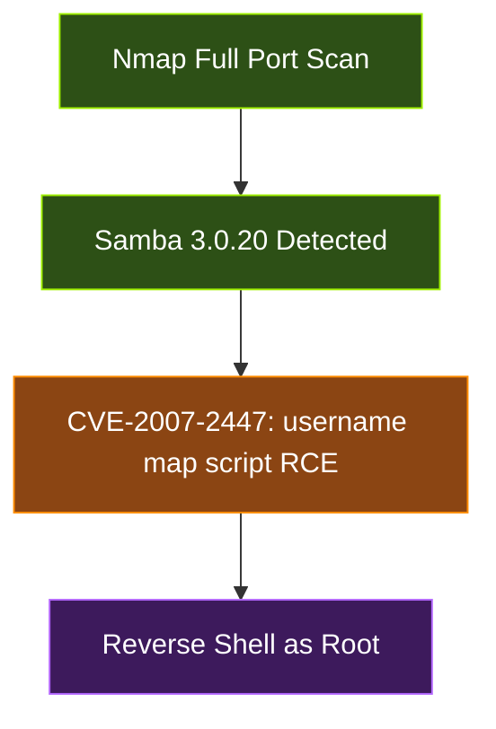

### Blue

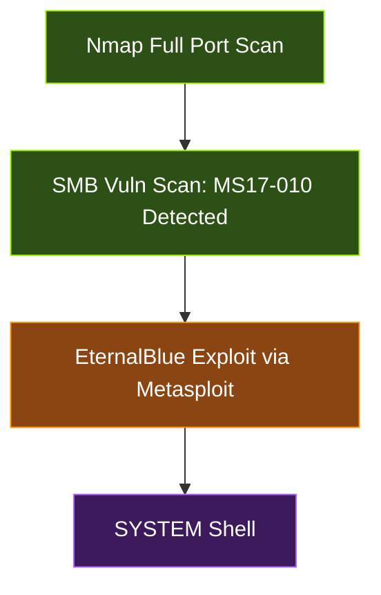

### Jerry

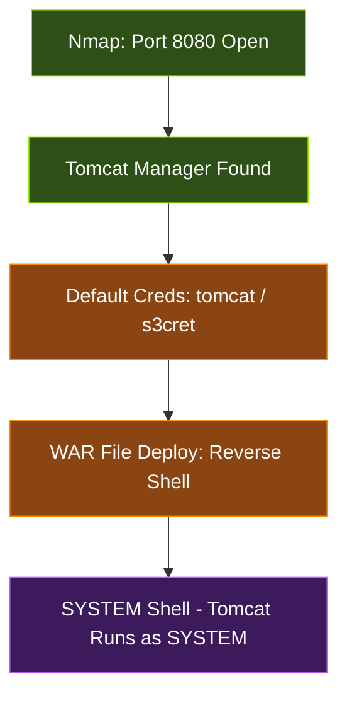

### Active

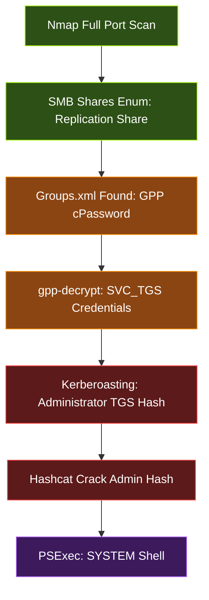

### Forest

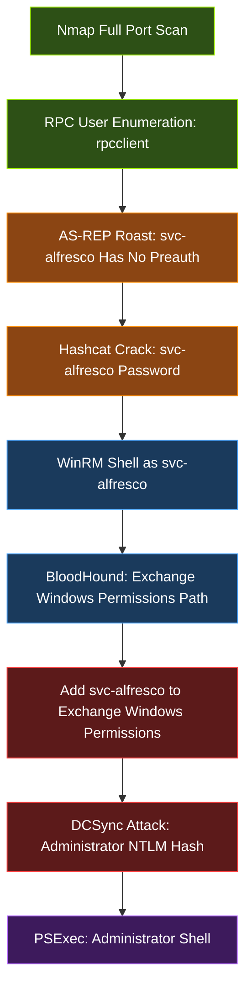

### Sauna

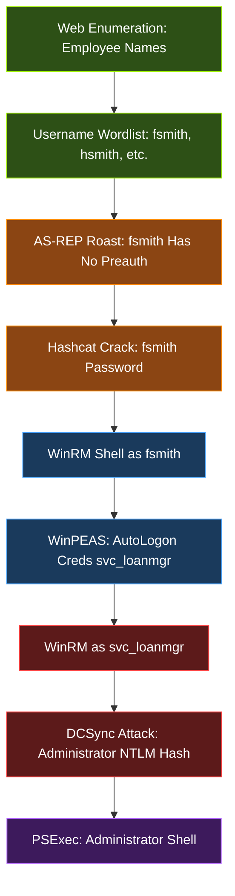

### Shocker

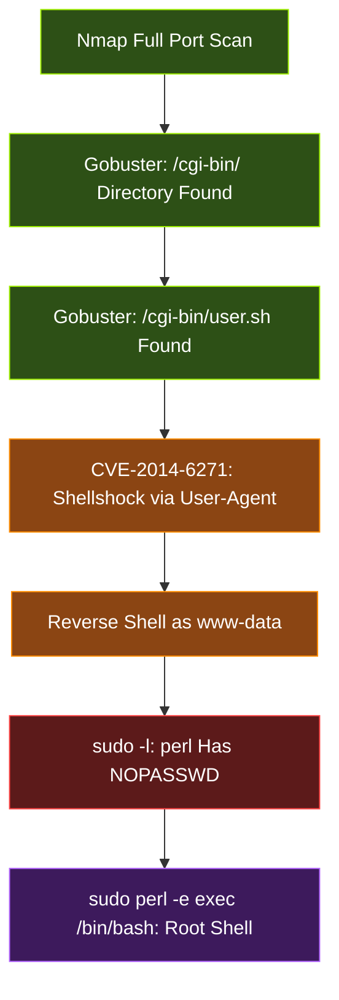

### Valentine

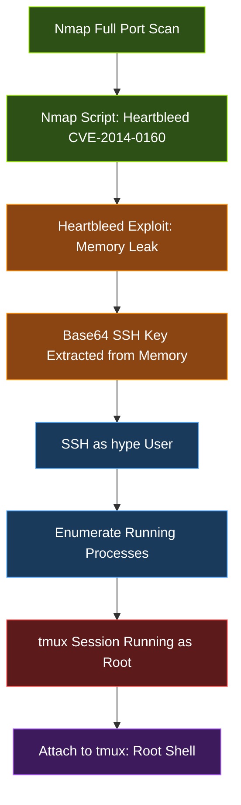

### Cap

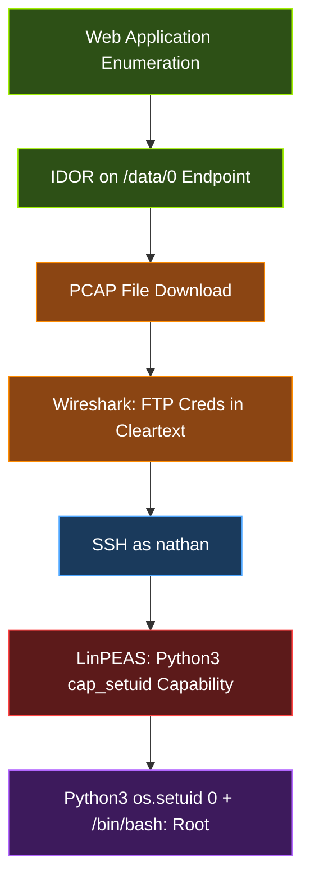

### Knife

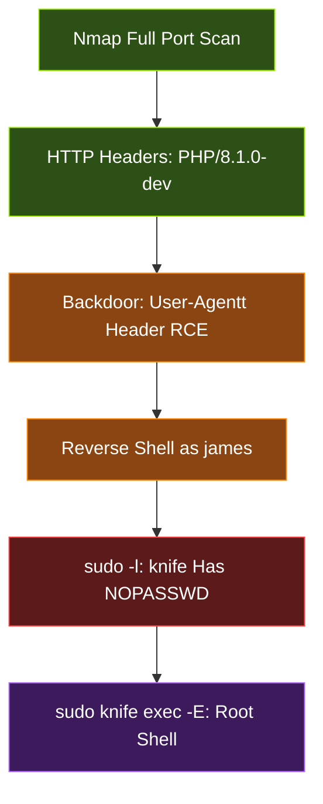

---

## Medium Machines

### Cronos

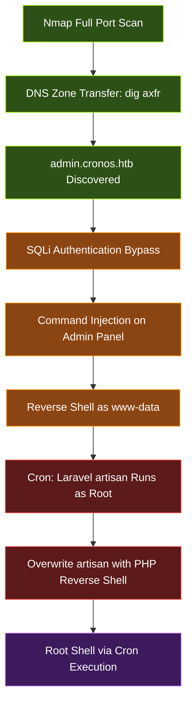

### Jeeves

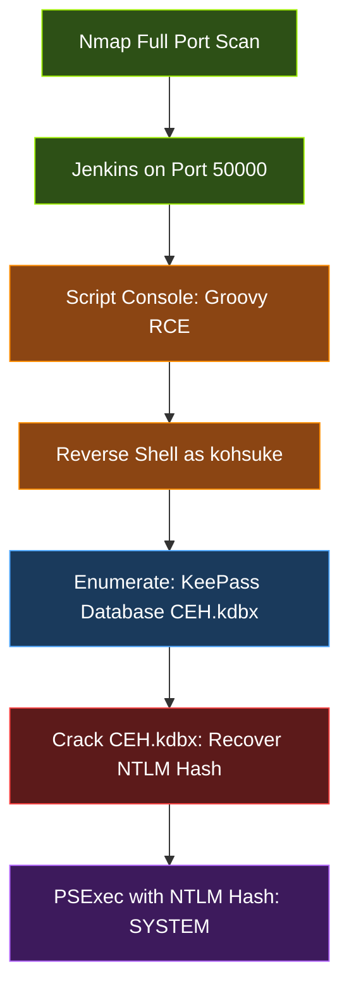

### Monteverde

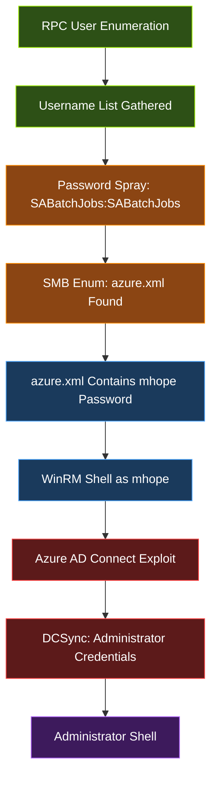

### Cascade

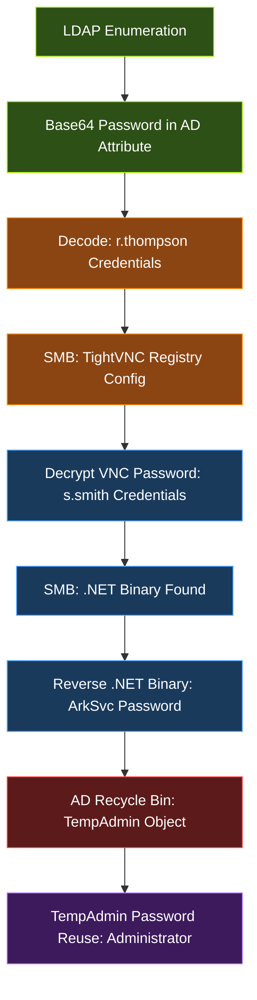

### Escape

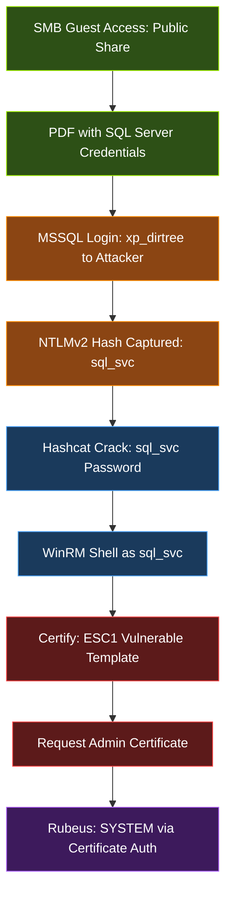

### Intelligence

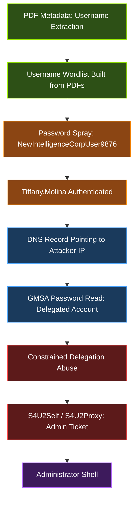

### Poison

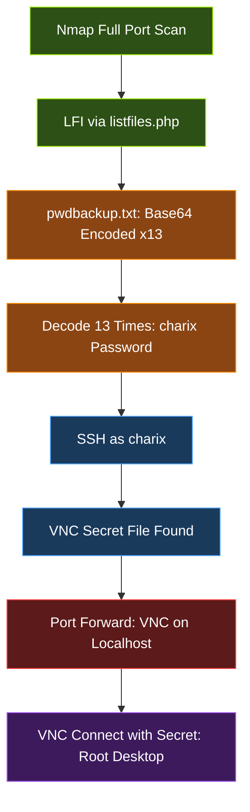

---

## Hard Machines

### Reel

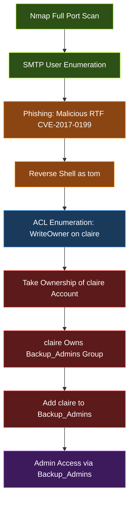

### Sizzle

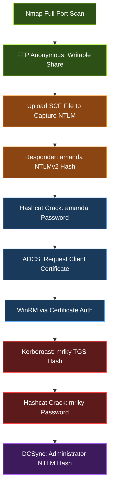

### Blackfield

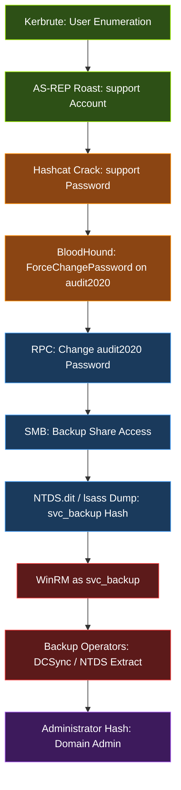

### Object

```mermaid
graph TD
    classDef recon fill:#2d5016,stroke:#9fef00,color:#fff
    classDef access fill:#8b4513,stroke:#ff8c00,color:#fff
    classDef post fill:#1a3a5c,stroke:#4da6ff,color:#fff
    classDef privesc fill:#5c1a1a,stroke:#ff4444,color:#fff
    classDef root fill:#3d1a5c,stroke:#b366ff,color:#fff

    A["Nmap: Jenkins on 8080"]:::recon
    B["Jenkins Token Extraction"]:::recon
    C["API Enumerate AD Users: oliver"]:::access
    D["oliver Shell"]:::access
    E["GenericWrite on smith"]:::post
    F["Targeted Kerberoast: smith TGS"]:::post
    G["smith Shell"]:::post
    H["GenericWrite on maria"]:::privesc
    I["maria Shell"]:::privesc
    J["WriteOwner on Domain Admins"]:::privesc
    K["Add maria to Domain Admins"]:::root

    A --> B
    B --> C
    C --> D
    D --> E
    E --> F
    F --> G
    G --> H
    H --> I
    I --> J
    J --> K
```

### Cerberus

```mermaid
graph TD
    classDef recon fill:#2d5016,stroke:#9fef00,color:#fff
    classDef access fill:#8b4513,stroke:#ff8c00,color:#fff
    classDef post fill:#1a3a5c,stroke:#4da6ff,color:#fff
    classDef privesc fill:#5c1a1a,stroke:#ff4444,color:#fff
    classDef root fill:#3d1a5c,stroke:#b366ff,color:#fff

    A["Nmap Full Port Scan"]:::recon
    B["Icinga Web Application Found"]:::recon
    C["SSRF on Icinga Web"]:::access
    D["CVE-2022-24716: Arbitrary File Read"]:::access
    E["DC Credentials Extracted"]:::post
    F["ADCS Enumeration: ESC7 Vulnerable"]:::privesc
    G["ESC7 Exploit: Cross-Domain Certificate"]:::privesc
    H["Admin on Both Domains"]:::root

    A --> B
    B --> C
    C --> D
    D --> E
    E --> F
    F --> G
    G --> H
```

### Rebound

```mermaid
graph TD
    classDef recon fill:#2d5016,stroke:#9fef00,color:#fff
    classDef access fill:#8b4513,stroke:#ff8c00,color:#fff
    classDef post fill:#1a3a5c,stroke:#4da6ff,color:#fff
    classDef privesc fill:#5c1a1a,stroke:#ff4444,color:#fff
    classDef root fill:#3d1a5c,stroke:#b366ff,color:#fff

    A["AS-REP Roast Enumeration"]:::recon
    B["jjones: No Preauth Required"]:::recon
    C["Hashcat Crack: jjones Password"]:::access
    D["Kerberoast: ServiceMgmt TGS Hash"]:::access
    E["RBCD Abuse: Configure Delegation"]:::post
    F["S4U Attack: winrm_svc Ticket"]:::post
    G["WinRM as winrm_svc"]:::post
    H["ReadGMSAPassword: delegator$ Account"]:::privesc
    I["Constrained Delegation: S4U2Proxy"]:::privesc
    J["DC Admin Shell"]:::root

    A --> B
    B --> C
    C --> D
    D --> E
    E --> F
    F --> G
    G --> H
    H --> I
    I --> J
```

---

## Insane Machines

### Sink

```mermaid
graph TD
    classDef recon fill:#2d5016,stroke:#9fef00,color:#fff
    classDef access fill:#8b4513,stroke:#ff8c00,color:#fff
    classDef post fill:#1a3a5c,stroke:#4da6ff,color:#fff
    classDef privesc fill:#5c1a1a,stroke:#ff4444,color:#fff
    classDef root fill:#3d1a5c,stroke:#b366ff,color:#fff

    A["Nmap Full Port Scan"]:::recon
    B["HAProxy + Gunicorn Detected"]:::recon
    C["HTTP Request Smuggling: CL.TE"]:::access
    D["Session Hijack: Admin Cookie Stolen"]:::access
    E["Gitea Repositories: AWS Keys Found"]:::post
    F["AWS Secrets Manager Enumeration"]:::post
    G["Secrets Retrieved: Encrypted Blobs"]:::privesc
    H["AWS KMS Decrypt: Root Credentials"]:::privesc
    I["SSH as Root"]:::root

    A --> B
    B --> C
    C --> D
    D --> E
    E --> F
    F --> G
    G --> H
    H --> I
```

### Fulcrum

```mermaid
graph TD
    classDef recon fill:#2d5016,stroke:#9fef00,color:#fff
    classDef access fill:#8b4513,stroke:#ff8c00,color:#fff
    classDef post fill:#1a3a5c,stroke:#4da6ff,color:#fff
    classDef privesc fill:#5c1a1a,stroke:#ff4444,color:#fff
    classDef root fill:#3d1a5c,stroke:#b366ff,color:#fff

    A["Nmap Full Port Scan"]:::recon
    B["API Endpoint Discovered"]:::recon
    C["XXE on API: Internal File Read"]:::access
    D["SSRF: Reach Internal Services"]:::access
    E["PowerShell Web Access Found"]:::post
    F["Pivot Through Network 1"]:::post
    G["Pivot Through Network 2"]:::post
    H["Pivot Through Network 3"]:::post
    I["LDAP Credentials Extracted"]:::privesc
    J["Domain Controller Compromise"]:::privesc
    K["Forest Root Compromise"]:::root

    A --> B
    B --> C
    C --> D
    D --> E
    E --> F
    F --> G
    G --> H
    H --> I
    I --> J
    J --> K
```

---

## ProLab Overviews

### Dante ProLab

```mermaid
graph TD
    classDef recon fill:#2d5016,stroke:#9fef00,color:#fff
    classDef access fill:#8b4513,stroke:#ff8c00,color:#fff
    classDef post fill:#1a3a5c,stroke:#4da6ff,color:#fff
    classDef privesc fill:#5c1a1a,stroke:#ff4444,color:#fff
    classDef root fill:#3d1a5c,stroke:#b366ff,color:#fff

    A["Internet Facing Recon"]:::recon
    B["NIX01: Web Application Exploit"]:::access
    C["Foothold on NIX01"]:::access
    D["Pivot to Subnet 1"]:::post
    E["Credential Reuse Across Hosts"]:::post
    F["SQL01 Compromised"]:::post
    G["Pivot to Subnet 2"]:::privesc
    H["DC01: Domain Controller"]:::privesc
    I["Domain Admin Achieved"]:::root

    A --> B
    B --> C
    C --> D
    D --> E
    E --> F
    F --> G
    G --> H
    H --> I
```

### Offshore ProLab

```mermaid
graph TD
    classDef recon fill:#2d5016,stroke:#9fef00,color:#fff
    classDef access fill:#8b4513,stroke:#ff8c00,color:#fff
    classDef post fill:#1a3a5c,stroke:#4da6ff,color:#fff
    classDef privesc fill:#5c1a1a,stroke:#ff4444,color:#fff
    classDef root fill:#3d1a5c,stroke:#b366ff,color:#fff

    A["DMZ Recon and Enumeration"]:::recon
    B["DMZ Web Shell: Initial Foothold"]:::access
    C["Domain 1: Kerberoast Attack"]:::access
    D["Lateral Movement to Domain 2"]:::post
    E["ADCS Abuse in Domain 2"]:::post
    F["Trust Exploitation: Cross-Domain"]:::privesc
    G["Domain 3 Compromised"]:::privesc
    H["Domain 4: Full Forest Admin"]:::root

    A --> B
    B --> C
    C --> D
    D --> E
    E --> F
    F --> G
    G --> H
```

---

## Attack Pattern Summary

The machines above demonstrate recurring attack patterns in HTB and real-world environments:

| Pattern | Machines | Key Takeaway |
|:--------|:---------|:-------------|
| AS-REP Roasting | Forest, Sauna, Blackfield, Rebound | Disable accounts without Kerberos pre-auth or monitor for 4768 events |
| Kerberoasting | Active, Sizzle, Rebound, Offshore | Use long, random service account passwords and AES-only encryption |
| DCSync | Forest, Sauna, Monteverde, Blackfield, Sizzle | Restrict Replicating Directory Changes rights to DCs only |
| ADCS Abuse (ESC1/ESC7) | Escape, Cerberus, Offshore | Audit certificate templates with Certify or Certipy regularly |
| ACL Abuse Chains | Forest, Object, Reel | Use BloodHound to map and remediate dangerous ACL paths |
| Credential Reuse | Cascade, Dante | Enforce unique passwords per service account |
| Default Credentials | Jerry, Jeeves | Never deploy services with default or weak credentials |
| Known CVE Exploitation | Lame, Blue, Shocker, Valentine, Reel, Cerberus | Patch management is the first line of defense |
| HTTP Request Smuggling | Sink | Use consistent HTTP parsers and disable connection reuse between tiers |
| Multi-Network Pivoting | Fulcrum, Dante, Offshore | Segment networks and monitor lateral traffic between zones |
