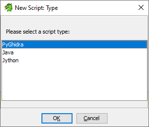
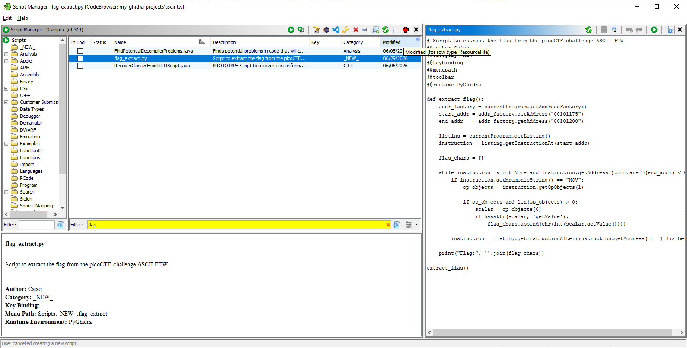
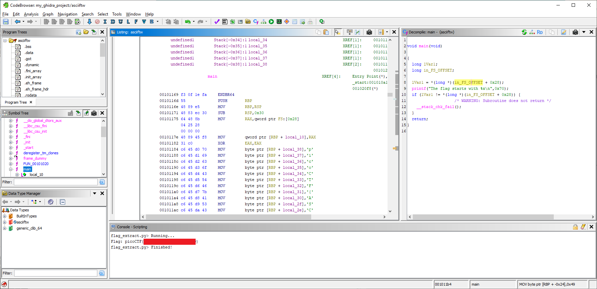

# ASCII FTW

- [Challenge information](#challenge-information)
- [Manual Solution](#manual-solution)
- [Scripted Solution](#scripted-solution)
- [References](#references)

## Challenge information

```text
Level: Medium
Points: 100
Tags: Challenge Library Exclusive, Reverse Engineering
Meta Tags: Walkthrough, Walk-through, Write-up, Writeup
Author: LT 'SYREAL' JONES

Description:
This program has constructed the flag using hex ascii values. Identify the flag text by disassembling the program.

Hints:
1. The combined range of hex-ascii for English alphabets and numerical digits is from 30 to 7A.
2. Online hex-ascii converters can be helpful.
```

Challenge link: [https://learn.cylabacademy.org/library/389](https://learn.cylabacademy.org/library/389)

## Manual Solution

Import the file in [Ghidra](https://ghidra-sre.org/) and analyze it with the default settings.  
Double-click on the `main` function to show the decompiled version of it.

```C
void main(void)

{
  long lVar1;
  long in_FS_OFFSET;
  
  lVar1 = *(long *)(in_FS_OFFSET + 0x28);
  printf("The flag starts with %x\n",0x70);
  if (lVar1 != *(long *)(in_FS_OFFSET + 0x28)) {
                    /* WARNING: Subroutine does not return */
    __stack_chk_fail();
  }
  return;
}
```

The flag data is stored at memory position `in_FS_OFFSET`. Double-click to navigate to it in the Listing window.

```text
        0010117e 48 89 45 f8     MOV        qword ptr [RBP + local_10],RAX
        00101182 31 c0           XOR        EAX,EAX
        00101184 c6 45 d0 70     MOV        byte ptr [RBP + local_38],0x70
        00101188 c6 45 d1 69     MOV        byte ptr [RBP + local_37],0x69
        0010118c c6 45 d2 63     MOV        byte ptr [RBP + local_36],0x63
        00101190 c6 45 d3 6f     MOV        byte ptr [RBP + local_35],0x6f
        00101194 c6 45 d4 43     MOV        byte ptr [RBP + local_34],0x43
        00101198 c6 45 d5 54     MOV        byte ptr [RBP + local_33],0x54
        0010119c c6 45 d6 46     MOV        byte ptr [RBP + local_32],0x46
< --- snip --- >
```

The flag is stored as ASCII-values byte by byte. I.e. the values 0x70, 0x69, etc. 0x70 corresponds to 'p', 0x69 to 'i', etc.  The lookup can be done manually with an online [ASCII table](https://www.ascii-code.com/) or within Ghidra by right-clicking on each value and selecting `Convert -> Char` in the menu.

The result then looks like this:

```text
        0010117e 48 89 45 f8     MOV        qword ptr [RBP + local_10],RAX
        00101182 31 c0           XOR        EAX,EAX
        00101184 c6 45 d0 70     MOV        byte ptr [RBP + local_38],'p'
        00101188 c6 45 d1 69     MOV        byte ptr [RBP + local_37],'i'
        0010118c c6 45 d2 63     MOV        byte ptr [RBP + local_36],'c'
        00101190 c6 45 d3 6f     MOV        byte ptr [RBP + local_35],'o'
        00101194 c6 45 d4 43     MOV        byte ptr [RBP + local_34],'C'
        00101198 c6 45 d5 54     MOV        byte ptr [RBP + local_33],'T'
        0010119c c6 45 d6 46     MOV        byte ptr [RBP + local_32],'F'
        001011a0 c6 45 d7 7b     MOV        byte ptr [RBP + local_31],'{'
        001011a4 c6 45 d8 41     MOV        byte ptr [RBP + local_30],'A'
<---snip--->
        001011fc c6 45 ee 7d     MOV        byte ptr [RBP + local_1a],'}'
        00101200 0f b6 45 d0     MOVZX      EAX,byte ptr [RBP + local_38]
```

Finally, manually create the flag by going down the listing line by line.

## Scripted Solution

Alternatively, we can script the flag extraction with [PyGhidra](https://pypi.org/project/pyghidra/).

First, we need to make sure PyGhidra is installed and configured:

- Install Python 3.12 if needed
- Install PyGhidra with `pip install pyghidra`
- Make sure you have an environment variable called `GHIDRA_INSTALL_DIR` pointing to your Ghidra-directory
- Start Ghidra with `python.exe -m pyghidra --gui --install-dir "<Ghidra_install_dir>"` to launch Ghidra with PyGhidra activated

Then we select `Script Manager` in the `Window`-menu in Ghidra and click the `Create New Script`-button.

Select the `PyGhidra` script type



Name the script something like `flag.extract.py`

```python
# Script to extract the flag from the picoCTF-challenge ASCII FTW
#@author Cajac
#@category _NEW_
#@keybinding 
#@menupath 
#@toolbar 
#@runtime PyGhidra

def extract_flag():
    addr_factory = currentProgram.getAddressFactory()
    start_addr = addr_factory.getAddress("00101184")
    end_addr   = addr_factory.getAddress("00101200")

    listing = currentProgram.getListing()
    instruction = listing.getInstructionAt(start_addr)

    flag_chars = []

    while instruction is not None and instruction.getAddress().compareTo(end_addr) < 0:
        if instruction.getMnemonicString() == "MOV":
            op_objects = instruction.getOpObjects(1)

            if op_objects and len(op_objects) > 0:
                scalar = op_objects[0]
                if hasattr(scalar, 'getValue'):
                    flag_chars.append(chr(int(scalar.getValue())))

        instruction = listing.getInstructionAfter(instruction.getAddress())

    print("Flag:", ''.join(flag_chars))

extract_flag()
```



Finally, click the `Run Script`-button.

The flag will be shown in the `Script Console` in the main Ghidra window:



For additional information, please see the references below.

## References

- [ASCII Table](https://www.asciitable.com/)
- [ASCII - Wikipedia](https://en.wikipedia.org/wiki/ASCII)
- [Ghidra - Homepage](https://ghidra-sre.org/)
- [Ghidra - Kali Tools](https://www.kali.org/tools/ghidra/)
- [Ghidra - Wikipedia](https://en.wikipedia.org/wiki/Ghidra)
- [PyGhidra - README - Ghidra Docs](https://www.ghidradocs.com/12.1.2_PUBLIC/Ghidra/Features/PyGhidra/pypkg/README.html)
- [pyghidra - PyPI Module](https://pypi.org/project/pyghidra/)
