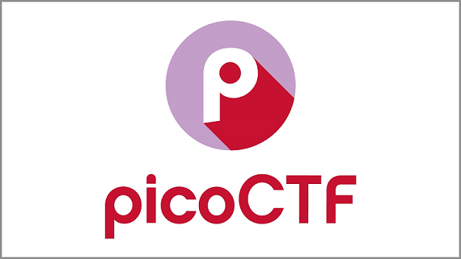
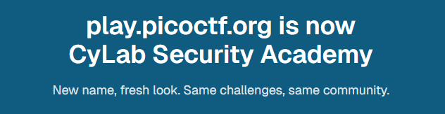

# Writeups for picoCTF challenges

Welcome to [my](https://learn.cylabacademy.org/users/Cajac) writeups for [picoCTF](https://learn.cylabacademy.org/login) challenges.

In May 2026 the web site rebranded and is now called **CyLab Security Academy**.

These writeups are mainly a documentation for myself but I hope others will benefit from them as well.

In total you will find more than 250 challenge solutions here.

## Challenges

- [picoCTF 2025 Challenges](picoCTF_2025/README.md)
- [picoCTF 2024 Challenges](picoCTF_2024/README.md)
- [picoCTF 2023 Challenges](picoCTF_2023/README.md)
- [picoCTF 2022 Challenges](picoCTF_2022/README.md)
- [Beginner picoMini 2022 Challenges](Beginner_picoMini_2022/README.md)
- [picoMini by redpwn Challenges](picoMini_by_redpwn/README.md)
- [picoCTF 2021 Challenges](picoCTF_2021/README.md)
- [picoCTF 2020 Mini-Competition Challenges](picoCTF_2020/README.md)
- [picoCTF 2019 Challenges](picoCTF_2019/README.md)
- [Challenge Library Exclusive](Challenge_Library_Exclusive/README.md)

## No spoilers

The solutions contains step-by-step walkthroughs but doesn't display the flags in plain text.  
Instead the flags are displayd as `picoCTF{<REDACTED>}` or with just some portion of the flag visible.

## When to use

These solutions can be used in two different scenarios:

**Scenario #1**:  
When you are stuck, have already tried different solutions on your own, and don't know how to continue.  
Don't look at them to soon though. It's always good to develop your ["Try harder"-mindset](https://www.offsec.com/blog/what-it-means-to-try-harder/)!

**Scenario #2**:  
When you have already solved the challenge on your own but what to see if you can learn different methods, tools or approaches.  
Are there different and perhaps smarter ways to solve the challenge?

## Support my work

If you appreciate this repository and learn from it, please consider [giving it a star](https://docs.github.com/en/get-started/exploring-projects-on-github/saving-repositories-with-stars#starring-a-repository) to support it and spread the word.

## Language disclaimer

I'm not a native English speaker so please forgive any spelling mistakes or grammatical errors.

## Acknowledgements

Some of the solutions were inspired by writeups and walkthroughs from these guys:

- [Almond Force](https://www.youtube.com/@AlmondForce)
- David
- [Gynvael](https://www.youtube.com/@GynvaelEN)
- [Hayden Housen](https://github.com/HHousen)
- [John Hammond](https://www.youtube.com/@_JohnHammond)
- [Martin Carlisle](https://www.youtube.com/@carlislemc)
