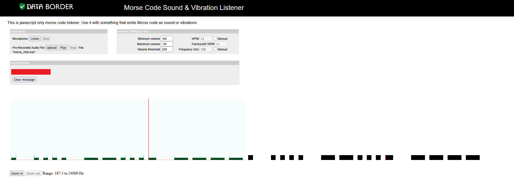

# morse-code

- [Challenge information](#challenge-information)
- [Solution](#solution)
- [References](#references)

## Challenge information

```text
Level: Medium
Points: 100
Tags: picoCTF 2022, Cryptography, morse_code
Meta Tags: Walkthrough, Walk-through, Write-up, Writeup
Author: WILL HONG
 
Description:
Morse code is well known. Can you decrypt this?
 
Download the file here.

Wrap your answer with picoCTF{}, put underscores in place of pauses, and use all lowercase.

Hints:
1. Audacity is a really good program to analyze morse code audio.
```

Challenge link: [https://learn.cylabacademy.org/library/280](https://learn.cylabacademy.org/library/280)

## Solution

I searched for an online service to decode morse-code from audio and found [this one on Data Border](https://databorder.com/transfer/morse-sound-receiver/). It is good at presenting the pauses between the words.

Upload the .wav file, and then Play it to get the message.

Create the flag from the output according to the instructions given.



For additional information, please see the references below.

## References

- [Morse code - Wikipedia](https://en.wikipedia.org/wiki/Morse_code)
- [Morse Code Sound & Vibration Listener](https://databorder.com/transfer/morse-sound-receiver/)
- [WAV - Wikipedia](https://en.wikipedia.org/wiki/WAV)
