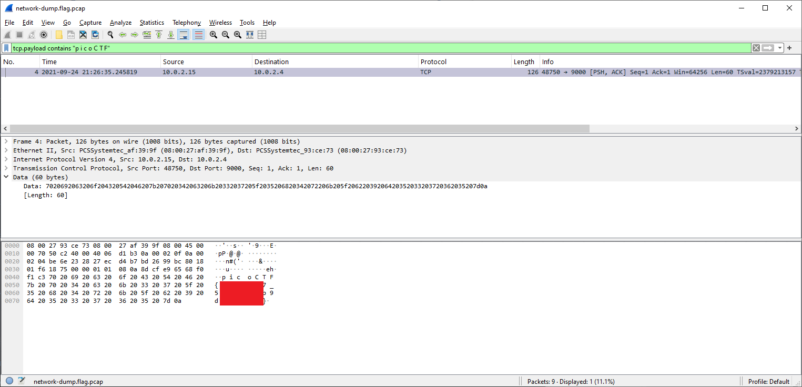
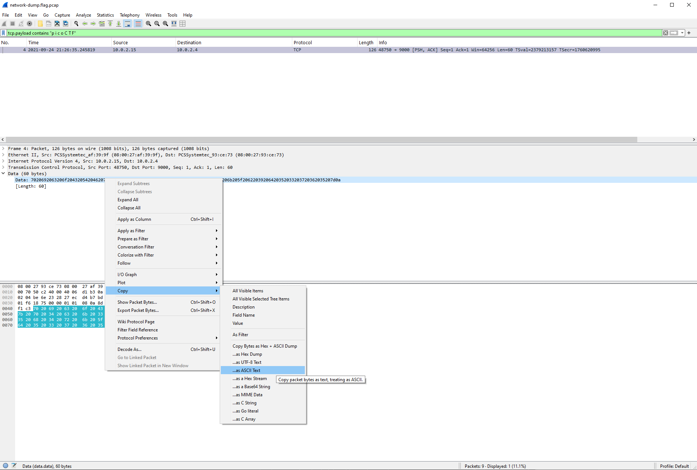

# Packets Primer

- [Challenge information](#challenge-information)
- [GUI Solution](#gui-solution)
- [Commandline Solution](#commandline-solution)
- [References](#references)

## Challenge information

```text
Level: Medium
Points: 100
Tags: picoCTF 2022, Forensics, pcap
Meta Tags: Walkthrough, Walk-through, Write-up, Writeup
Author: LT 'SYREAL' JONES

Description:
Download the packet capture file and use packet analysis software to find the flag.

Hints:
1. Wireshark, if you can install and use it, is probably the most beginner friendly packet analysis software product.
```

Challenge link: [https://learn.cylabacademy.org/library/286](https://learn.cylabacademy.org/library/286)

## GUI Solution

Open up the PCAP-file in [Wireshark](https://www.wireshark.org/).

On easier challenges it can sometimes be worth searching for the flag in plaintext by entering a display filter of `tcp.payload contains "picoCTF"`.  
Unfortunately, it doesn't works here because there are spaces in the flag.

But if we search for `tcp.payload contains "p i c o C T F"` we get one hit in packet number 4 which contains the flag.



To construct/copy the flag you can either

- See the packet's ASCII-details and construct the flag manually
- Right-click on the 60 bytes of data and select Copy -> `...as ASCII Text` and then remove the spaces.



## Commandline Solution

Wireshark also has a commandline version called `tshark`.

Without any parameters other than the PCAP-file to analyse the output resembles the GUI output

```bash
┌──(kali㉿kali)-[/mnt/…/picoCTF/picoCTF_2022/Forensics/Packets_Primer]
└─$ tshark -r network-dump.flag.pcap 
    1 2021-09-24 19:26:35.244594    10.0.2.15 → 10.0.2.4     TCP 74 48750 → 9000 [SYN] Seq=0 Win=64240 Len=0 MSS=1460 SACK_PERM TSval=2379213156 TSecr=0 WS=128
    2 2021-09-24 19:26:35.245490     10.0.2.4 → 10.0.2.15    TCP 74 9000 → 48750 [SYN, ACK] Seq=0 Ack=1 Win=65160 Len=0 MSS=1460 SACK_PERM TSval=1760620995 TSecr=2379213156 WS=128
    3 2021-09-24 19:26:35.245600    10.0.2.15 → 10.0.2.4     TCP 66 48750 → 9000 [ACK] Seq=1 Ack=1 Win=64256 Len=0 TSval=2379213157 TSecr=1760620995
    4 2021-09-24 19:26:35.245819    10.0.2.15 → 10.0.2.4     TCP 126 48750 → 9000 [PSH, ACK] Seq=1 Ack=1 Win=64256 Len=60 TSval=2379213157 TSecr=1760620995
    5 2021-09-24 19:26:35.246625     10.0.2.4 → 10.0.2.15    TCP 66 9000 → 48750 [ACK] Seq=1 Ack=61 Win=65152 Len=0 TSval=1760620996 TSecr=2379213157
    6 2021-09-24 19:26:40.265000 PCSSystemtec_93:ce:73 → PCSSystemtec_af:39:9f ARP 60 Who has 10.0.2.15? Tell 10.0.2.4
    7 2021-09-24 19:26:40.265048 PCSSystemtec_af:39:9f → PCSSystemtec_93:ce:73 ARP 42 10.0.2.15 is at 08:00:27:af:39:9f
    8 2021-09-24 19:26:40.276530 PCSSystemtec_af:39:9f → PCSSystemtec_93:ce:73 ARP 42 Who has 10.0.2.4? Tell 10.0.2.15
    9 2021-09-24 19:26:40.277416 PCSSystemtec_93:ce:73 → PCSSystemtec_af:39:9f ARP 60 10.0.2.4 is at 08:00:27:93:ce:73
```

We set display filters with the `-Y` parameter

```bash
┌──(kali㉿kali)-[/mnt/…/picoCTF/picoCTF_2022/Forensics/Packets_Primer]
└─$ tshark -r network-dump.flag.pcap -Y 'tcp.payload contains "p i c o C T F"'
    4 2021-09-24 19:26:35.245819    10.0.2.15 → 10.0.2.4     TCP 126 48750 → 9000 [PSH, ACK] Seq=1 Ack=1 Win=64256 Len=60 TSval=2379213157 TSecr=1760620995
```

To output only specific fields we add `-T fields` and then add one or more fields with the `-e` parameter

```bash
┌──(kali㉿kali)-[/mnt/…/picoCTF/picoCTF_2022/Forensics/Packets_Primer]
└─$ tshark -r network-dump.flag.pcap -Y 'tcp.payload contains "p i c o C T F"' -T fields -e tcp.payload
7020692063206f204320542046207b207020342063206b20332037205f2035206820342072206b205f20622039206420352033203720362035207d0a
```

The output here is in hex, but we can convert it with `xxd`

```bash
┌──(kali㉿kali)-[/mnt/…/picoCTF/picoCTF_2022/Forensics/Packets_Primer]
└─$ tshark -r network-dump.flag.pcap -Y 'tcp.payload contains "p i c o C T F"' -T fields -e tcp.payload | xxd -r -p
p i c o C T F { p <REDACTED> 5 }
```

Finally, we can remove the spaces with `tr -d`

```bash
┌──(kali㉿kali)-[/mnt/…/picoCTF/picoCTF_2022/Forensics/Packets_Primer]
└─$ tshark -r network-dump.flag.pcap -Y 'tcp.payload contains "p i c o C T F"' -T fields -e tcp.payload | xxd -r -p | tr -d ' '
picoCTF{<REDACTED>}
```

For additional information, please see the references below.

## References

- [pcap - Wikipedia](https://en.wikipedia.org/wiki/Pcap)
- [tr - Linux manual page](https://man7.org/linux/man-pages/man1/tr.1.html)
- [tshark - Manual page - Wireshark](https://www.wireshark.org/docs/man-pages/tshark.html)
- [Wireshark - Homepage](https://www.wireshark.org/)
- [Wireshark display filter syntax and reference](https://www.wireshark.org/docs/man-pages/wireshark-filter.html)
- [xxd - Linux manual page](https://linux.die.net/man/1/xxd)
