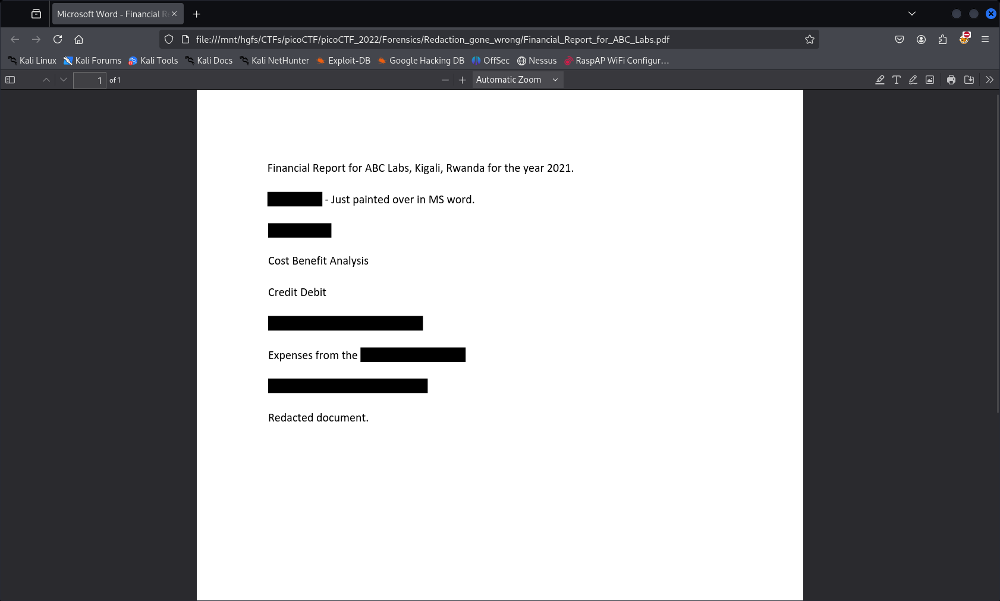

# Redaction gone wrong

- [Challenge information](#challenge-information)
- [Solution](#solution)

## Challenge information

```text
Level: Medium
Points: 100
Tags: picoCTF 2022, Forensics
Meta Tags: Walkthrough, Walk-through, Write-up, Writeup
Author: MUBARAK MIKAIL

Description:
Now you DON’T see me.
This report has some critical data in it, some of which have been redacted correctly, while some were not. 
 
Can you find an important key that was not redacted properly?
 
Hints:
1. How can you be sure of the redaction?
```

Challenge link: [https://learn.cylabacademy.org/library/290](https://learn.cylabacademy.org/library/290)

## Solution

Open up the PDF-document in any PDF-reader that enables you to select and copy all text in the document.  
Why not use the keyboard shortcuts `CTRL`+ `A` to select all text and the `CTRL` + `C` to copy it?

Here, I opened the document in the Firefox web browser.



Then paste the text into a text editor and you will get (apart from the flag redacted here)

```text
Financial Report for ABC Labs, Kigali, Rwanda for the year 2021.
Breakdown - Just painted over in MS word.
Cost Benefit Analysis
Credit Debit
This is not the flag, keep looking
Expenses from the
picoCTF{<REDACTED>}
Redacted document.
```
