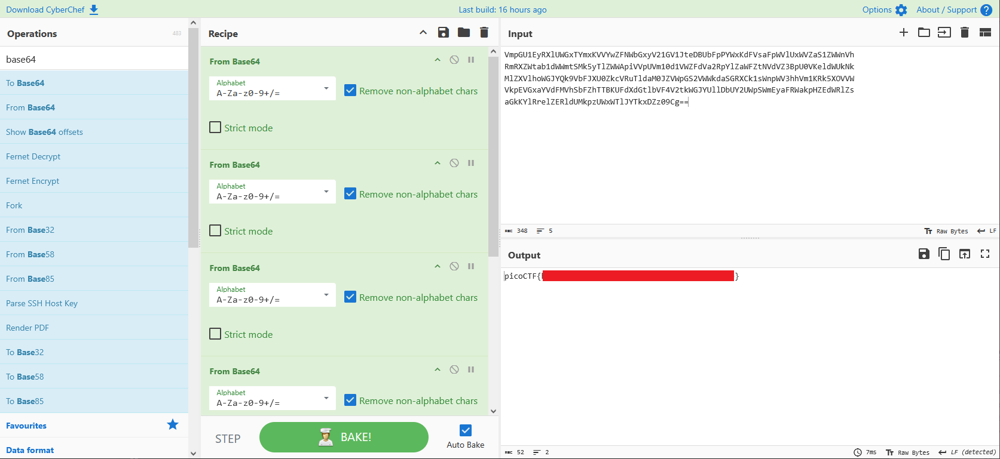

# repetitions

- [Challenge information](#challenge-information)
- [CyberChef Solution](#cyberchef-solution)
- [Python Solution](#python-solution)
- [Bash Solution](#bash-solution)
- [References](#references)

## Challenge information

```text
Level: Easy
Points: 100
Tags: picoCTF 2023, General Skills, base64
Meta Tags: Walkthrough, Walk-through, Write-up, Writeup
Author: THEONESTE BYAGUTANGAZA

Description:
Can you make sense of this file?

Download the file here.

Hints:
1. Multiple decoding is always good.
```

Challenge link: [https://learn.cylabacademy.org/library/371](https://learn.cylabacademy.org/library/371)

## CyberChef Solution

One of the tags already gave it away. The contents of the file is [base64 encoded data](https://en.wikipedia.org/wiki/Base64).

Otherwise, a good indicator for base64 encoded data is a string ending with one or two equal signs ('=') and  
that the string contains nothing but letters and numbers (with three exceptions: '+', '/', and '=').  
The ('=') is padding in base64 encoding.

The contents of the file is

```text
VmpGU1EyRXlUWGxTYmxKVVYwZFNWbGxyV21GV1JteDBUbFpPYWxKdFVsaFpWVlUxWVZaS1ZWWnVh
RmRXZWtab1dWWmtSMk5yTlZWWApiVVpUVm10d1VWZFdVa2RpYlZaWFZtNVdVZ3BpU0VKeldWUkNk
MlZXVlhoWGJYQk9VbFJXU0ZkcVRuTldaM0JZVWpGS2VWWkdaSGRXCk1sWnpWV3hhVm1KRk5XOVVW
VkpEVGxaYVdFMVhSbFZhTTBKUFdXdGtlbVF4V2tkWGJYUllDbUY2UWpSWmEyaFRWakpHZEdWRlZs
aGkKYlRrelZERldUMkpzUWxWTlJYTkxDZz09Cg==
```

Both the challenge name and the hint suggests that we need to do a number of decoding levels to get our flag.

We can manually apply a number of ['From Base64' recipes in CyberChef](https://gchq.github.io/CyberChef/#recipe=From_Base64('A-Za-z0-9%2B/%3D',true,false)) until we get the flag like this:



Six levels are needed.

## Python Solution

Alternatively, we can write a little Python script called `solve.py` that automatically finds the flag in any number of base64 layers.

```python
#!/usr/bin/python

import base64

# Read the encoded flag
with open("enc_flag", 'r') as fh:
    enc_flag = fh.read()

while ('picoCTF' not in enc_flag):
    enc_flag = base64.b64decode(enc_flag).decode('ascii')

print(enc_flag)
```

Then make the script executable and run it

```bash
┌──(kali㉿kali)-[/picoCTF/picoCTF_2023/General_Skills/repetitions]
└─$ chmod +x solve.py

┌──(kali㉿kali)-[/picoCTF/picoCTF_2023/General_Skills/repetitions]
└─$ ./solve.py       
picoCTF{<REDACTED>}
```

## Bash Solution

Finally, we can manually add `base64 -d` in Bash until we get the flag

```bash
┌──(kali㉿kali)-[/mnt/…/picoCTF/picoCTF_2023/General_Skills/repetitions]
└─$ cat enc_flag | base64 -d                       
VjFSQ2EyTXlSblJUV0dSVllrWmFWRmx0TlZOalJtUlhZVVU1YVZKVVZuaFdWekZoWVZkR2NrNVVX
bUZTVmtwUVdWUkdibVZXVm5WUgpiSEJzWVRCd2VWVXhXbXBOUlRWSFdqTnNWZ3BYUjFKeVZGZHdW
MlZzVWxaVmJFNW9UVVJDTlZaWE1XRlVaM0JPWWtkemQxWkdXbXRYCmF6QjRZa2hTVjJGdGVFVlhi
bTkzVDFWT2JsQlVNRXNLCg==

┌──(kali㉿kali)-[/mnt/…/picoCTF/picoCTF_2023/General_Skills/repetitions]
└─$ cat enc_flag | base64 -d | base64 -d 
V1RCa2MyRnRTWGRVYkZaVFltNVNjRmRXYUU5aVJUVnhWVzFhYVdGck5UWmFSVkpQWVRGbmVWVnVR
bHBsYTBweVUxWmpNRTVHWjNsVgpXR1JyVFdwV2VsUlZVbE5oTURCNVZXMWFUZ3BOYkdzd1ZGWmtX
azB4YkhSV2FteEVXbm93T1VOblBUMEsK

┌──(kali㉿kali)-[/mnt/…/picoCTF/picoCTF_2023/General_Skills/repetitions]
└─$ cat enc_flag | base64 -d | base64 -d | base64 -d
WTBkc2FtSXdUbFZTYm5ScFdWaE9iRTVxVW1aaWFrNTZaRVJPYTFneVVuQlpla0pyU1ZjME5GZ3lV
WGRrTWpWelRVUlNhMDB5VW1aTgpNbGswVFZkWk0xbHRWamxEWnowOUNnPT0K

┌──(kali㉿kali)-[/mnt/…/picoCTF/picoCTF_2023/General_Skills/repetitions]
└─$ cat enc_flag | base64 -d | base64 -d | base64 -d | base64 -d
Y0dsamIwTlVSbnRpWVhObE5qUmZiak56ZEROa1gyUnBZekJrSVc0NFgyUXdkMjVzTURSa00yUmZN
Mlk0TVdZM1ltVjlDZz09Cg==

┌──(kali㉿kali)-[/mnt/…/picoCTF/picoCTF_2023/General_Skills/repetitions]
└─$ cat enc_flag | base64 -d | base64 -d | base64 -d | base64 -d | base64 -d
cGljb0NURntiYXNlNjRfbjNzdDNkX2RpYzBkIW44X2Qwd25sMDRkM2RfM2Y4MWY3YmV9Cg==

┌──(kali㉿kali)-[/mnt/…/picoCTF/picoCTF_2023/General_Skills/repetitions]
└─$ cat enc_flag | base64 -d | base64 -d | base64 -d | base64 -d | base64 -d | base64 -d
picoCTF{<REDACTED>}
```

For additional information, please see the references below.

## References

- [Base64 - Wikipedia](https://en.wikipedia.org/wiki/Base64)
- [base64 module - Python](https://docs.python.org/3/library/base64.html)
- [CyberChef - Homepage](https://gchq.github.io/CyberChef/)
- [python - Linux manual page](https://linux.die.net/man/1/python)
- [Python (programming language) - Wikipedia](https://en.wikipedia.org/wiki/Python_(programming_language))
