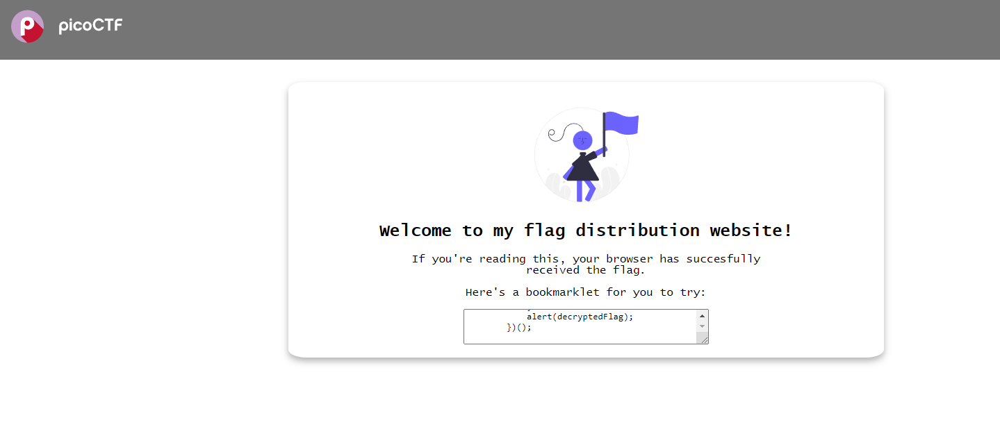

# Bookmarklet

- [Challenge information](#challenge-information)
- [Solution](#solution)
- [References](#references)

## Challenge information

```text
Level: Easy
Points: 50
Tags: picoCTF 2024, Web Exploitation, obfuscation, browser_webshell_solvable, browser
Meta Tags: Walkthrough, Walk-through, Write-up, Writeup
Author: JEFFERY JOHN

Description:
Why search for the flag when I can make a bookmarklet to print it for me?

Browse here, and find the flag!

Hints:
1. A bookmarklet is a bookmark that runs JavaScript instead of loading a webpage.
2. What happens when you click a bookmarklet?
3. Web browsers have other ways to run JavaScript too.
```

Challenge link: [https://learn.cylabacademy.org/library/406](https://learn.cylabacademy.org/library/406)

## Solution

Browse to the web site and you will see a web page like this:



The text box contains the following JavaScript:

```javascript
        javascript:(function() {
            var encryptedFlag = "àÒÆަȬë٣֖ÓÚåÛÑ¢ÕӖәǡ”¥Ìí";
            var key = "picoctf";
            var decryptedFlag = "";
            for (var i = 0; i < encryptedFlag.length; i++) {
                decryptedFlag += String.fromCharCode((encryptedFlag.charCodeAt(i) - key.charCodeAt(i % key.length) + 256) % 256);
            }
            alert(decryptedFlag);
        })();
```

You can decode this by running the code in the browser's DevTools. Press `F12` or `Ctrl + Shift + I` to activate the developer tools.  
Select the `Console` tab and type `allow pasting` followed by the code:

```text
allow pasting
>         javascript:(function() {
            var encryptedFlag = "àÒÆަȬëÙ£Ö�ÓÚåÛÑ¢ÕÓ�¡��ÒŤ�í";
            var key = "picoctf";
            var decryptedFlag = "";
            for (var i = 0; i < encryptedFlag.length; i++) {
                decryptedFlag += String.fromCharCode((encryptedFlag.charCodeAt(i) - key.charCodeAt(i % key.length) + 256) % 256);
            }
            alert(decryptedFlag);
        })();
```

The flag will be shown in an alert-box.

For additional information, please see the references below.

## References

- [Bookmarklet - Wikipedia](https://en.wikipedia.org/wiki/Bookmarklet)
- [DevTools - Chrome Docs](https://developer.chrome.com/docs/devtools/)
- [DevTools - Firefox User Docs](https://firefox-source-docs.mozilla.org/devtools-user/)
- [DevTools - MDN](https://developer.mozilla.org/en-US/docs/Learn_web_development/Howto/Tools_and_setup/What_are_browser_developer_tools)
- [JavaScript - Wikipedia](https://en.wikipedia.org/wiki/JavaScript)
