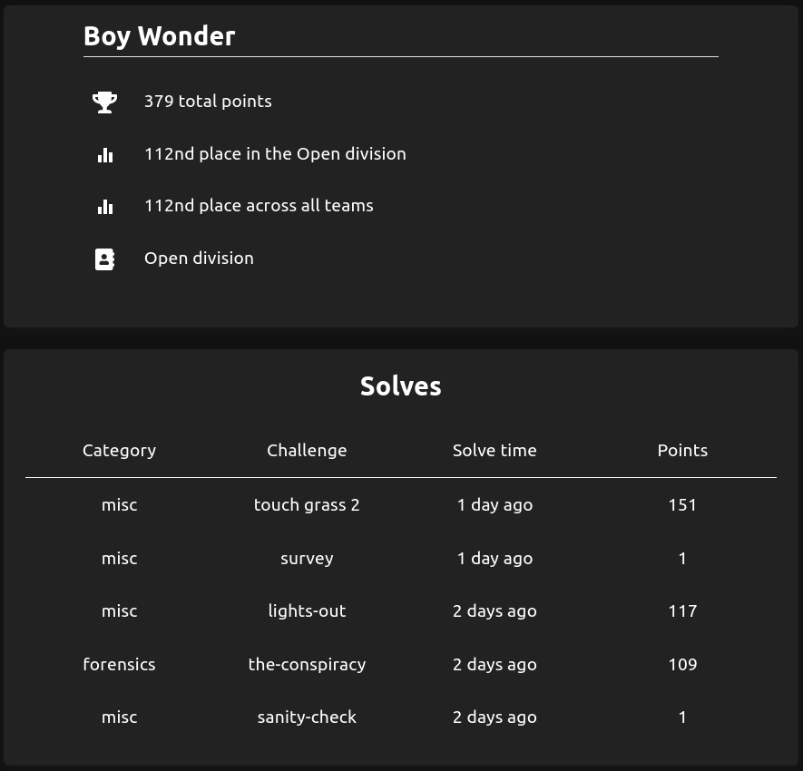

# corCTF 2024 Writeup

[corCTF 2024](https://2024.cor.team) was a 48 hour competition that ran from 7/26/2024 through 7/28/2024. Below are my writeups for the challenges
I attempted, including the ones that I did not successfully complete. You can also view my results in the competition below my writeups.

Click [here](https://github.com/rstacks/ctf-writeups) to check out my writeups for other CTFs I've participated in.

## Solved Challenges

  
Forensics

  * [the-conspiracy](https://github.com/rstacks/corCTF2024-writeup)
  

  
Misc

  * [lights-out](https://github.com/rstacks/corCTF2024-writeup)
  * [touch grass 2](https://github.com/rstacks/corCTF2024-writeup)
  

## Unfinished Challenges

  
Forensics

  * [infiltration](https://github.com/rstacks/corCTF2024-writeup)
  

  
Web

  * [erm](https://github.com/rstacks/corCTF2024-writeup)
  * [rock-paper-scissors](https://github.com/rstacks/corCTF2024-writeup)
  

## Results

I was the sole member of team Boy Wonder. I scored **379 points** in total and finished **112th out of 641** teams (that solved at least one challenge).

*Writeups for the "sanity-check" and "survey" challenges are not included.
