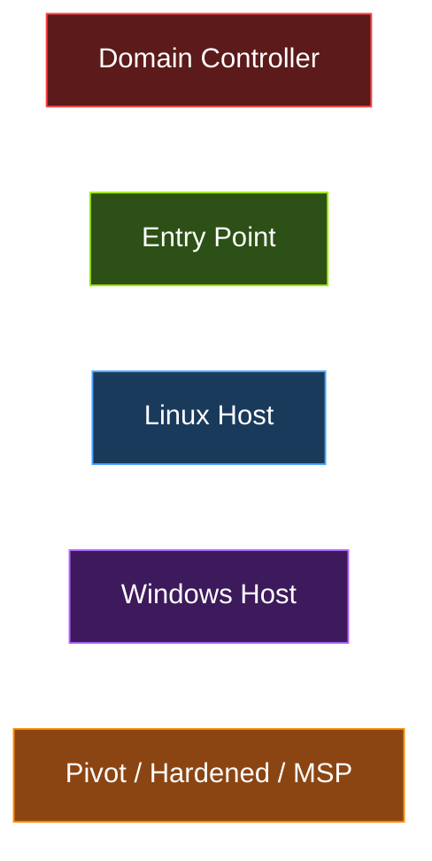
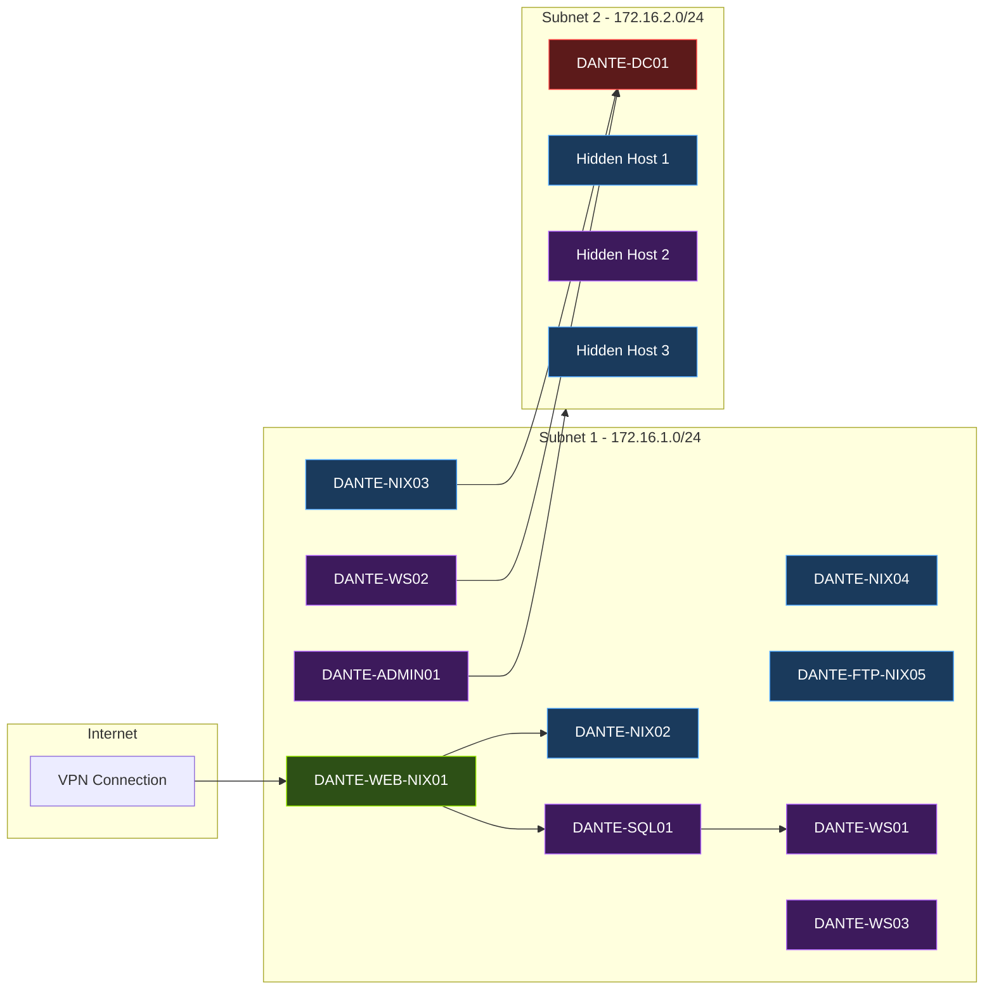
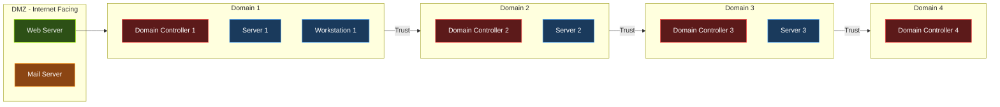
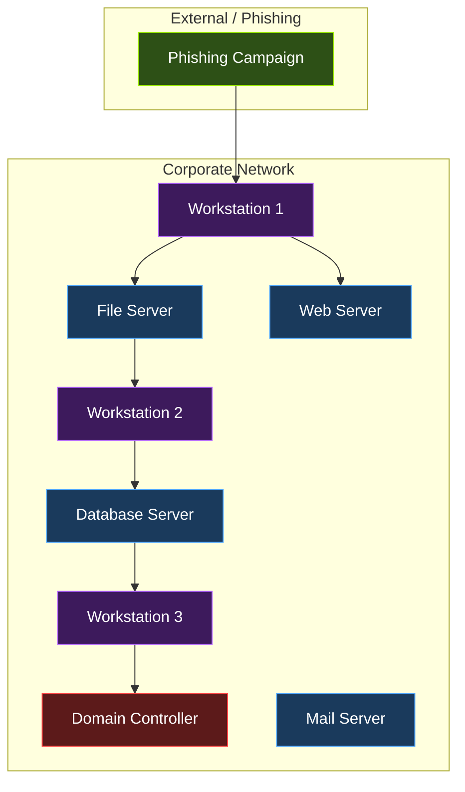
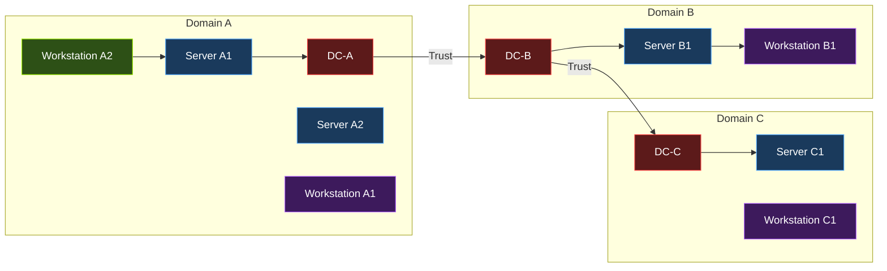
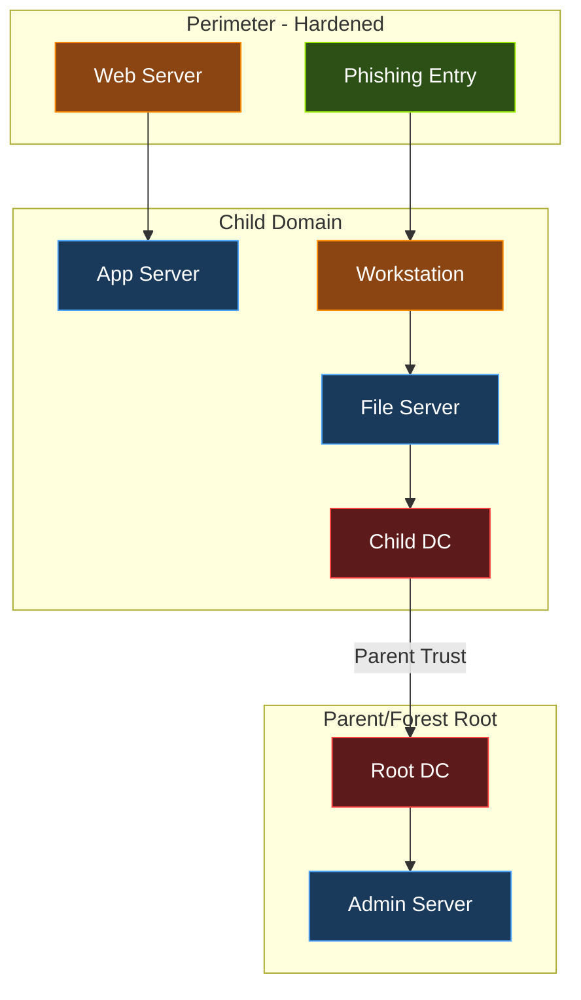
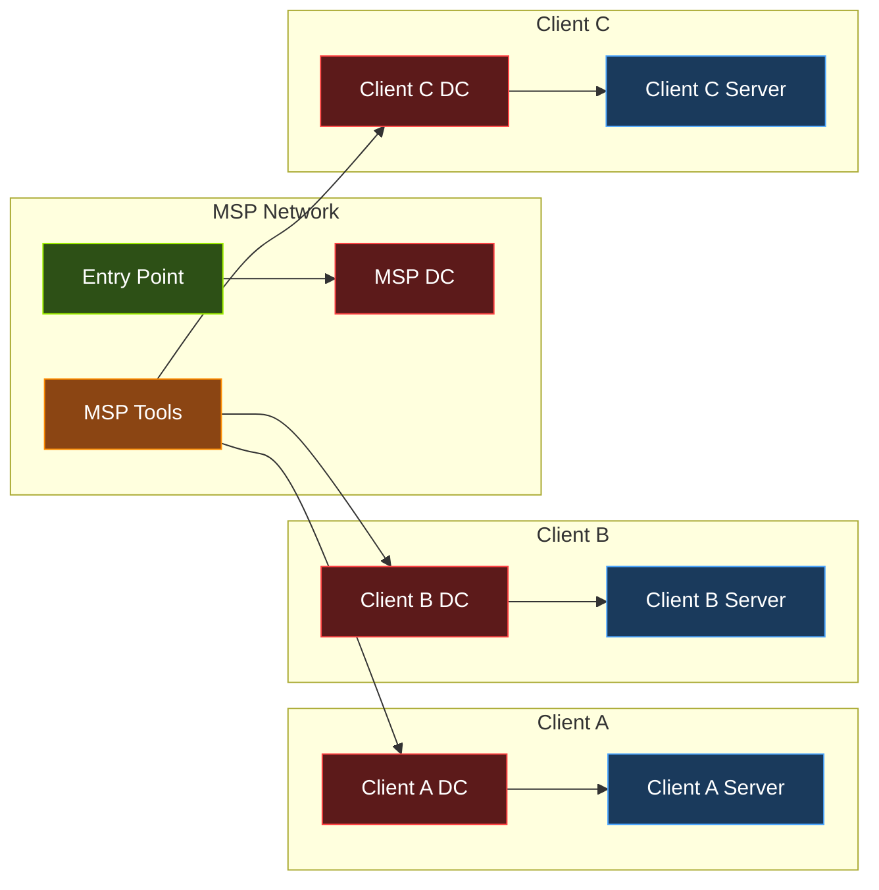

# HackTheBox ProLabs - Detailed Walkthroughs

> Enterprise-grade lab environments simulating real corporate networks. Each covers multi-machine attack paths, lateral movement, and domain dominance.

### Diagram Legend

The network topology diagrams below use the following color coding:



- **Red** - Domain Controllers (primary targets for domain dominance)
- **Green** - Entry points (initial foothold machines)
- **Blue** - Linux hosts
- **Purple** - Windows hosts
- **Orange** - Pivot points, hardened hosts, or MSP infrastructure

---

## 1. Dante (Beginner)

**Machines:** 14 | **Flags:** 27 | **Format:** DANTE{} | **Level:** Penetration Tester Level 1

### Network Architecture
- **Subnet 1 (172.16.1.0/24):** Entry network accessible via VPN
- **Subnet 2 (172.16.2.0/24):** Internal network requiring pivoting through bastion host

**Network Topology:**



### Known Machines

| Machine | Role | Key Techniques |
|---------|------|----------------|
| DANTE-WEB-NIX01 | Web server (entry point) | Web exploitation, initial foothold |
| DANTE-NIX02 | Linux host | Service exploitation, credential reuse |
| DANTE-NIX03 | Linux host | Privilege escalation, pivoting |
| DANTE-NIX04 | Linux host | Custom exploitation |
| DANTE-FTP-NIX05 | FTP server | FTP enumeration, file retrieval |
| DANTE-SQL01 | Database server | SQL exploitation, credential extraction |
| DANTE-WS01 | Windows workstation | Windows exploitation, lateral movement |
| DANTE-WS02 | Windows workstation | Post-exploitation, credential harvesting |
| DANTE-WS03 | Windows workstation | Privilege escalation |
| DANTE-DC01 | Domain Controller | AD enumeration, domain compromise |
| DANTE-ADMIN01 | Admin server | Jenkins exploitation |
| + 3 additional hosts in second subnet | Various | Pivoting required |

### Techniques Covered
- Network enumeration and service discovery
- Web application exploitation (SQLi, file upload, CMS exploits)
- Buffer overflow and custom payload crafting
- Pivoting through bastion hosts (Chisel, SSH tunneling, Ligolo-ng)
- Password profiling and credential reuse
- Windows and Linux privilege escalation
- Basic Active Directory enumeration
- Multi-network pivoting

### Writeup Resources
- [Beginner Guide - dr34mhacks](https://dr34mhacks.github.io/posts/dante-walkthrough-beginner-guide/)
- [Review - Nicholas D'Acri (Medium)](https://nicholasdacri.medium.com/htb-pro-lab-dante-review-wrecks-lessons-02ca78c1e26e)
- [Dante Prolab - Barath (Medium)](https://medium.com/@barath.ravan/dante-prolab-hackthebox-50ef7101d7cb)
- [Review - The Grey Corner](https://thegreycorner.com/2021/12/15/hackthebox_dante-review.html)
- [Review - Dev-angelist (Medium)](https://medium.com/@dev-angelist/my-journey-into-htb-dante-prolab-0a02e00311fd)
- [Walkthrough - s4my9](https://s4my9.github.io/posts/dante-htb-prolab/)

---

## 2. Offshore (Intermediate)

**Machines:** 21 | **Flags:** 38 | **Level:** Penetration Tester Level 2

### Network Architecture
- **DMZ:** Internet-facing services
- **4 Active Directory Domains:** Multi-domain forest with trust relationships

**Network Topology:**



### Techniques Covered

| Category | Specific Techniques |
|----------|-------------------|
| Web Exploitation | PHP RFI, CMS exploitation, web shells |
| Active Directory | Kerberoasting, AS-REP Roasting, DCSync, Pass-the-Hash |
| ADCS | ESC1 certificate abuse |
| Delegation | Constrained Delegation exploitation |
| Lateral Movement | NTLM Relay, PrintNightmare, Shadow Credentials |
| Pivoting | Ligolo-ng multi-hop tunneling |
| Credential Attacks | Password spraying, hash cracking, credential reuse |
| Enumeration | BloodHound, PowerView, AD enumeration at every stage |

### Key Takeaways
- ENUMERATION is critical at every stage
- BloodHound is essential for mapping AD attack paths
- CRTP knowledge gets you reasonably far
- Combines web exploitation with heavy AD content
- Includes some CTF-style crypto challenges

### Writeup Resources
- [Offshore Review - robsware (Medium)](https://robsware.medium.com/hackthebox-offshore-review-df5d17390922)
- [Offshore Review - mrb3n](https://www.mrb3n.com/?p=551)
- [Offshore Review - thehackerish](https://thehackerish.com/penetration-testing-lab-review-hackthebox-offshore/)
- [Offshore Review - TheZenTester](https://thezentester.com/htb-pro-labs-offshore-a-review/)
- [Offshore ProLab - LazyHackers](https://lazyhackers.in/article/hackthebox-offshore-pro-lab)
- [HTBPro Writeups](https://htbpro.xyz/)

---

## 3. RastaLabs (Intermediate)

**Machines:** 15 | **Level:** Red Team Operator Level 2

### Overview
Created by Rastamouse (creator of CRTO certification). Simulates a realistic corporate environment where all systems are reasonably patched, forcing reliance on misconfigurations and AD weaknesses rather than CVEs.

**Network Topology:**



### Techniques Covered

| Category | Specific Techniques |
|----------|-------------------|
| Initial Access | Phishing campaigns, OSINT on company info |
| Credential Attacks | Password cracking, brute-forcing, password manipulation, wordlist creation |
| Active Directory | AD misconfiguration exploitation, trust abuse |
| Lateral Movement | C2 frameworks, network pivoting |
| Persistence | Establishing persistent access |
| Privilege Escalation | Local privesc, domain escalation |
| Evasion | Payload obfuscation, AV bypass |

### Essential Tools
- BloodHound (AD relationship mapping)
- Impacket Suite (network protocol interactions)
- C2 Framework (Cobalt Strike / Sliver / Covenant)
- PowerView / SharpHound

### Key Advice
- NOT beginner-friendly; requires solid AD and red team fundamentals
- Rastamouse's blog archives are directly relevant to lab techniques
- Take hierarchical notes for quick reference during enumeration
- Directly aligned with CRTO certification material

### Writeup Resources
- [Review - Vardan Bansal (Medium)](https://medium.com/@vardan_24823/review-of-hackthebox-pro-labs-rastalabs-30fcd4228c47)
- [Everything You Need to Know - Krishnakant (Medium)](https://medium.com/@kksharma.infosec/hack-the-box-rastalabs-review-everything-you-need-to-know-before-starting-378ffe3cc5ff)
- [Review - RedTeamTrainingReviews](https://www.redteamtrainingreviews.com/hackthebox/rastalabs.html)
- [Review - Dylan Marino](https://dylanmarino.com/rastalabs-review/)
- [Detailed Review - sathiyanarayana (Medium)](https://sathiyanarayana-pentester.medium.com/hackthebox-rastalabs-where-your-patience-and-coffee-will-be-tested-a-detailed-review-of-this-537f9f4bc710)

---

## 4. Zephyr (Intermediate)

**Machines:** 17 | **Flags:** 17 | **Level:** Red Team Operator Level 1

### Network Architecture
- **3 Active Directory Domains** with 3 Domain Controllers
- Pure Active Directory - no web apps, no advanced stuff
- Each domain has corresponding servers and workstations

**Network Topology:**



### Techniques Covered

| Category | Specific Techniques |
|----------|-------------------|
| AD Enumeration | BloodHound, domain trust mapping |
| Kerberos Attacks | Kerberoasting, Pass-the-Hash, ticket manipulation |
| Delegation | Constrained Delegation abuse |
| Cross-Domain | Pivoting between domains, trust exploitation |
| ADCS | Certificate Services exploitation |
| DPAPI | Data Protection API secret extraction |
| Lateral Movement | Multi-domain privilege escalation |

### Created By
- Daniel Morris (dmw0ng) and Matthew Bach (TheCyberGeek)

### Key Advice
- Integrates tools like BloodHound and Kerberoasting across a sprawling interconnected network
- Directly aligned with CRTP and CRTO material
- Requires thinking about attack strategies across domain boundaries
- Not just linear "exploit one machine, move on" - requires strategic pivoting

### Writeup Resources
- [Review - pri3st (Medium)](https://medium.com/@pri3st/hack-the-box-red-team-operator-pro-labs-review-zephyr-8c175b4d02fe)
- [Review - arth0s (Medium)](https://arth0s.medium.com/hackthebox-zephyr-pro-lab-review-a016ac17a26f)
- [Pentester's Perspective - Technicalhats (Medium)](https://yennitarunkumar.medium.com/hack-the-box-zephyr-pro-lab-a-pentesters-perspective-48986a90a601)
- [Official Blog Post](https://www.hackthebox.com/blog/professional-labs-zephyr)

---

## 5. Cybernetics (Advanced)

**Machines:** 20+ | **Level:** Red Team Operator Level 2

### Overview
Immersive enterprise AD environment with advanced infrastructure and strong security posture. Systems are fully patched with hardened OS configurations. AV catches default payloads.

**Network Topology:**



### Techniques Covered

| Category | Specific Techniques |
|----------|-------------------|
| AV Evasion | Custom C# payloads, encrypted payloads, obfuscation |
| Phishing | Advanced phishing campaigns (particularly challenging section) |
| Active Directory | Child/parent domain traversal, cross-forest attacks |
| Lateral Movement | Multi-domain lateral movement |
| Custom Tooling | Building custom C# tools for Windows environments |
| Hardened Environments | Bypassing updated AV, hardened OS configurations |

### Key Challenges
- Default binaries/payloads get flagged and removed by AV
- Phishing section requires significant research
- Playing solo is quite challenging
- Custom C# code essential for Windows environments
- Earns Red Team Operator Level 2 certification upon completion

### Writeup Resources
- [Review - swzhouu (Medium)](https://swzhouu.medium.com/hack-the-box-cybernetics-pro-lab-review-a02c91026c90)
- [Review - RedTeamTrainingReviews](https://www.redteamtrainingreviews.com/hackthebox/cybernetics.html)
- [AD Labs Review - GitHub](https://github.com/ryan412/ADLabsReview)
- [ProLabs Review - Leo Smith](https://leosmith.wtf/blog/big-boy-cert.html)

---

## 6. APTLabs (Advanced)

**Machines:** 20+ | **Level:** Red Team Operator Level 3

### Overview
The most challenging ProLab. Simulates a targeted attack by an external threat agent against a Managed Service Provider (MSP). No CVEs are needed - all attacks exploit misconfigurations and trust relationships. Requires C2 framework usage (Cobalt Strike recommended).

**Network Topology:**



### Techniques Covered

| Category | Specific Techniques |
|----------|-------------------|
| APT Simulation | Long-lasting TTPs, patient attack chains |
| Enterprise Technology | Attacking real enterprise software and services |
| MSP Exploitation | Compromising MSP to reach client networks |
| Multi-Domain | Compromising all client networks |
| C2 Operations | Cobalt Strike or equivalent C2 framework mandatory |
| Research | Heavy "Google-ninja" research required |

### Key Characteristics
- Took ~2 months to complete (vs 1 month for other ProLabs)
- No hand-holding; Discord community is the only help
- Goal: compromise ALL client networks and reach Domain Admin everywhere
- Cobalt Strike recommended over open-source C2
- Requires advanced research skills

### Writeup Resources
- [APTLabs Review - Avantguard](https://avantguard.io/en/blog/aptlabs-review)
- [Review - RedTeamTrainingReviews](https://www.redteamtrainingreviews.com/hackthebox/aptlabs.html)
- [AD Labs Review - GitHub](https://github.com/ryan412/ADLabsReview)
- [ProLabs Review - Leo Smith](https://leosmith.wtf/blog/big-boy-cert.html)

---

## ProLab Progression Path

```
Dante (Beginner) --> Offshore (Intermediate) --> RastaLabs (Intermediate)
                                                      |
                                                      v
                     Zephyr (Intermediate) --> Cybernetics (Advanced)
                                                      |
                                                      v
                                              APTLabs (Advanced)
```

**Certification Alignment:**
- Dante/Offshore: OSCP, CPTS preparation
- RastaLabs/Zephyr: CRTO, CRTP preparation
- Cybernetics/APTLabs: Advanced red team operations
