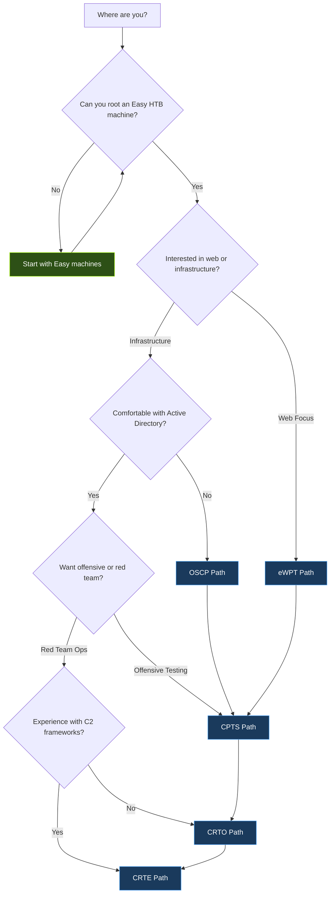
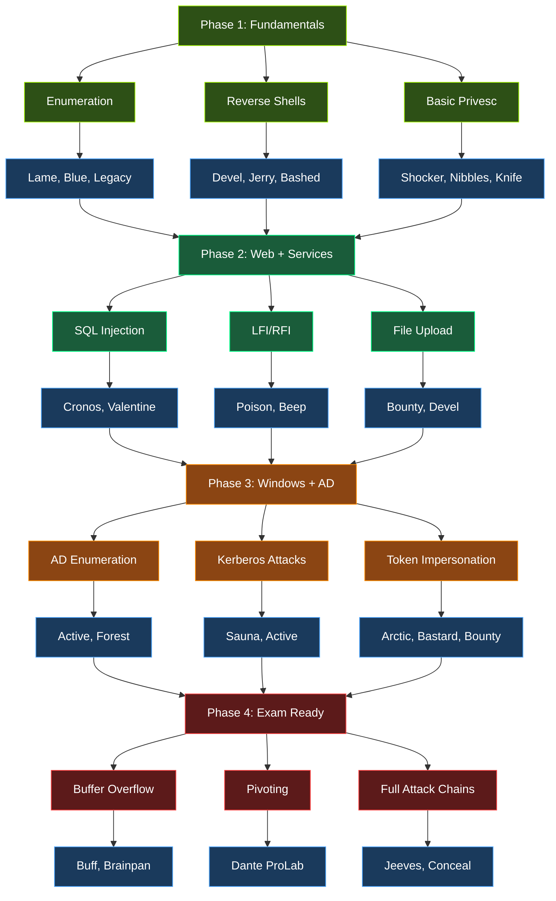
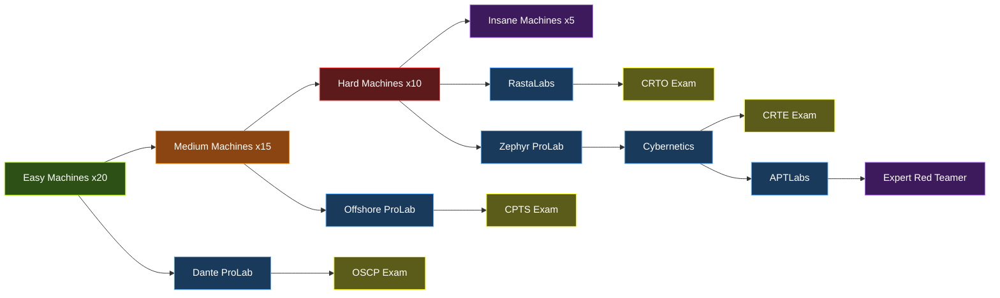

# Skill Trees & Certification Roadmaps
{: .fs-9 }

Visual progression paths mapping HTB machines to real-world certifications and technique skill trees.
{: .fs-6 .fw-300 }

---

## How to Use This Page

Skill trees are visual maps that show how different techniques build on each other and which HTB machines let you practice each skill. Use them to:

- **Plan your study path** - Follow a tree from top to bottom to build skills in the right order
- **Find machines to practice** - Blue nodes link techniques to specific HTB machines
- **Prepare for certifications** - Follow the cert-specific paths (OSCP, CPTS, CRTO, CRTE) to target the right skills
- **Identify gaps** - If you can do the intermediate techniques but struggle with advanced ones, you know where to focus

### Color Legend

| Color | Meaning |
|:------|:--------|
| **Green** | Beginner-level techniques - start here |
| **Orange** | Intermediate techniques - requires solid fundamentals |
| **Red** | Advanced techniques - requires experience with intermediate skills |
| **Purple** | Expert-level techniques - deep specialization required |
| **Blue** | Specific HTB machines or challenges to practice the technique |

---

## 1. Certification Decision Flowchart

Not sure which certification to pursue? Follow this decision tree based on your current skill level and interests.

**How to read this:** Start at the top and answer each question honestly. The blue nodes are your recommended certification target. The arrows at the bottom show the natural progression order between certs.

---

## 2. OSCP Preparation Path

A four-phase progression from fundamentals to exam readiness, with specific machines at each stage.

**Recommended timeline:** 3-4 months. Spend roughly 3 weeks per phase. Do not skip Phase 1 even if it feels easy - the fundamentals compound.

---

## 3. Active Directory Attack Skill Tree

Progression from basic AD enumeration through credential attacks, privilege escalation, and expert-level techniques like ADCS abuse and cross-forest attacks.

```mermaid
graph TD
    classDef basic fill:#2d5016,stroke:#9fef00,color:#fff
    classDef intermediate fill:#8b4513,stroke:#ff8c00,color:#fff
    classDef advanced fill:#5c1a1a,stroke:#ff4444,color:#fff
    classDef expert fill:#3d1a5c,stroke:#b366ff,color:#fff
    classDef machine fill:#1a3a5c,stroke:#4da6ff,color:#fff

    ROOT[Active Directory Attacks]

    ROOT --> RECON[AD Enumeration]:::basic
    RECON --> BLOODHOUND[BloodHound]:::basic
    RECON --> LDAP_ENUM[LDAP Queries]:::basic
    RECON --> RPC_ENUM[RPC User Enum]:::basic

    BLOODHOUND --> M_FOREST[Forest]:::machine
    LDAP_ENUM --> M_CASCADE[Cascade]:::machine
    RPC_ENUM --> M_FOREST

    ROOT --> CRED[Credential Attacks]:::intermediate
    CRED --> ASREP[AS-REP Roasting]:::intermediate
    CRED --> KERB[Kerberoasting]:::intermediate
    CRED --> SPRAY[Password Spraying]:::intermediate
    CRED --> GPP[GPP Abuse]:::intermediate

    ASREP --> M_SAUNA[Sauna]:::machine
    ASREP --> M_BLACKFIELD[Blackfield]:::machine
    KERB --> M_ACTIVE[Active]:::machine
    SPRAY --> M_MONTEVERDE[Monteverde]:::machine
    GPP --> M_ACTIVE

    ROOT --> PRIV[Privilege Escalation]:::advanced
    PRIV --> DCSYNC[DCSync]:::advanced
    PRIV --> ACL[ACL Abuse]:::advanced
    PRIV --> DELEG[Delegation Abuse]:::advanced
    PRIV --> GMSA[GMSA Password Read]:::advanced

    DCSYNC --> M_FOREST
    ACL --> M_OBJECT[Object]:::machine
    DELEG --> M_INTELLIGENCE[Intelligence]:::machine
    GMSA --> M_INTELLIGENCE

    ROOT --> EXPERT_AD[Expert Techniques]:::expert
    EXPERT_AD --> ADCS[ADCS Abuse]:::expert
    EXPERT_AD --> RBCD_ATK[RBCD Attack]:::expert
    EXPERT_AD --> CROSS[Cross-Forest]:::expert
    EXPERT_AD --> SHADOW[Shadow Credentials]:::expert

    ADCS --> M_ESCAPE[Escape]:::machine
    ADCS --> M_CERBERUS[Cerberus]:::machine
    RBCD_ATK --> M_REBOUND[Rebound]:::machine
    CROSS --> M_CERBERUS
    SHADOW --> M_ABSOLUTE[Absolute]:::machine
```

**Key tools for this tree:** BloodHound, Impacket, Rubeus, Certify, SharpHound, PowerView. Learn them in order as you progress through the skill levels.

---

## 4. Web Exploitation Skill Tree

From basic injection attacks through access control flaws, client-side exploitation, and infrastructure-level web attacks.

```mermaid
graph TD
    classDef basic fill:#2d5016,stroke:#9fef00,color:#fff
    classDef intermediate fill:#8b4513,stroke:#ff8c00,color:#fff
    classDef advanced fill:#5c1a1a,stroke:#ff4444,color:#fff
    classDef machine fill:#1a3a5c,stroke:#4da6ff,color:#fff

    ROOT[Web Exploitation]

    ROOT --> INJECT[Injection]:::basic
    INJECT --> SQLI[SQL Injection]:::basic
    INJECT --> CMDI[Command Injection]:::basic
    INJECT --> SSTI_ATK[SSTI]:::intermediate
    INJECT --> XXEI[XXE]:::intermediate

    SQLI --> M_CRONOS[Cronos]:::machine
    CMDI --> M_SHOCKER[Shocker]:::machine
    SSTI_ATK --> M_SANDWORM[Sandworm]:::machine
    XXEI --> M_DEVOOPS[DevOops]:::machine

    ROOT --> ACCESS[Access Control]:::basic
    ACCESS --> IDOR_ATK[IDOR]:::basic
    ACCESS --> AUTH[Auth Bypass]:::basic
    ACCESS --> SSRF_ATK[SSRF]:::intermediate

    IDOR_ATK --> M_CAP[Cap]:::machine
    AUTH --> M_JERRY[Jerry]:::machine
    SSRF_ATK --> M_LOVE[Love]:::machine

    ROOT --> CLIENT[Client-Side]:::intermediate
    CLIENT --> XSS_ATK[XSS]:::intermediate
    CLIENT --> DESER[Deserialization]:::advanced
    CLIENT --> PROTO[Prototype Pollution]:::advanced

    XSS_ATK --> C_SPOOKTASTIC[SpookTastic Challenge]:::machine
    DESER --> M_BAGEL[Bagel]:::machine
    PROTO --> C_GUNSHIP[Gunship Challenge]:::machine

    ROOT --> INFRA[Infrastructure]:::advanced
    INFRA --> LFI_ATK[LFI/RFI]:::intermediate
    INFRA --> UPLOAD_ATK[File Upload]:::intermediate
    INFRA --> SMUGGLE[Request Smuggling]:::advanced
    INFRA --> CACHE[Cache Poisoning]:::advanced

    LFI_ATK --> M_POISON[Poison]:::machine
    UPLOAD_ATK --> M_NIBBLES[Nibbles]:::machine
    SMUGGLE --> M_SINK[Sink]:::machine
    CACHE --> C_CDNIO[CDNio Challenge]:::machine
```

**Tip:** Start with SQL Injection and Command Injection (green). These are the most common web vulnerabilities you will encounter on the OSCP and in real engagements. Move to SSTI and XXE once you are comfortable with basic injection mechanics.

---

## 5. Linux Privilege Escalation Tree

Covers misconfigurations, service exploitation, kernel exploits, and the essential tools you need at each stage.

```mermaid
graph TD
    classDef basic fill:#2d5016,stroke:#9fef00,color:#fff
    classDef intermediate fill:#8b4513,stroke:#ff8c00,color:#fff
    classDef advanced fill:#5c1a1a,stroke:#ff4444,color:#fff
    classDef machine fill:#1a3a5c,stroke:#4da6ff,color:#fff

    ROOT[Linux Privilege Escalation]

    ROOT --> MISCONFIG[Misconfigurations]:::basic
    MISCONFIG --> SUDO[Sudo Abuse]:::basic
    MISCONFIG --> SUID[SUID Binaries]:::basic
    MISCONFIG --> CRON_PE[Cron Jobs]:::basic
    MISCONFIG --> CAPS[Capabilities]:::intermediate

    SUDO --> M_SHOCKER2[Shocker - sudo perl]:::machine
    SUDO --> M_NIBBLES2[Nibbles - sudo monitor.sh]:::machine
    SUID --> M_BEEP[Beep]:::machine
    CRON_PE --> M_CRONOS2[Cronos]:::machine
    CRON_PE --> M_BASHED[Bashed]:::machine
    CAPS --> M_CAP2[Cap - cap_setuid]:::machine

    ROOT --> SERVICES[Service Exploitation]:::intermediate
    SERVICES --> DOCKER[Docker Escape]:::intermediate
    SERVICES --> MYSQL[MySQL UDF]:::intermediate
    SERVICES --> NFS[NFS no_root_squash]:::intermediate

    DOCKER --> M_TALKATIVE[Talkative]:::machine

    ROOT --> KERNEL[Kernel Exploits]:::advanced
    KERNEL --> DIRTY[DirtyPipe/DirtyCow]:::advanced
    KERNEL --> CUSTOM[Custom Kernel Exploit]:::advanced

    ROOT --> TOOLS[Essential Tools]:::basic
    TOOLS --> LINPEAS[LinPEAS]:::basic
    TOOLS --> PSPY[pspy - process monitor]:::basic
    TOOLS --> GTFO[GTFOBins]:::basic

    GTFO --> M_KNIFE2[Knife - knife exec]:::machine
    GTFO --> M_OPENADMIN[OpenAdmin - nano]:::machine
```

**Enumeration order on every Linux box:** Run `sudo -l` first, then check SUID binaries (`find / -perm -4000`), then cron jobs (`cat /etc/crontab` + pspy), then capabilities (`getcap -r /`). Use LinPEAS to catch anything you missed.

---

## 6. Windows Privilege Escalation Tree

Token attacks, misconfigurations, credential access methods, and kernel exploits for Windows targets.

```mermaid
graph TD
    classDef basic fill:#2d5016,stroke:#9fef00,color:#fff
    classDef intermediate fill:#8b4513,stroke:#ff8c00,color:#fff
    classDef advanced fill:#5c1a1a,stroke:#ff4444,color:#fff
    classDef machine fill:#1a3a5c,stroke:#4da6ff,color:#fff

    ROOT[Windows Privilege Escalation]

    ROOT --> TOKEN[Token Attacks]:::basic
    TOKEN --> POTATO_ATK[Potato Attacks]:::basic
    TOKEN --> IMPERSON[Token Impersonation]:::basic

    POTATO_ATK --> M_ARCTIC2[Arctic - JuicyPotato]:::machine
    POTATO_ATK --> M_BASTARD2[Bastard - JuicyPotato]:::machine
    IMPERSON --> M_GRANDPA[Grandpa]:::machine

    ROOT --> MISCONFIG_W[Misconfigurations]:::intermediate
    MISCONFIG_W --> ALWAYS[AlwaysInstallElevated]:::intermediate
    MISCONFIG_W --> UNQUOTED[Unquoted Service Path]:::intermediate
    MISCONFIG_W --> DLL_HIJACK[DLL Hijacking]:::intermediate

    ALWAYS --> M_LOVE2[Love]:::machine

    ROOT --> CREDS_W[Credential Access]:::intermediate
    CREDS_W --> SAM[SAM/SYSTEM Dump]:::intermediate
    CREDS_W --> AUTOLOGON[AutoLogon Creds]:::intermediate
    CREDS_W --> KEEPASS[KeePass Database]:::intermediate
    CREDS_W --> DPAPI_ATK[DPAPI Secrets]:::advanced

    AUTOLOGON --> M_SAUNA2[Sauna]:::machine
    KEEPASS --> M_JEEVES2[Jeeves]:::machine

    ROOT --> KERNEL_W[Kernel Exploits]:::advanced
    KERNEL_W --> MS16[MS16-098]:::advanced
    KERNEL_W --> PRINT[PrintNightmare]:::advanced

    MS16 --> M_OPTIMUM2[Optimum]:::machine

    ROOT --> TOOLS_W[Essential Tools]:::basic
    TOOLS_W --> WINPEAS[WinPEAS]:::basic
    TOOLS_W --> SEATBELT[Seatbelt]:::basic
    TOOLS_W --> SHARPHOUND[SharpHound]:::basic
```

**Enumeration order on every Windows box:** Check `whoami /priv` for SeImpersonate (Potato path). Run WinPEAS. Check for stored credentials (`cmdkey /list`, registry AutoLogon). Look for interesting files (KeePass databases, config files with passwords). Kernel exploits are a last resort.

---

## 7. Overall HTB Progression Roadmap

The big picture - how machine difficulty, ProLabs, and certifications connect.

**Machine counts are minimums.** The numbers (x20, x15, x10, x5) represent the minimum number of machines you should complete at each difficulty level before moving on. More is always better. Quality matters more than quantity - make sure you understand the techniques, not just follow the writeup.

---

## Suggested Study Order

1. **Start with the Certification Decision Flowchart** to pick your target cert
2. **Follow the OSCP Preparation Path** if you are new - it builds a solid foundation regardless of your end goal
3. **Branch into specialized trees** (AD, Web, Linux privesc, Windows privesc) based on your weak areas
4. **Use the Overall Progression Roadmap** to plan your ProLab and cert timeline

For detailed machine lists mapped to each certification, see the [Cert Prep guides](resources/cert-prep/).

---

Skill trees are living documents. As new machines release and techniques evolve, these paths will be updated. Suggestions welcome via [GitHub Issues](https://github.com/momenbasel/htb-writeups/issues).
