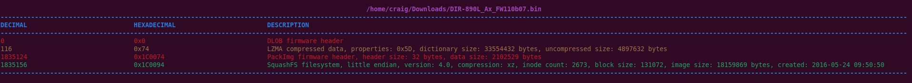

# Binwalk v3

This is an updated version of the Binwalk firmware analysis tool, re-written in Rust for speed and accuracy.


## What does it do?

Binwalk can identify, and optionally extract, files and data that have been embedded inside of other files.

While its primary focus is firmware analysis, it supports a [wide variety](../../../../40-tooling/archives/forensics-tools/binwalk) of file and data types.

Through [entropy analysis](../../../../40-tooling/archives/forensics-tools/binwalk), it can even help to identify unknown compression or encryption!

Binwalk can be customized and [integrated](../../../../40-tooling/archives/forensics-tools/binwalk) into your own Rust projects.

## How do I get it?

The easiest way to install Binwalk and all dependencies is to [build a Docker image](../../../../40-tooling/archives/forensics-tools/binwalk).

Binwalk can also be [installed](../../../../40-tooling/archives/forensics-tools/binwalk) via the Rust package manager.

Or, you can [compile from source](../../../../40-tooling/archives/forensics-tools/binwalk)!

## How do I use it?

Usage is _**simple**_, analysis is _**fast**_, and results are _**detailed**_:

```
binwalk DIR-890L_AxFW110b07.bin
```


Use `--help`, or check out the [Wiki](../../../../40-tooling/archives/forensics-tools/binwalk) for more advanced options!
